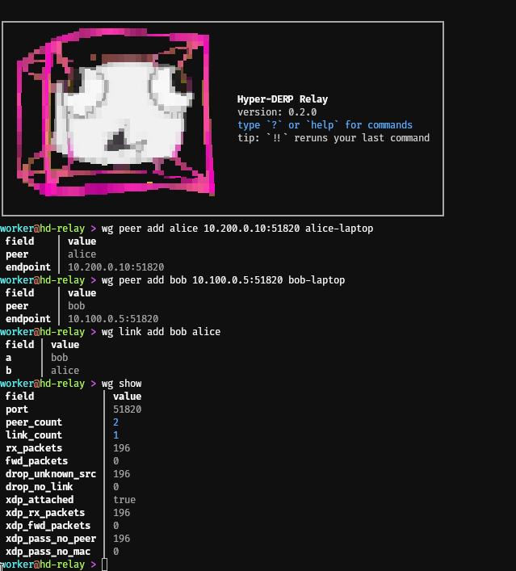

<p align="center">
  
</p>

<h1 align="center">Hyper-DERP</h1>

<p align="center">High-performance DERP relay server in C++23 with <code>io_uring</code>.</p>


## What Is This?

A high-performance relay server that does two things:

- **DERP relay** — drop-in replacement for Tailscale's Go [derper](https://pkg.go.dev/tailscale.com/derp). Hyper-DERP speaks the same protocol over the same TLS port, so Tailscale, Headscale, and any standard DERP client just work. Built around `io_uring` and kTLS, it moves **2–10× more bytes per CPU** than the Go reference at lower tail latency.
- **WireGuard relay** — a transparent UDP middlebox for stock WireGuard clients (no Tailscale required). Two peers behind NAT point their `Endpoint =` at hyper-derp; the relay forwards based on a peer + link table you set up once. Works with `wg-quick`, pfSense, mobile WireGuard apps. Optional XDP fast path keeps forwarding in the kernel.

[DERP](https://tailscale.com/blog/how-tailscale-works/) is the relay protocol Tailscale clients fall back to when direct WireGuard fails. WireGuard-relay mode covers the same problem at a different layer — for people running plain `wg-quick` on both ends.

## Performance

**2–10× throughput, 40 % lower tail latency, half the hardware.** 4,903 benchmark runs on GCP c4-highcpu VMs against Go derper v1.96.4.

Full results: [HD.Benchmark](https://github.com/hyper-derp/HD.Benchmark) · [hyper-derp.dev/benchmarks](https://hyper-derp.dev/benchmarks/)

### HD Protocol (native, zero-copy relay)

| Test | HD | Go derper | Ratio |
|------|---:|----------:|------:|
| TCP relay (8w, 25GbE) | 19,880 Mbps | 7,800 Mbps | **2.55×** |
| AF_XDP relay (25GbE) | 24,600 Mbps | 7,800 Mbps | **3.15×** |

### WireGuard relay (XDP fast path)

| Setup | Single-peer TCP |
|-------|----------------:|
| Mellanox CX-4 LX, 25 GbE | **10.4 Gbit/s** |
| GCP n2-standard-4 (gVNIC GQI) | **3.7 Gbit/s** |

## WireGuard Relay Mode

`mode: wireguard` turns hyper-derp into a UDP middlebox for stock WG clients. Set it up with three commands in the operator REPL:

```
hyper-derp> wg peer add alice <ALICE-IP>:51820 alice-laptop
hyper-derp> wg peer add bob   <BOB-IP>:51820   bob-laptop
hyper-derp> wg link add alice bob
```

Clients run vanilla `wg-quick` with `Endpoint = <relay>:51820`. The relay never decrypts traffic — it just rewrites the destination based on which peer the source 4-tuple matches.

<p align="center">
  
</p>

Full walkthrough — eight copy-paste steps from a clean Debian box: [docs/wireguard_relay_quickstart.md](docs/wireguard_relay_quickstart.md).

## Install

From the apt repo (Debian / Ubuntu):

```sh
curl -fsSL https://hyper-derp.dev/repo/key.gpg | \
  sudo gpg --dearmor -o /usr/share/keyrings/hyper-derp.gpg

echo "deb [signed-by=/usr/share/keyrings/hyper-derp.gpg] \
  https://hyper-derp.dev/repo stable main" | \
  sudo tee /etc/apt/sources.list.d/hyper-derp.list

sudo apt update && sudo apt install hyper-derp
```

That's it — postinst enables the service, loads the `tls` and
`wireguard` kernel modules, sets up `/tmp/einheit` for the operator
IPC channel, and bundles the `einheit` framework plus the `hdcli`
operator REPL. The deb drops:

- `/usr/bin/hyper-derp` — the daemon
- `/usr/bin/hdcli` — operator REPL (no sudo required)
- `/usr/bin/hdwg`, `/usr/bin/hdctl`, `/usr/bin/hdcat` — client-side tools
- `/etc/hyper-derp/hyper-derp.yaml.example` — sample config
- `/usr/lib/systemd/system/hyper-derp.service` — systemd unit

### Run it

```sh
sudoedit /etc/hyper-derp/hyper-derp.yaml     # tweak the example
sudo systemctl start hyper-derp              # start the daemon
journalctl -u hyper-derp -f                  # tail the logs
hdcli                                        # drop into the operator REPL
```

To build from source instead of using the apt repo, see [Building](#building) below.

## Configuration

Hyper-DERP reads a YAML config file and accepts CLI flag
overrides. CLI flags take precedence over file values.

```sh
# Config file only
hyper-derp --config /etc/hyper-derp/hyper-derp.yaml

# Config file + CLI override
hyper-derp --config /etc/hyper-derp/hyper-derp.yaml \
  --port 443 --workers 4
```

Example config (`/etc/hyper-derp/hyper-derp.yaml`):

```yaml
port: 3340
workers: 0              # 0 = auto (one per core)
# pin_cores: [0, 2, 4, 6]
sqpoll: false

# kTLS — both required to enable
# tls_cert: /etc/hyper-derp/cert.pem
# tls_key: /etc/hyper-derp/key.pem

log_level: info

metrics:
  # port: 9100
  debug_endpoints: false
```

### kTLS Prerequisites

```sh
sudo modprobe tls
lsmod | grep tls
```

HD auto-detects kTLS support via OpenSSL. Without the `tls`
kernel module loaded, OpenSSL falls back to userspace TLS
silently. To persist across reboots:

```sh
echo tls | sudo tee /etc/modules-load.d/tls.conf
```

### Worker Count Guidance

- **With kTLS (production):** use default (vCPU / 2). More
  workers means more parallel crypto throughput.
- **Without TLS (testing only):** cap at 4 workers.

### systemd

The packaged service unit runs as:

```
ExecStart=/usr/bin/hyper-derp --config /etc/hyper-derp/hyper-derp.yaml
```

Hardened with `DynamicUser`, `ProtectSystem=strict`,
`NoNewPrivileges`, and a restricted syscall filter.
`CAP_SYS_NICE` is granted for SQPOLL mode and
`LimitMEMLOCK=infinity` for io_uring buffer rings.

See [OPERATIONS.md](OPERATIONS.md) for production tuning:
sysctl settings, CPU pinning, memory footprint, and Prometheus
alerting.

## Compatibility

Hyper-DERP implements the Tailscale DERP wire protocol and is
compatible with:

- **Tailscale** clients (all platforms)
- **Headscale** self-hosted control planes
- Any client that speaks the standard DERP protocol

## HD Protocol ecosystem

Beyond the DERP-compatible relay, the repository ships an HD
Protocol mode (native, connection-time auth, MeshData /
FleetData frames) and a set of client tools built on it.

| Component | Purpose | Docs |
|-----------|---------|------|
| `hyper-derp` --hd-relay-key | Native HD relay; adds `--hd-relay-id` / `--hd-seed-relay` for fleet routing | [architecture.md](docs/design/architecture.md) |
| HD SDK (`sdk/`) | C++23 client library — `hd::sdk::Client` / `Tunnel` with pluggable extensions (`hd_wg`, `hd_ice`, `hd_bridge`, `hd_policy`, `hd_fleet`) plus a C ABI wrapper | [sdk.md](docs/design/sdk.md) |
| `hdwg` | WireGuard tunnel daemon. Uses HD as signaling; tries direct UDP first, falls back (and auto-recovers) through the relay when direct paths die | [hdwg.md](docs/hdwg.md) |
| `hdcat` | netcat/socat over HD tunnels. TCP / UDP / unix-socket / stdin-stdout, YAML config, wildcard peers | — |
| `hdctl` | ZMQ IPC control CLI for the relay (list peers, drive a config-driven bridge) | — |
| `hdcli` | Interactive operator shell for the running daemon. Shows status, peers, and counters, drives the candidate-config / commit lifecycle, runs `wg`-relay verbs in `mode: wireguard`, and follows live events. Tab-completion, `?` mid-line help, oneshot or REPL | [cli_handbook.md](docs/cli_handbook.md) |

## Building

### Dependencies

System packages (Debian/Ubuntu):

```sh
sudo apt install \
  clang cmake ninja-build \
  liburing-dev libsodium-dev \
  libgtest-dev libgmock-dev libcli11-dev
```

Requires Linux with `io_uring` support (kernel 6.1+
recommended for DEFER_TASKRUN and SINGLE_ISSUER).

### Build Commands

```sh
# Release
cmake --preset default
cmake --build build -j

# Debug
cmake --preset debug
cmake --build build-debug -j
```

### ARM64 Cross-Compile

```sh
sudo apt install gcc-aarch64-linux-gnu g++-aarch64-linux-gnu
cmake -DCMAKE_TOOLCHAIN_FILE=cmake/aarch64-toolchain.cmake \
  -B build-arm64
cmake --build build-arm64 -j
```

Targets AWS Graviton and Ampere (Oracle/Azure) instances.

### Packaging

```sh
cmake --build build --target package
# Produces build/hyper-derp_<version>_<arch>.deb
sudo dpkg -i build/hyper-derp_*.deb
```

Installs systemd unit (`hyper-derp.service`), example config
(`/etc/hyper-derp/hyper-derp.yaml`), and binaries to
`/usr/bin/`.

## Testing

```sh
# All tests
ctest --preset debug

# Unit tests only
ctest --preset debug -R unit_tests

# Integration tests (fork-based, process-isolated)
ctest --preset debug -R integration_tests
```

## Contributing

See [CONTRIBUTING.md](CONTRIBUTING.md) for build instructions,
code style requirements, and the PR process.

## License

[MIT](LICENSE)
