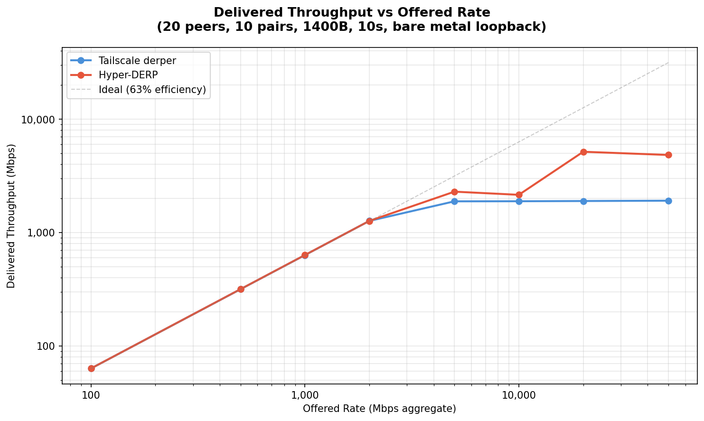
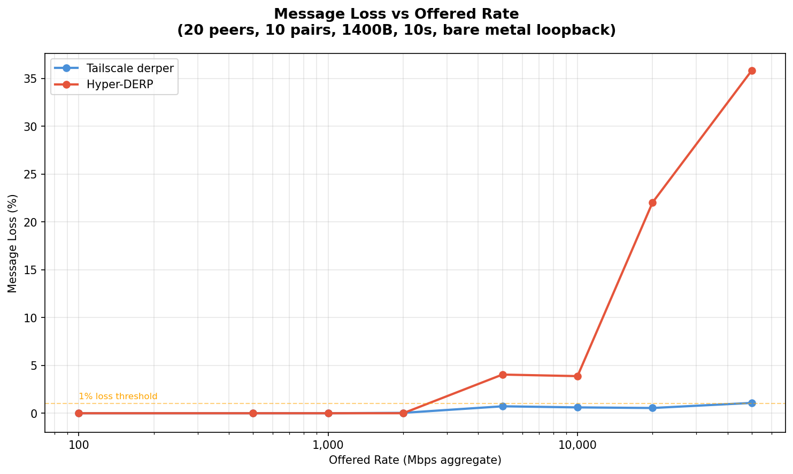
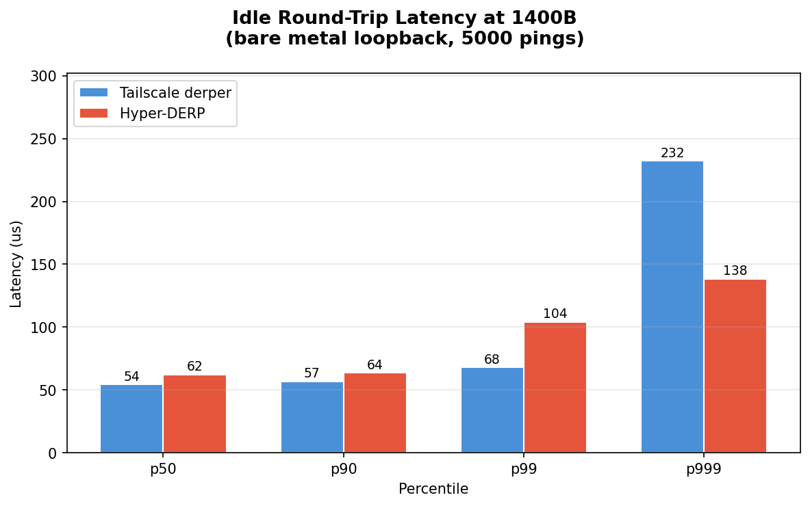
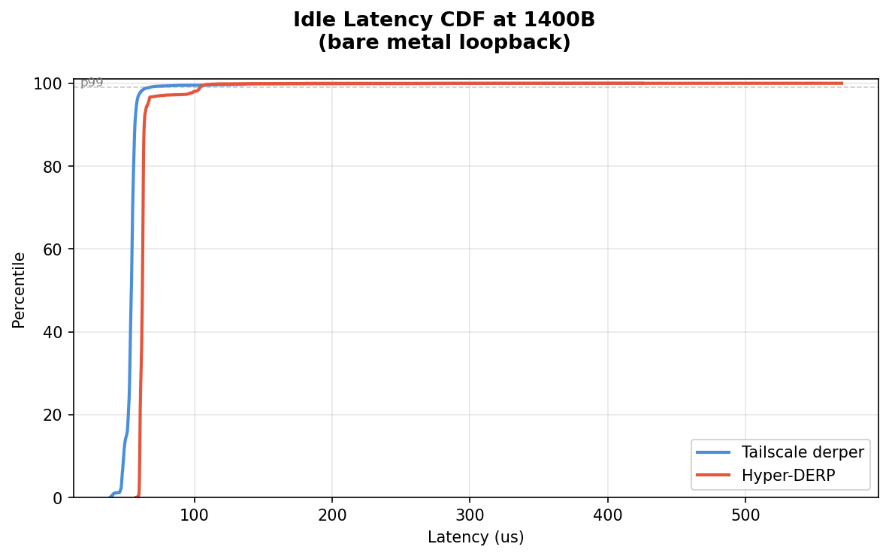
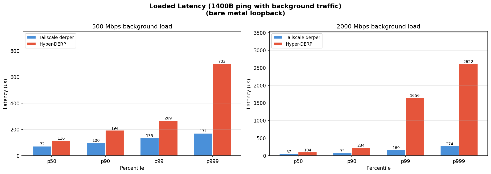
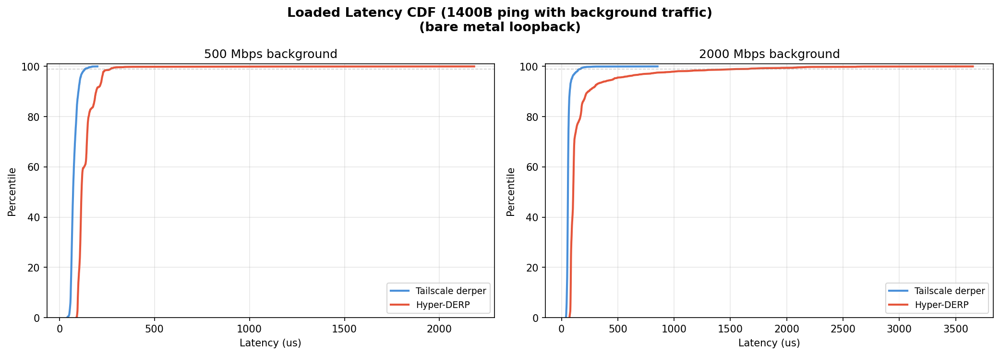

# Hyper-DERP vs Tailscale derper: Bare Metal Comparison

## Test Environment

- **Date**: 2026-03-11T13:43:17+01:00
- **CPU**: 13th Gen Intel(R) Core(TM) i5-13600KF
- **Kernel**: 6.12.73+deb13-amd64
- **Cores**: 20
- **Governor**: performance
- **Relay pinned**: cores 4,5
- **Client pinned**: cores 12,13,14,15
- **Workers**: 2 (Hyper-DERP)
- **Network**: localhost loopback (TCP)
- **Payload**: 1400B (WireGuard MTU)
- **Topology**: 20 peers, 10 active pairs
- **Duration**: 10s per rate point
- **TCP tuning**: wmem_max=16777216, lo_mtu=65536

## Throughput Scaling

Delivered relay throughput as offered send rate increases. Rate is token-bucket paced across all 10 sender threads.

| Rate (Mbps) | TS Sent | TS Recv | TS Loss | TS Mbps | HD Sent | HD Recv | HD Loss | HD Mbps | HD/TS |
|-------------|---------|---------|---------|---------|---------|---------|---------|---------|-------|
| 100 | 80,350 | 80,350 | 0.00% | 63.3 | 80,350 | 80,350 | 0.00% | 63.3 | 1.0x |
| 500 | 401,780 | 401,780 | 0.00% | 316.5 | 401,780 | 401,780 | 0.00% | 316.7 | 1.0x |
| 1,000 | 803,562 | 803,558 | 0.00% | 632.4 | 803,561 | 803,561 | 0.00% | 633.2 | 1.0x |
| 2,000 | 1,607,133 | 1,606,498 | 0.04% | 1266.3 | 1,607,134 | 1,607,097 | 0.00% | 1265.7 | 1.0x |
| 5,000 | 2,413,022 | 2,395,531 | 0.72% | 1884.7 | 3,039,329 | 2,916,482 | 4.04% | 2293.7 | 1.2x |
| 10,000 | 2,410,732 | 2,396,017 | 0.61% | 1888.1 | 2,840,659 | 2,730,472 | 3.88% | 2151.5 | 1.1x |
| 20,000 | 2,425,247 | 2,411,953 | 0.55% | 1897.1 | 8,520,452 | 6,642,671 | 22.04% | 5156.6 | 2.7x |
| 50,000 | 2,453,105 | 2,426,642 | 1.08% | 1909.6 | 9,780,473 | 6,275,277 | 35.84% | 4831.7 | 2.5x |





## Saturation Analysis

- **TS ceiling**: 1910 Mbps (reached at 50,000 Mbps offered) — plateaus and cannot push further
- **HD ceiling**: 5157 Mbps (reached at 20,000 Mbps offered)
- **HD/TS peak ratio**: **2.7x**

- **TS** first loss at 2,000 Mbps (0.04%)
- **HD** first loss at 5,000 Mbps (4.04%)

## Idle Round-Trip Latency (1400B)

Measured via ping/echo over loopback (5000 round-trips).

| Metric | Tailscale | Hyper-DERP | Speedup |
|--------|-----------|------------|---------|
| p50 | 54 us | 62 us | 0.87x |
| p90 | 57 us | 64 us | 0.89x |
| p99 | 68 us | 104 us | 0.65x |
| p999 | 232 us | 138 us | **1.68x** |
| max | 425 us | 570 us | 0.75x |

Ping throughput: TS 18,367 pps, HD 15,755 pps (0.86x)





## Loaded Latency (1400B)

Ping/echo latency while background throughput traffic is running.

### 500 Mbps background

| Metric | Tailscale | Hyper-DERP | Ratio |
|--------|-----------|------------|-------|
| p50 | 72 us | 116 us | 1.6x |
| p90 | 100 us | 194 us | 1.9x |
| p99 | 135 us | 269 us | 2.0x |
| p999 | 171 us | 703 us | 4.1x |

### 2000 Mbps background

| Metric | Tailscale | Hyper-DERP | Ratio |
|--------|-----------|------------|-------|
| p50 | 57 us | 104 us | 1.8x |
| p90 | 73 us | 234 us | 3.2x |
| p99 | 169 us | 1656 us | 9.8x |
| p999 | 274 us | 2622 us | 9.6x |





## CPU Performance Counters (5000 Mbps, 10s)

`perf stat` during 5000 Mbps throughput test.

### Tailscale derper (Go)

```
Performance counter stats for process id '56408':
44,223.10 msec task-clock                       #    4.421 CPUs utilized
166,585,534,028      cpu_atom/cycles/                 #    3.767 GHz                         (44.99%)
213,246,514,471      cpu_core/cycles/                 #    4.822 GHz                         (55.01%)
144,335,906,317      cpu_atom/instructions/           #    0.87  insn per cycle              (44.99%)
228,893,712,165      cpu_core/instructions/           #    1.07  insn per cycle              (55.01%)
40,609,780      cpu_atom/cache-misses/           #    3.35% of all cache refs           (44.99%)
117,840,088      cpu_core/cache-misses/           #    3.32% of all cache refs           (55.01%)
1,212,624,474      cpu_atom/cache-references/       #   27.421 M/sec                       (44.99%)
3,551,805,469      cpu_core/cache-references/       #   80.316 M/sec                       (55.01%)
1,367,785      context-switches                 #   30.929 K/sec
67,441      cpu-migrations                   #    1.525 K/sec
10.002760101 seconds time elapsed
```

### Hyper-DERP (C++/io_uring)

```
Performance counter stats for process id '57476':
17,553.95 msec task-clock                       #    1.755 CPUs utilized
2,983,824      cpu_atom/cycles/                 #    0.000 GHz                         (0.01%)
89,288,243,143      cpu_core/cycles/                 #    5.087 GHz                         (99.99%)
802,331      cpu_atom/instructions/           #    0.27  insn per cycle              (0.01%)
101,524,296,671      cpu_core/instructions/           #    1.14  insn per cycle              (99.99%)
20,689      cpu_atom/cache-misses/           #   25.80% of all cache refs           (0.01%)
207,858,397      cpu_core/cache-misses/           #   23.26% of all cache refs           (99.99%)
80,179      cpu_atom/cache-references/       #    4.568 K/sec                       (0.01%)
893,685,889      cpu_core/cache-references/       #   50.911 M/sec                       (99.99%)
3,041      context-switches                 #  173.237 /sec
4      cpu-migrations                   #    0.228 /sec
10.001897128 seconds time elapsed
```

### Key Metrics

| Metric | Tailscale | Hyper-DERP |
|--------|-----------|------------|
| task-clock | 44223.10 | 17553.95 |
| context-switches | 1367785 | 3041 |
| cpu-migrations | 67441 | 4 |

## Summary

Hyper-DERP (io_uring, C++) vs Tailscale derper (Go) on bare metal:

### Throughput

- **TS peak**: 1910 Mbps
- **HD peak**: 5157 Mbps
- HD delivers **2.7x** peak throughput

### Idle Latency

- **p50**: HD 62 us vs TS 54 us (TS 1.1x faster)
- **p90**: HD 64 us vs TS 57 us (TS 1.1x faster)
- **p99**: HD 104 us vs TS 68 us (TS 1.5x faster)
- **p999**: HD 138 us vs TS 232 us (**HD 1.7x faster**)

### Loaded Latency

- **500 Mbps p50**: HD 116 us vs TS 72 us (1.6x)
- **2000 Mbps p50**: HD 104 us vs TS 57 us (1.8x)

### Loss

- **2,000 Mbps**: TS 0.04%, HD 0.00%
- **5,000 Mbps**: TS 0.72%, HD 4.04%
- **10,000 Mbps**: TS 0.61%, HD 3.88%
- **20,000 Mbps**: TS 0.55%, HD 22.04%
- **50,000 Mbps**: TS 1.08%, HD 35.84%

### CPU Efficiency

- **CPU time**: HD 17554 ms vs TS 44223 ms (2.5x less CPU)
- **Context switches**: HD 3,041 vs TS 1,367,785 (450x fewer)
