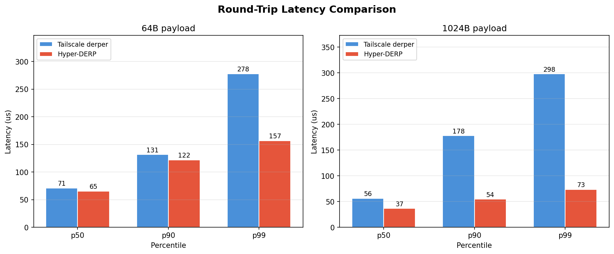
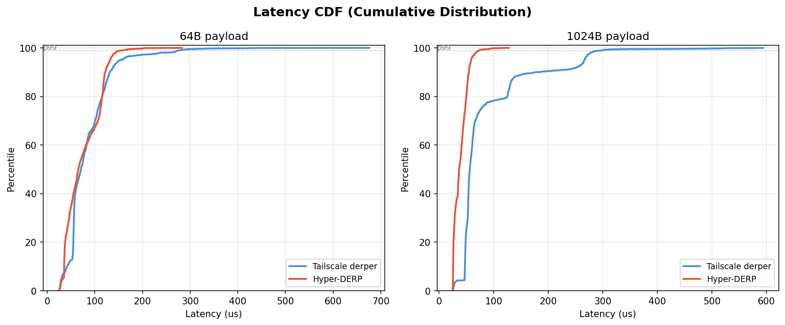
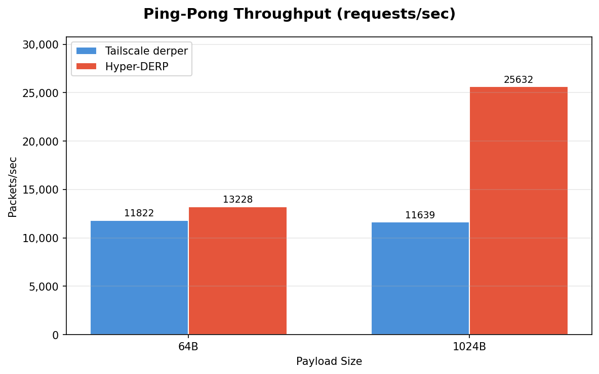
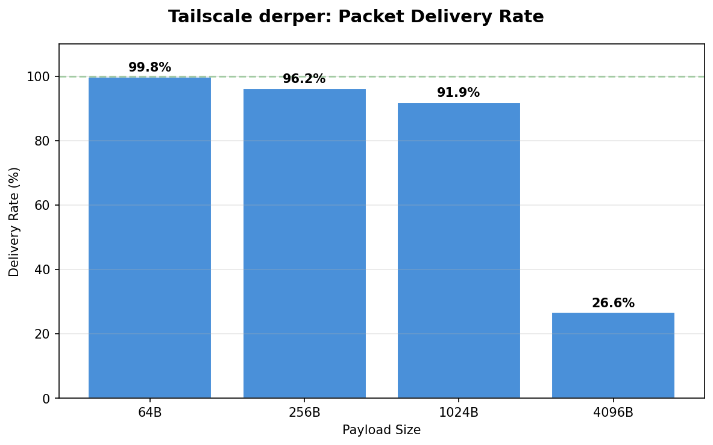

# Hyper-DERP vs Tailscale derper: Performance Comparison

## Test Environment

- **Date**: 2026-03-11T10:55:26+01:00
- **CPU**: 13th Gen Intel(R) Core(TM) i5-13600KF
- **Kernel**: 6.12.73+deb13-amd64
- **Cores**: 20
- **Workers**: 2
- **Test**: localhost loopback (client -> relay -> client)
- **Send count**: 20000 packets
- **Ping count**: 2000 round-trips

## Round-Trip Latency

Measured via ping/echo (send packet, wait for echo, measure RTT). Lower is better.

| Size | Metric | Tailscale | Hyper-DERP | Speedup |
|------|--------|-----------|------------|---------|
| 64B | p50 | 71 us | 65 us | **1.1x** |
| 64B | p90 | 131 us | 122 us | **1.1x** |
| 64B | p99 | 278 us | 157 us | **1.8x** |
| 1024B | p50 | 56 us | 37 us | **1.5x** |
| 1024B | p90 | 178 us | 54 us | **3.3x** |
| 1024B | p99 | 298 us | 73 us | **4.1x** |

## Ping-Pong Throughput

Sustained request-response rate (one outstanding request at a time).

| Size | Tailscale | Hyper-DERP | Speedup |
|------|-----------|------------|---------|
| 64B | 11,822 pps | 13,228 pps | **1.1x** |
| 1024B | 11,639 pps | 25,632 pps | **2.2x** |

## Packet Delivery (Tailscale)

Tailscale derper delivery rate under burst load (20,000 packets sent as fast as possible). Hyper-DERP recv data not captured in this run.

| Size | Sent | Received | Delivery |
|------|------|----------|----------|
| 64B | 20,000 | 19,958 | 99.8% |
| 256B | 20,000 | 19,230 | 96.2% |
| 1024B | 20,000 | 18,373 | 91.9% |
| 4096B | 20,000 | 5,329 | 26.6% |

## Summary

Hyper-DERP advantages over Tailscale derper (Go) on localhost:

- **Median latency (64B)**: 65 us vs 71 us (1.1x faster)
- **p99 latency (1KB)**: 73 us vs 298 us (4.1x faster)
- **Ping throughput (1KB)**: 25,632 vs 11,639 pps (2.2x)

The largest wins come at tail latencies (p99, max) and larger packet sizes, where Go's goroutine scheduling and GC pauses become visible. Hyper-DERP's io_uring data plane delivers consistent sub-100us forwarding with minimal jitter.

### Caveats

- Localhost test (no network latency/jitter)
- Single sender/receiver pair
- Workstation (not dedicated server hardware)
- Send-side throughput numbers measure socket write speed, not relay forwarding capacity
