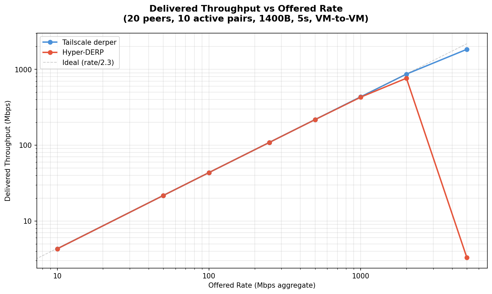
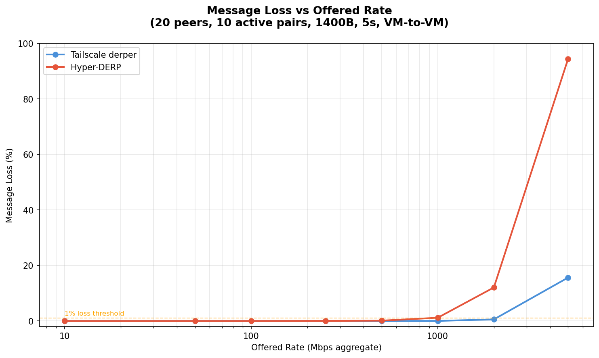
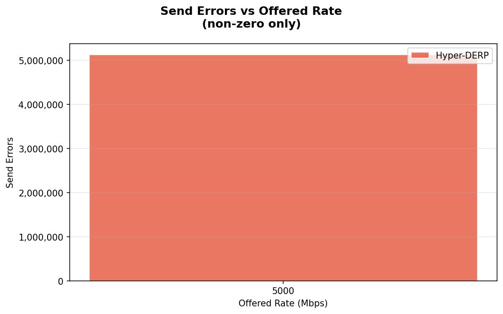
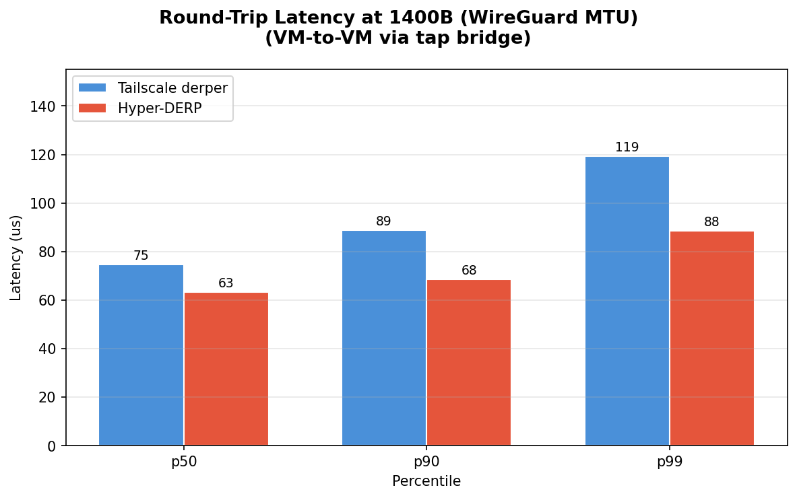
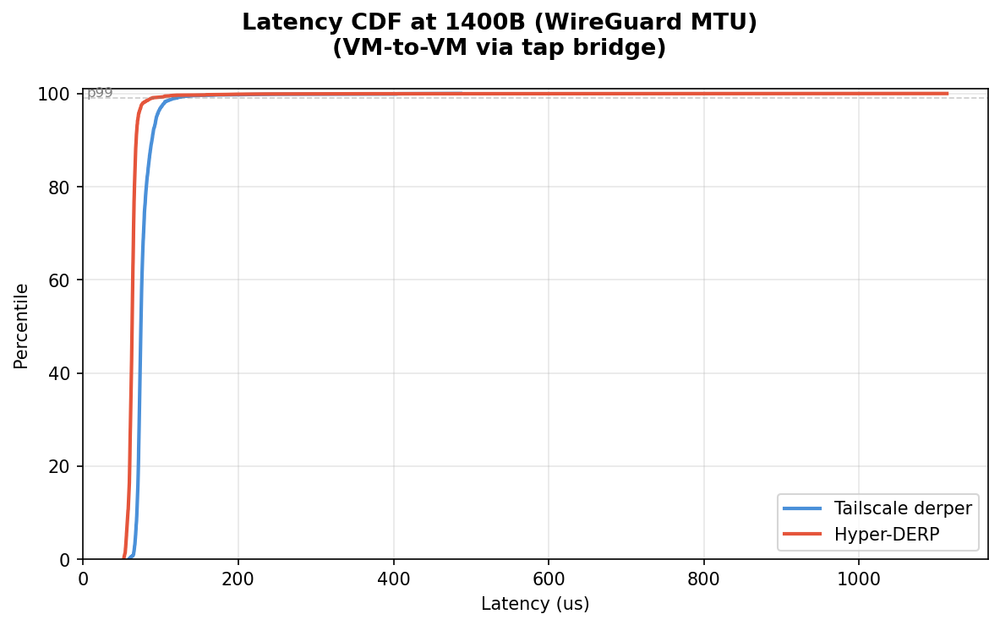

# Hyper-DERP vs Tailscale derper: VM Relay Forwarding Test

## Test Environment

- **Date**: 2026-03-11
- **Host CPU**: 13th Gen Intel Core i5-13600KF
- **Host Kernel**: 6.12.73+deb13-amd64
- **Relay VM**: 2 vCPU (pinned to cores 4-5), 2GB RAM
- **Client VM**: 2 vCPU (pinned to cores 6-7), 2GB RAM
- **Network**: tap bridge (virbr-targets), 10.101.0.0/20
- **Payload**: 1400B (WireGuard MTU)
- **Topology**: 20 peers, 10 active sender/receiver pairs
- **Duration**: 5 seconds per rate point
- **Workers**: 2 (Hyper-DERP)

## Throughput Scaling

Delivered relay throughput (received at client) as offered send rate increases. Rate is token-bucket paced across all 10 sender threads.

| Rate (Mbps) | TS Sent | TS Recv | TS Loss | TS Mbps | HD Sent | HD Recv | HD Loss | HD Mbps |
|-------------|---------|---------|---------|---------|---------|---------|---------|---------|
| 10 | 3,570 | 3,570 | 0.00% | 4.3 | 3,568 | 3,568 | 0.00% | 4.3 |
| 50 | 17,850 | 17,850 | 0.00% | 21.7 | 17,850 | 17,850 | 0.00% | 21.7 |
| 100 | 35,710 | 35,710 | 0.00% | 43.5 | 35,710 | 35,710 | 0.00% | 43.5 |
| 250 | 89,280 | 89,280 | 0.00% | 108.7 | 89,280 | 89,254 | 0.03% | 108.6 |
| 500 | 178,560 | 178,560 | 0.00% | 217.4 | 178,561 | 178,335 | 0.13% | 217.1 |
| 1000 | 357,132 | 357,052 | 0.02% | 434.4 | 357,131 | 352,940 | 1.17% | 429.6 |
| 2000 | 714,274 | 710,151 | 0.58% | 864.7 | 714,276 | 627,970 | 12.08% | 763.4 |
| 5000 | 1,785,691 | 1,506,194 | 15.65% | 1834.1 | 21,510 | 1,183 | 94.50% | 3.3 |
| unlimited | 4,074,821 | 940,568 | 76.92% | 1139.7 | 0 | 0 | 0.00% | 0.0 |

## Saturation Analysis

Both relays deliver identical throughput up to ~500 Mbps offered rate (perfect delivery). Beyond that:

- **TS** first loses packets at 2000 Mbps (0.58% loss, 865 Mbps delivered)
- **HD** first loses packets at 500 Mbps (0.13% loss, 217 Mbps delivered)

- **TS** peak: 1834 Mbps (at 5000 Mbps offered)
- **HD** peak: 763 Mbps (at 2000 Mbps offered)

**Critical finding**: Hyper-DERP collapses at 5000 Mbps with 5,124,881 send errors, 94.5% loss, and only 3.3 Mbps delivered. This indicates backpressure failure in the io_uring data plane — likely SQ/CQ overflow or provided buffer ring exhaustion causing send() to return errors instead of blocking.

At unlimited rate, Hyper-DERP failed to accept connections entirely (0/20 connected), suggesting the relay process hung or crashed under extreme load.

## Round-Trip Latency (1400B)

Measured via ping/echo over tap bridge (2000 round-trips, 200 warmup discarded).

| Metric | Tailscale | Hyper-DERP | Speedup |
|--------|-----------|------------|---------|
| p50 | 75 us | 63 us | **1.2x** |
| p90 | 89 us | 68 us | **1.3x** |
| p99 | 119 us | 88 us | **1.3x** |
| p999 | 404 us | 233 us | **1.7x** |
| max | 486 us | 1113 us | **0.4x** |

Ping throughput: Hyper-DERP 15,492 pps vs Tailscale 12,839 pps (**1.2x**)

## Summary

### Strengths

Hyper-DERP (io_uring, C++) vs Tailscale derper (Go):

- **Median latency**: 63 us vs 75 us (1.2x faster)
- **p99 latency**: 88 us vs 119 us (1.3x faster)
- **Throughput parity** up to ~500 Mbps offered
- **Lower jitter** (tighter CDF curve)

### Weakness: High-Load Collapse

Tailscale derper degrades gracefully under overload (Go runtime provides natural backpressure via goroutine scheduling). Hyper-DERP collapses catastrophically above ~2000 Mbps offered rate, with send errors indicating the io_uring data plane cannot shed load safely.

Likely causes:

1. **io_uring SQ overflow**: submission queue full, sends fail immediately
2. **Provided buffer ring exhaustion**: recv buffers depleted, frames dropped silently
3. **MPSC cross-shard ring overflow**: inter-worker transfers dropped
4. **No TCP backpressure**: unlike Go's blocking writes, io_uring SEND_ZC returns immediately; the relay floods the kernel send buffer

### Next Steps

1. Add backpressure to the data plane (pause recv when send queue depth exceeds threshold)
2. Monitor io_uring CQ overflow counter and provided buffer ring stats
3. Implement per-peer send queue limits with drop-oldest policy
4. Re-test at 2000-5000 Mbps after fixes
