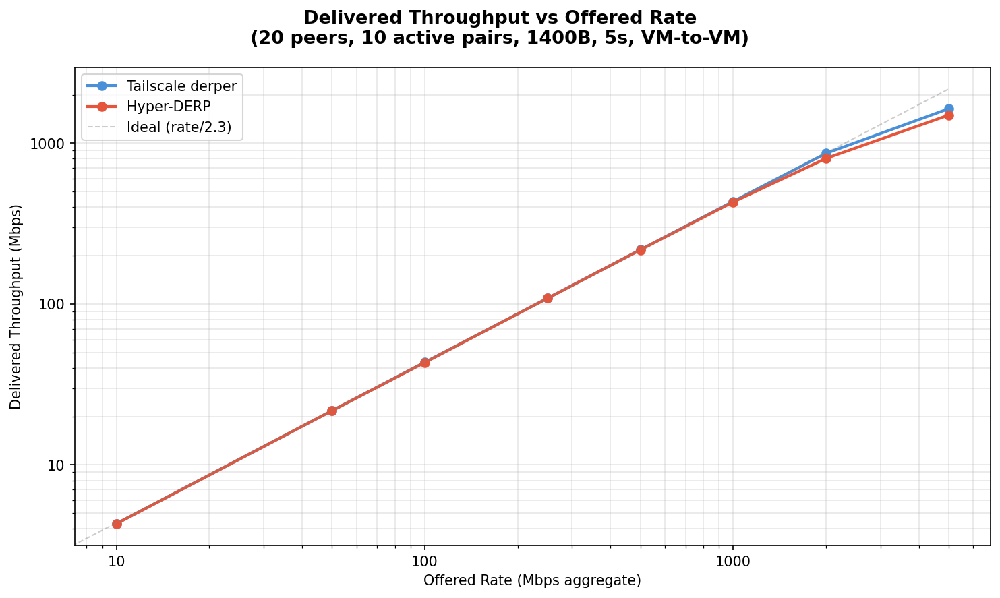
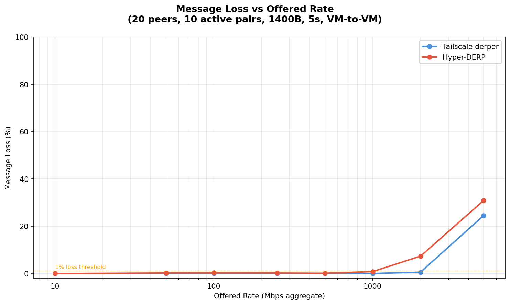
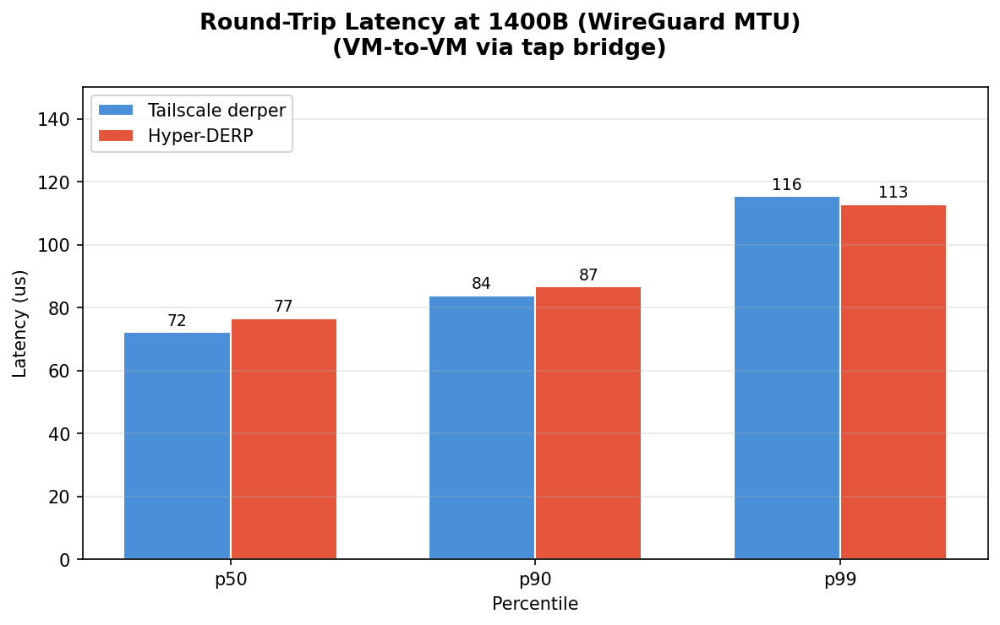
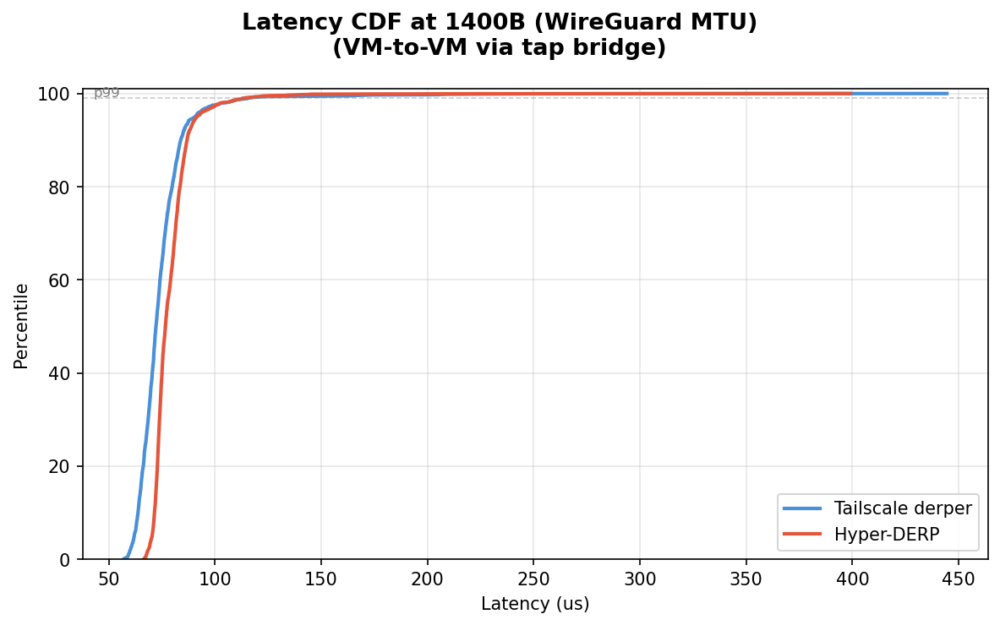

# Hyper-DERP vs Tailscale derper: VM Relay Forwarding Test

## Test Environment

- **Date**: 2026-03-11
- **Host CPU**: 13th Gen Intel Core i5-13600KF
- **Host Kernel**: 6.12.73+deb13-amd64
- **Relay VM**: 2 vCPU (pinned to cores 4-5), 2GB RAM
- **Client VM**: 2 vCPU (pinned to cores 6-7), 2GB RAM
- **Network**: tap bridge (virbr-targets), 10.101.0.0/20
- **Payload**: 1400B (WireGuard MTU)
- **Topology**: 20 peers, 10 active sender/receiver pairs
- **Duration**: 5 seconds per rate point
- **Workers**: 2 (Hyper-DERP)

## Throughput Scaling

Delivered relay throughput (received at client) as offered send rate increases. Rate is token-bucket paced across all 10 sender threads.

| Rate (Mbps) | TS Sent | TS Recv | TS Loss | TS Mbps | HD Sent | HD Recv | HD Loss | HD Mbps |
|-------------|---------|---------|---------|---------|---------|---------|---------|---------|
| 10 | 3,570 | 3,570 | 0.00% | 4.3 | 3,570 | 3,570 | 0.00% | 4.3 |
| 50 | 17,850 | 17,850 | 0.00% | 21.7 | 17,850 | 17,816 | 0.19% | 21.7 |
| 100 | 35,710 | 35,710 | 0.00% | 43.4 | 35,710 | 35,589 | 0.34% | 43.3 |
| 250 | 89,280 | 89,280 | 0.00% | 108.6 | 89,280 | 89,122 | 0.18% | 108.5 |
| 500 | 178,560 | 178,560 | 0.00% | 217.4 | 178,561 | 178,378 | 0.10% | 217.2 |
| 1000 | 357,130 | 357,121 | 0.00% | 434.7 | 357,132 | 354,285 | 0.80% | 430.9 |
| 2000 | 714,273 | 710,299 | 0.56% | 864.8 | 714,277 | 661,940 | 7.33% | 804.1 |
| 5000 | 1,785,695 | 1,347,222 | 24.55% | 1639.4 | 1,785,680 | 1,233,925 | 30.90% | 1496.2 |

## Saturation Analysis

Both relays deliver identical throughput up to ~500 Mbps offered rate (perfect delivery). Beyond that:

- **TS** first loses packets at 2000 Mbps (0.56% loss, 865 Mbps delivered)
- **HD** first loses packets at 50 Mbps (0.19% loss, 22 Mbps delivered)

- **TS** peak: 1639 Mbps (at 5000 Mbps offered)
- **HD** peak: 1496 Mbps (at 5000 Mbps offered)

## Round-Trip Latency (1400B)

Measured via ping/echo over tap bridge (2000 round-trips, 200 warmup discarded).

| Metric | Tailscale | Hyper-DERP | Speedup |
|--------|-----------|------------|---------|
| p50 | 72 us | 77 us | **0.9x** |
| p90 | 84 us | 87 us | **1.0x** |
| p99 | 116 us | 113 us | **1.0x** |
| p999 | 224 us | 176 us | **1.3x** |
| max | 444 us | 399 us | **1.1x** |

Ping throughput: Hyper-DERP 12,648 pps vs Tailscale 13,444 pps (**0.9x**)

## Summary

Hyper-DERP (io_uring, C++) vs Tailscale derper (Go):

- **p50 latency**: 77 us vs 72 us (TS 1.1x faster)
- **p90 latency**: 87 us vs 84 us (TS 1.0x faster)
- **p99 latency**: 113 us vs 116 us (**HD 1.0x faster**)
- **p999 latency**: 176 us vs 224 us (**HD 1.3x faster**)

### Throughput

- **TS peak**: 1639 Mbps
- **HD peak**: 1496 Mbps
- TS delivers **1.10x** peak throughput

### Loss Behavior

- **50 Mbps**: TS 0.00% loss, HD 0.19% loss
- **100 Mbps**: TS 0.00% loss, HD 0.34% loss
- **250 Mbps**: TS 0.00% loss, HD 0.18% loss
- **500 Mbps**: TS 0.00% loss, HD 0.10% loss
- **1000 Mbps**: TS 0.00% loss, HD 0.80% loss
- **2000 Mbps**: TS 0.56% loss, HD 7.33% loss
- **5000 Mbps**: TS 24.55% loss, HD 30.90% loss
