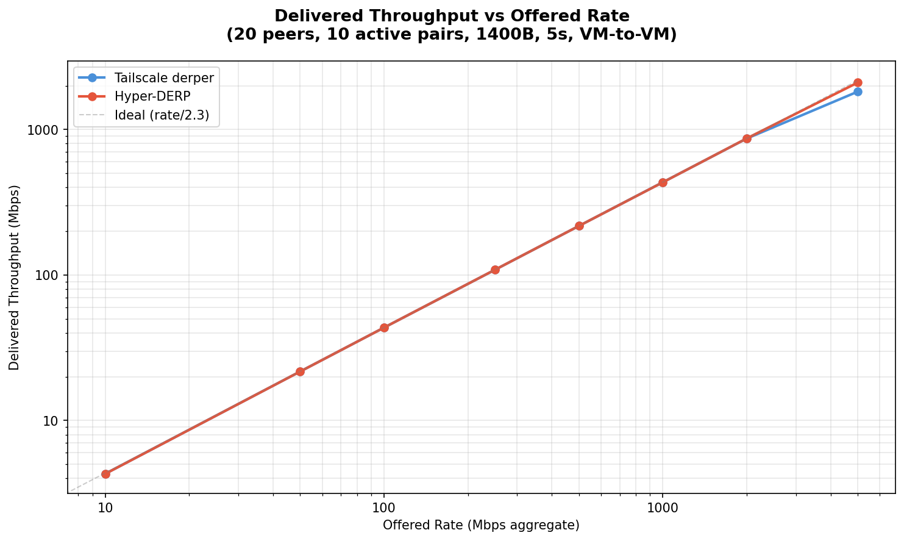
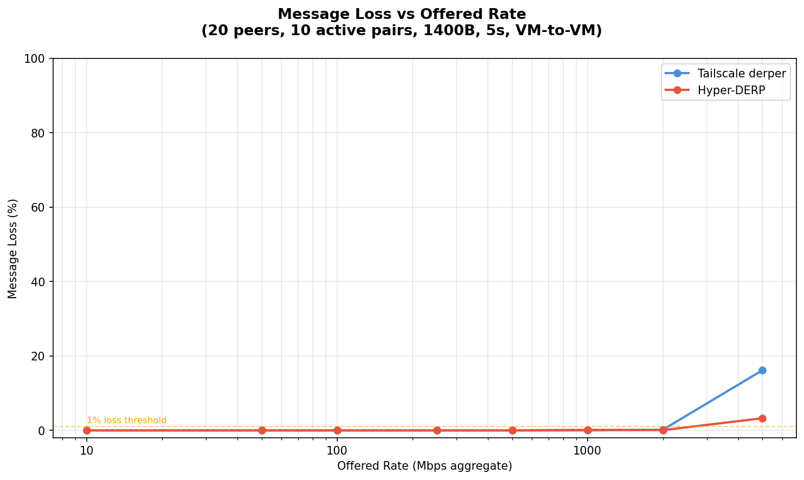
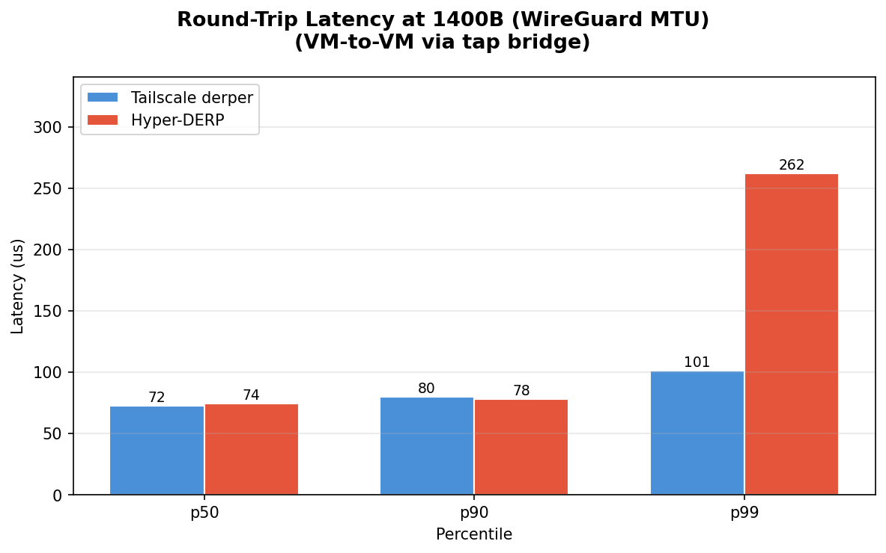
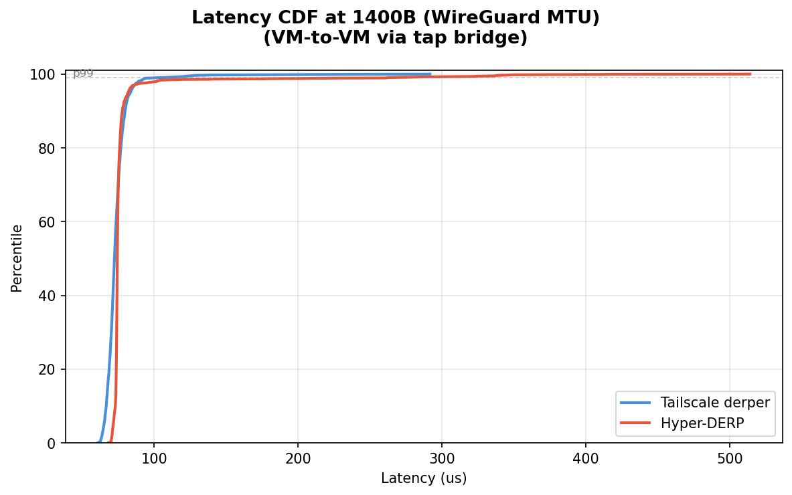

# Hyper-DERP vs Tailscale derper: VM Relay Forwarding Test

## Test Environment

- **Date**: 2026-03-11
- **Host CPU**: 13th Gen Intel Core i5-13600KF
- **Host Kernel**: 6.12.73+deb13-amd64
- **Relay VM**: 2 vCPU (pinned to cores 4-5), 2GB RAM
- **Client VM**: 2 vCPU (pinned to cores 6-7), 2GB RAM
- **Network**: tap bridge (virbr-targets), 10.101.0.0/20
- **Payload**: 1400B (WireGuard MTU)
- **Topology**: 20 peers, 10 active sender/receiver pairs
- **Duration**: 5 seconds per rate point
- **Workers**: 2 (Hyper-DERP)

## Throughput Scaling

Delivered relay throughput (received at client) as offered send rate increases. Rate is token-bucket paced across all 10 sender threads.

| Rate (Mbps) | TS Sent | TS Recv | TS Loss | TS Mbps | HD Sent | HD Recv | HD Loss | HD Mbps |
|-------------|---------|---------|---------|---------|---------|---------|---------|---------|
| 10 | 3,570 | 3,570 | 0.00% | 4.3 | 3,570 | 3,570 | 0.00% | 4.3 |
| 50 | 17,850 | 17,850 | 0.00% | 21.7 | 17,850 | 17,850 | 0.00% | 21.7 |
| 100 | 35,710 | 35,710 | 0.00% | 43.5 | 35,710 | 35,710 | 0.00% | 43.5 |
| 250 | 89,280 | 89,280 | 0.00% | 108.6 | 89,280 | 89,280 | 0.00% | 108.7 |
| 500 | 178,560 | 178,560 | 0.00% | 217.4 | 178,562 | 178,562 | 0.00% | 217.4 |
| 1000 | 357,131 | 357,131 | 0.00% | 434.3 | 357,132 | 356,596 | 0.15% | 433.8 |
| 2000 | 714,274 | 712,965 | 0.18% | 867.3 | 714,276 | 713,791 | 0.07% | 869.1 |
| 5000 | 1,785,700 | 1,496,754 | 16.18% | 1821.4 | 1,785,583 | 1,727,093 | 3.28% | 2102.2 |

## Saturation Analysis

Both relays deliver identical throughput up to ~500 Mbps offered rate (perfect delivery). Beyond that:

- **TS** first loses packets at 2000 Mbps (0.18% loss, 867 Mbps delivered)
- **HD** first loses packets at 1000 Mbps (0.15% loss, 434 Mbps delivered)

- **TS** peak: 1821 Mbps (at 5000 Mbps offered)
- **HD** peak: 2102 Mbps (at 5000 Mbps offered)

## Round-Trip Latency (1400B)

Measured via ping/echo over tap bridge (2000 round-trips, 200 warmup discarded).

| Metric | Tailscale | Hyper-DERP | Speedup |
|--------|-----------|------------|---------|
| p50 | 72 us | 74 us | **1.0x** |
| p90 | 80 us | 78 us | **1.0x** |
| p99 | 101 us | 262 us | **0.4x** |
| p999 | 215 us | 410 us | **0.5x** |
| max | 292 us | 514 us | **0.6x** |

Ping throughput: Hyper-DERP 12,784 pps vs Tailscale 13,597 pps (**0.9x**)

## Summary

Hyper-DERP (io_uring, C++) vs Tailscale derper (Go):

- **p50 latency**: 74 us vs 72 us (TS 1.0x faster)
- **p90 latency**: 78 us vs 80 us (**HD 1.0x faster**)
- **p99 latency**: 262 us vs 101 us (TS 2.6x faster)
- **p999 latency**: 410 us vs 215 us (TS 1.9x faster)

### Throughput

- **TS peak**: 1821 Mbps
- **HD peak**: 2102 Mbps
- HD delivers **1.15x** peak throughput

### Loss Behavior

- **1000 Mbps**: TS 0.00% loss, HD 0.15% loss
- **2000 Mbps**: TS 0.18% loss, HD 0.07% loss
- **5000 Mbps**: TS 16.18% loss, HD 3.28% loss
