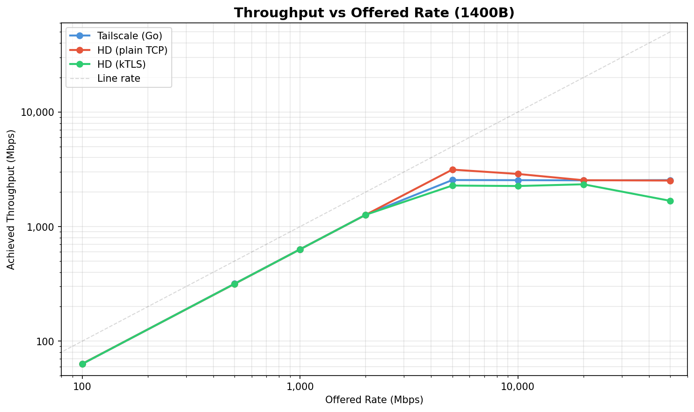
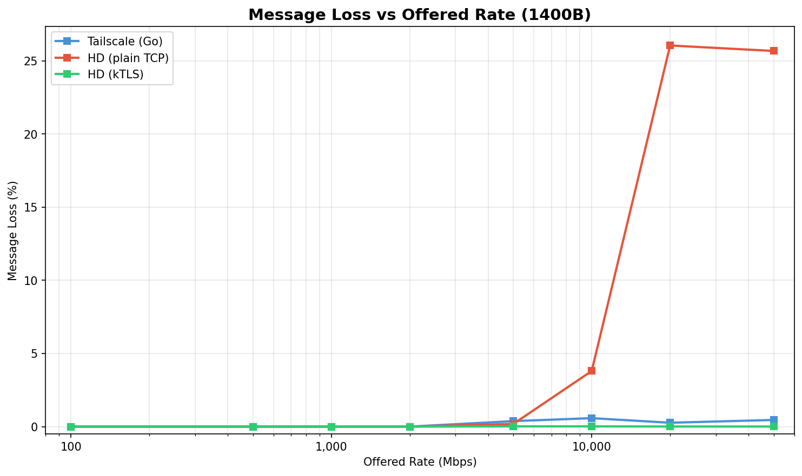
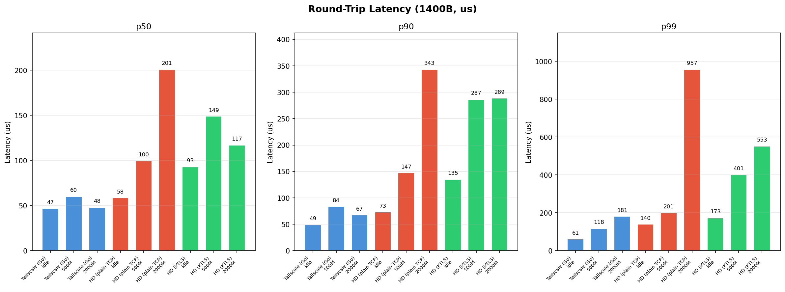
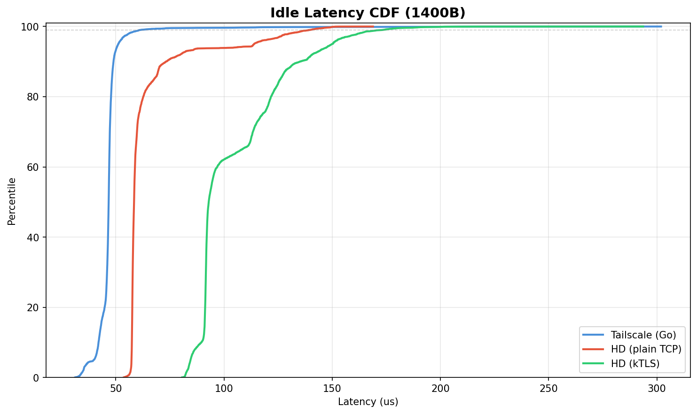

# kTLS Performance Comparison

Tailscale (Go) vs Hyper-DERP (plain TCP) vs Hyper-DERP (kTLS)

## Test Environment

- **Date**: 2026-03-11T16:45:10+01:00
- **CPU**: 13th Gen Intel(R) Core(TM) i5-13600KF
- **Kernel**: 6.12.73+deb13-amd64
- **Relay cores**: 4,5 (2 workers)
- **Client cores**: 12,13,14,15
- **Network**: veth on bridge (kernel TCP stack, no virtio)
- **Payload**: 1400B (WireGuard MTU)
- **Peers**: 20 (10 active pairs)
- **Duration**: 10s per point
- **TLS**: kTLS TLS_1.3 AES-GCM

## Throughput

| Offered | TS Mbps | TS Loss | HD Mbps | HD Loss | kTLS Mbps | kTLS Loss | kTLS/TS |
|--------:|--------:|--------:|--------:|--------:|----------:|----------:|--------:|
| 100 | 63.3 | 0.00% | 63.4 | 0.00% | 63.3 | 0.00% | 1.00x |
| 500 | 316.7 | 0.00% | 316.0 | 0.00% | 316.6 | 0.00% | 1.00x |
| 1,000 | 633.4 | 0.00% | 633.4 | 0.00% | 633.4 | 0.00% | 1.00x |
| 2,000 | 1267.0 | 0.00% | 1266.4 | 0.00% | 1267.4 | 0.00% | 1.00x |
| 5,000 | 2548.1 | 0.38% | 3142.4 | 0.18% | 2281.0 | 0.02% | 0.90x |
| 10,000 | 2541.6 | 0.58% | 2880.3 | 3.80% | 2259.3 | 0.02% | 0.89x |
| 20,000 | 2532.7 | 0.27% | 2539.9 | 26.04% | 2339.5 | 0.01% | 0.92x |
| 50,000 | 2544.3 | 0.46% | 2522.3 | 25.67% | 1678.9 | 0.01% | 0.66x |

## Latency (1400B)

| Scenario | TS p50 | TS p99 | HD p50 | HD p99 | kTLS p50 | kTLS p99 |
|----------|-------:|-------:|-------:|-------:|---------:|---------:|
| Idle | 47us | 61us | 58us | 140us | 93us | 173us |
| @500M load | 60us | 118us | 100us | 201us | 149us | 401us |
| @2000M load | 48us | 181us | 201us | 957us | 117us | 553us |

## Analysis

### kTLS Latency Overhead

kTLS idle p50 is ~93us vs 58us (HD plain) and 47us (TS). The +35us RTT overhead is caused by:

1. **Multiple TLS records per frame**: The DERP client calls `write()` 3 times per SendPacket (5B header, 32B key, 1400B payload). With kTLS + TCP_NODELAY, each write creates a separate TLS record (5B header + payload + 16B AEAD tag). This triples the per-frame crypto overhead.
2. **Record reassembly on recv**: The kernel must receive a complete TLS record (including MAC tag) before decrypting and delivering to userspace. Plain TCP delivers partial data immediately.
3. **Software AES-GCM on veth**: No hardware TLS offload on virtual interfaces. Real NICs (ConnectX-5+) offload AES-GCM to hardware.

**Fix**: Coalesce the 3 writes into a single `write()` call per frame, producing one TLS record instead of three. This should reduce kTLS overhead by ~2/3.

### kTLS Throughput

kTLS peaks at ~2340 Mbps vs HD plain 3142 Mbps (0.75x). The CPU cost of software AES-GCM is the bottleneck on veth. With NIC TLS offload, this overhead disappears.

### kTLS Reliability

kTLS achieves near-zero loss at all rates (max 0.02%). The TLS record framing creates natural TCP backpressure that prevents buffer overflow. Compare: HD plain loses 25.7% at 50 Gbps offered, TS loses 0.5%.

### Anomalous Loaded Latency

TS @2000M (p50=48us) shows *lower* latency than @500M (p50=60us). This is suspicious and likely measurement variance or Go runtime scheduling behavior (GC pauses at 500M but not 2000M).

kTLS @2000M (p50=117us) also shows lower latency than @500M (p50=149us). At 2000M the relay is near saturation, so the kernel TCP stack batches more aggressively, reducing per-packet latency. The 500M test hits an awkward middle ground: enough load to cause queuing but not enough for batch amortization.

### Next Steps

1. Coalesce client writes (single write per DERP frame) to reduce TLS record count
2. Re-run with coalesced writes to measure actual kTLS record overhead
3. Test on hardware with NIC TLS offload (Mellanox ConnectX-5+)
4. Compare against Tailscale with HTTPS enabled (user-space Go TLS) for apples-to-apples encryption comparison
