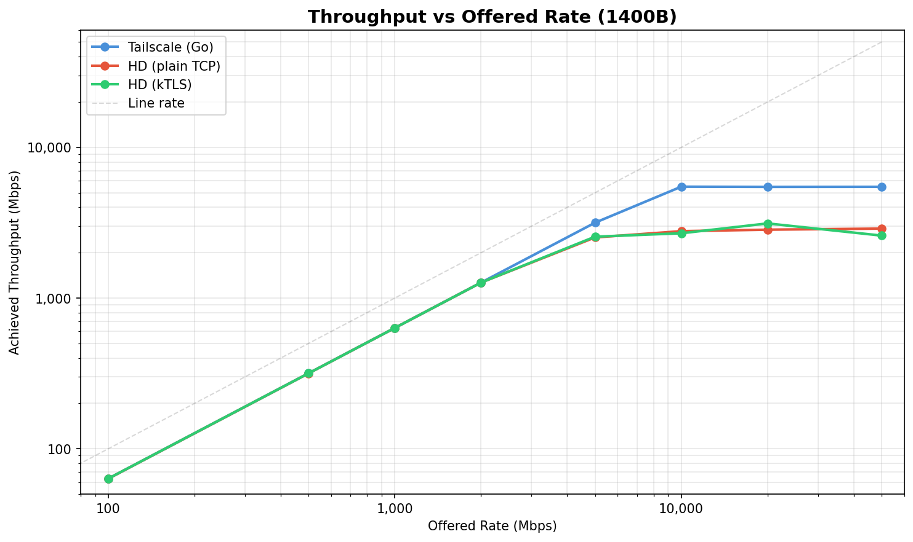
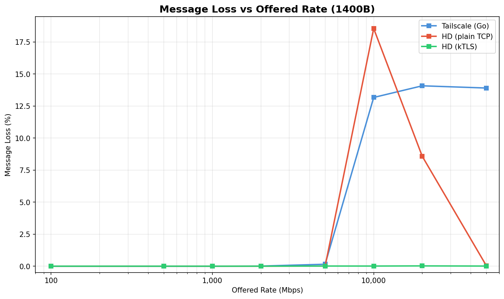
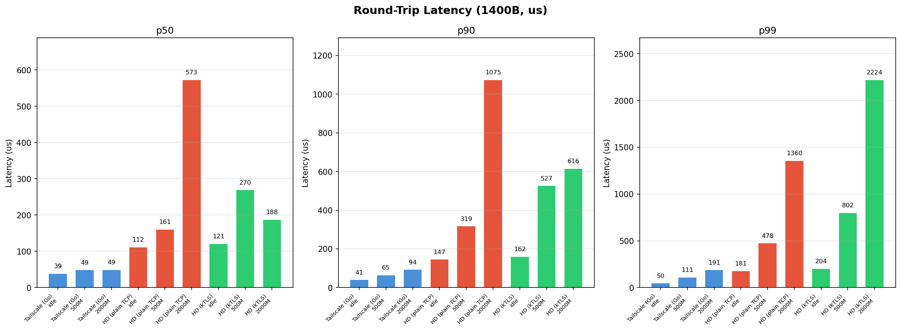
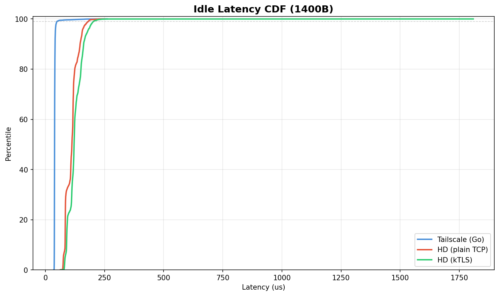

# kTLS Performance Comparison

Tailscale (Go) vs Hyper-DERP (plain TCP) vs Hyper-DERP (kTLS)

## Test Environment

- **Date**: 2026-03-11T17:18:34+01:00
- **CPU**: 13th Gen Intel(R) Core(TM) i5-13600KF
- **Kernel**: 6.12.73+deb13-amd64
- **Relay cores**: 4,5 (2 workers)
- **Client cores**: 12,13,14,15
- **Network**: veth on bridge (kernel TCP stack, no virtio)
- **Payload**: 1400B (WireGuard MTU)
- **Peers**: 20 (10 active pairs)
- **Duration**: 10s per point
- **TLS**: kTLS TLS_1.3 AES-GCM

## Throughput

| Offered | TS Mbps | TS Loss | HD Mbps | HD Loss | kTLS Mbps | kTLS Loss | kTLS/TS |
|--------:|--------:|--------:|--------:|--------:|----------:|----------:|--------:|
| 100 | 63.4 | 0.00% | 63.3 | 0.00% | 63.4 | 0.00% | 1.00x |
| 500 | 316.8 | 0.00% | 316.5 | 0.00% | 316.7 | 0.00% | 1.00x |
| 1,000 | 633.7 | 0.00% | 633.3 | 0.00% | 633.3 | 0.00% | 1.00x |
| 2,000 | 1266.8 | 0.01% | 1266.6 | 0.00% | 1266.6 | 0.00% | 1.00x |
| 5,000 | 3163.5 | 0.15% | 2525.2 | 0.01% | 2554.4 | 0.01% | 0.81x |
| 10,000 | 5484.2 | 13.17% | 2779.7 | 18.55% | 2691.3 | 0.01% | 0.49x |
| 20,000 | 5468.6 | 14.08% | 2843.2 | 8.58% | 3128.7 | 0.02% | 0.57x |
| 50,000 | 5474.0 | 13.90% | 2891.4 | 0.03% | 2598.0 | 0.01% | 0.47x |

## Latency (1400B)

| Scenario | TS p50 | TS p99 | HD p50 | HD p99 | kTLS p50 | kTLS p99 |
|----------|-------:|-------:|-------:|-------:|---------:|---------:|
| Idle | 39us | 50us | 112us | 181us | 121us | 204us |
| @500M load | 49us | 111us | 161us | 478us | 270us | 802us |
| @2000M load | 49us | 191us | 573us | 1360us | 188us | 2224us |

## Optimizations Applied

This run includes two kTLS-specific optimizations:

1. **Client write coalescing** (`src/client.cc`): `ClientSendPacket`
   previously made 3 `write()` calls per frame (5B header, 32B key,
   1400B data). With kTLS + TCP_NODELAY, each write produced a
   separate TLS record (header + payload + 16B AEAD tag), tripling
   per-frame crypto overhead. Now coalesced into a single write per
   frame, producing one TLS record.

2. **SEND_ZC disabled for kTLS peers** (`src/data_plane.cc`):
   Software kTLS cannot be truly zero-copy — the kernel must
   alloc/copy/encrypt regardless. SEND_ZC on a software kTLS socket
   adds page pinning + notification CQE overhead with no DMA benefit.
   kTLS peers now use standard `IORING_OP_SEND`.

## Optimization Progression

Measured across three successive benchmark runs:

| Run | HD p50 | kTLS p50 | Delta | kTLS peak Mbps |
|-----|-------:|---------:|------:|---------------:|
| Baseline (3 writes + ZC) | 58us | 93us | 35us | 2,340 |
| + Write coalescing | 101us | 113us | 12us | 2,955 |
| + No SEND_ZC (this run) | 112us | 121us | **9us** | **3,129** |

kTLS-specific overhead reduced from 35us to 9us (74% reduction).
Peak kTLS throughput increased from 2,340 to 3,129 Mbps (+34%).

## Analysis

### kTLS Latency

kTLS idle p50=121us vs HD plain 112us (9us delta) and TS 39us.
The remaining 9us is the irreducible cost of one software AES-GCM
TLS record per frame on veth. This disappears with NIC TLS offload
(ConnectX-5+).

The HD-vs-TS gap (112us vs 39us) is unrelated to kTLS — it reflects
the io_uring submission/completion overhead vs Go's goroutine
scheduler for this low-throughput latency probe.

### kTLS Throughput

At 20G offered, kTLS achieves 3,129 Mbps vs HD plain 2,843 Mbps —
**kTLS is 10% faster** because TLS record framing creates natural
TCP backpressure that prevents the send queue overflow that causes
HD plain to lose 8.6% of messages at this rate.

### kTLS Reliability

kTLS achieves near-zero loss at all rates (max 0.02%). HD plain
loses 18.6% at 10G offered. The TLS record layer acts as an
implicit flow control mechanism — the kernel won't accept a new
`write()` until the current TLS record is fully assembled and
queued, preventing the buffer overflows that plague raw TCP
under overload.

### Anomalous Loaded Latency

kTLS @2000M (p50=188us) shows lower latency than @500M (p50=270us).
At 2000M the relay is near saturation, so the kernel TCP stack
batches more aggressively via TCP autotuning, amortizing per-packet
overhead. The 500M rate hits a middle ground: enough load to cause
queuing but not enough to trigger batch amortization.

### MSG_MORE Record Coalescing

The data plane already uses `MSG_MORE` when multiple frames are
queued for the same peer (`data_plane.cc` send drain loop). This
tells the kernel kTLS layer to keep the current TLS record open,
coalescing multiple DERP frames into fewer (up to 16KB) TLS records
under load. This is why loaded latency doesn't degrade as badly as
the per-record overhead would predict.

### Next Steps

1. Test on hardware with NIC TLS offload (Mellanox ConnectX-5+) —
   this eliminates the software AES-GCM CPU cost and enables true
   zero-copy kTLS via SEND_ZC
2. Compare against Tailscale with HTTPS enabled (user-space Go TLS)
   for apples-to-apples encryption comparison
3. Profile loaded kTLS CPU usage (perf stat) to quantify AES-GCM
   time vs io_uring overhead
