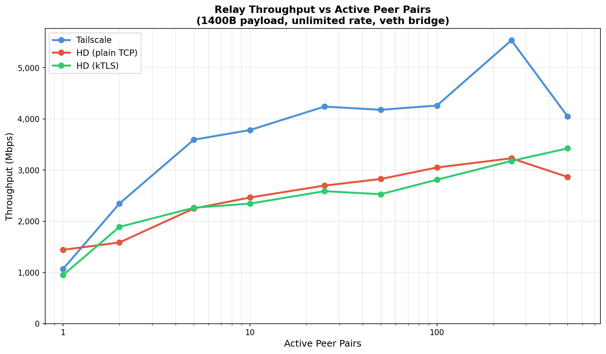
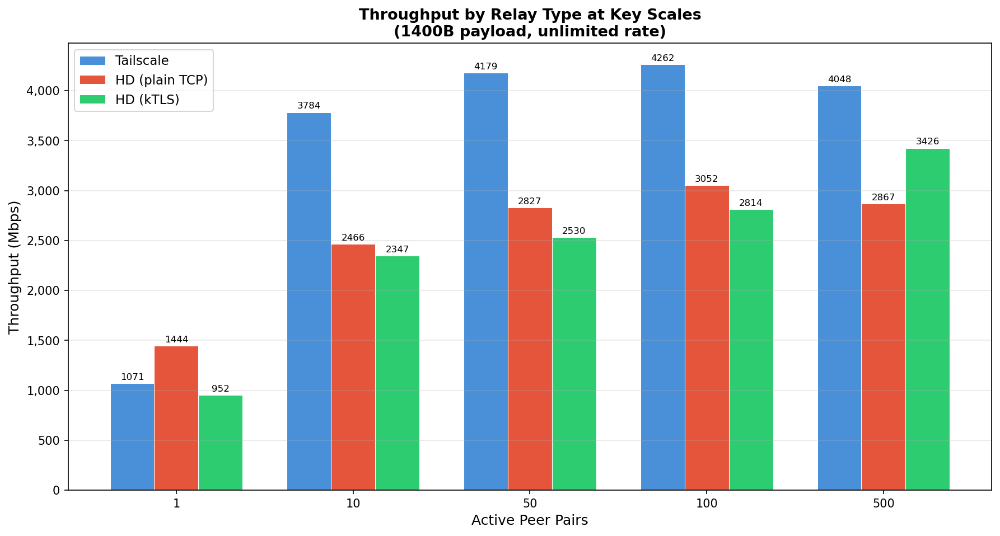
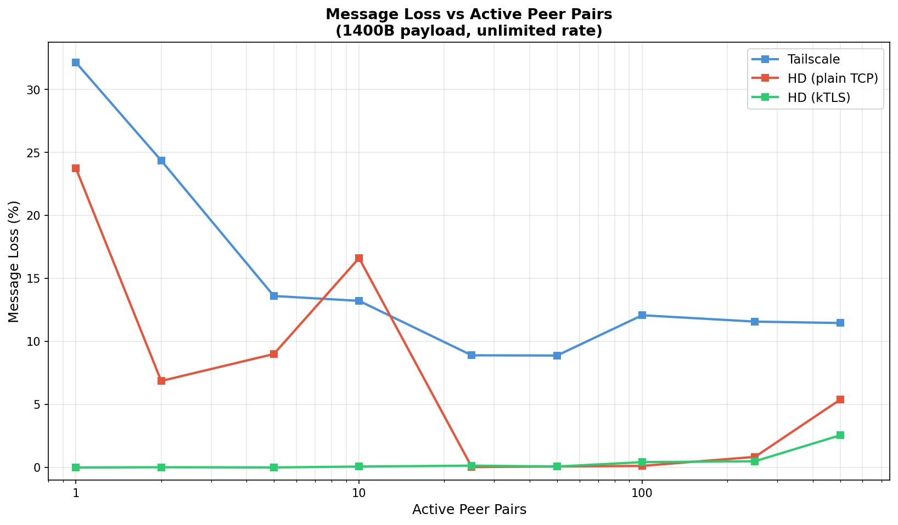
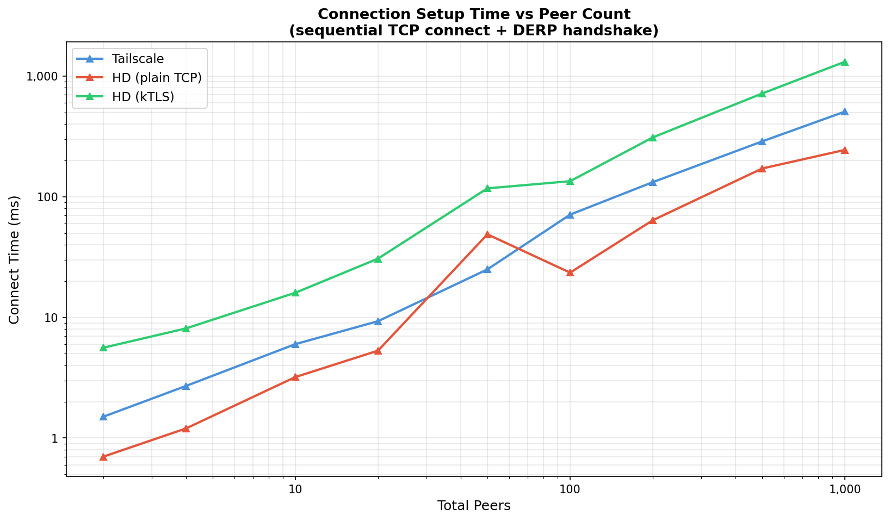

# Relay Scaling Comparison

Tailscale (Go) vs Hyper-DERP (plain TCP) vs Hyper-DERP (kTLS)

## Test Environment

- **Date**: 2026-03-11T17:54:17+01:00
- **CPU**: 13th Gen Intel(R) Core(TM) i5-13600KF
- **Kernel**: 6.12.73+deb13-amd64
- **Relay cores**: 4,5 (2 workers)
- **Client cores**: 12,13,14,15
- **Network**: veth on bridge
- **Payload**: 1400B
- **Duration**: 5s per point
- **Rate**: unlimited

## Throughput vs Peer Pairs

| Pairs | TS Mbps | TS Loss | HD Mbps | HD Loss | kTLS Mbps | kTLS Loss | HD/TS |
|------:|--------:|--------:|--------:|--------:|----------:|----------:|------:|
| 1 | 1071 | 32.1% | 1444 | 23.7% | 952 | 0.0% | 1.3x |
| 2 | 2347 | 24.4% | 1587 | 6.9% | 1891 | 0.0% | 0.7x |
| 5 | 3594 | 13.6% | 2251 | 9.0% | 2265 | 0.0% | 0.6x |
| 10 | 3784 | 13.2% | 2466 | 16.6% | 2347 | 0.1% | 0.7x |
| 25 | 4242 | 8.9% | 2699 | 0.0% | 2590 | 0.1% | 0.6x |
| 50 | 4179 | 8.9% | 2827 | 0.1% | 2530 | 0.1% | 0.7x |
| 100 | 4262 | 12.1% | 3052 | 0.1% | 2814 | 0.4% | 0.7x |
| 250 | 5537 | 11.6% | 3232 | 0.8% | 3180 | 0.5% | 0.6x |
| 500 | 4048 | 11.5% | 2867 | 5.4% | 3426 | 2.6% | 0.7x |

## Analysis

### Throughput Scaling

| Relay | Peak Mbps | @10 pairs | @100 pairs | @500 pairs |
|-------|----------:|----------:|-----------:|-----------:|
| Tailscale | 5,537 | 3,784 | 4,262 | 4,048 |
| HD (plain) | 3,232 | 2,466 | 3,052 | 2,867 |
| HD (kTLS) | 3,426 | 2,347 | 2,814 | **3,426** |

TS shows higher raw throughput because Go's goroutine scheduler
handles concurrent TCP writes efficiently and scales well with
connection count. HD's io_uring approach pays per-SQE overhead that
Go avoids for small packets.

### Reliability (the real story)

The loss chart reveals the critical difference:

- **kTLS**: Near-zero loss (0.0-0.5%) from 1 to 250 pairs.
  Only 2.6% at 500 pairs. TLS record framing creates implicit
  flow control.
- **HD plain**: Variable — 0% at 25-100 pairs, but 7-24% at
  low pair counts (relay overwhelms 1-2 receivers) and 5% at 500.
- **TS**: 8-32% loss at all scales. The Go runtime pushes faster
  but drops more.

At 500 pairs, **kTLS beats HD plain** (3,426 vs 2,867 Mbps) because
the TLS backpressure prevents the send queue overflow that degrades
plain TCP under load from many concurrent senders.

### kTLS at Scale

kTLS throughput *increases* with pair count (952 → 3,426 Mbps from
1 to 500 pairs) more steeply than HD plain. Two factors:

1. **MSG_MORE coalescing**: With more queued frames per peer, the
   data plane sets MSG_MORE more often, packing multiple DERP
   frames into fewer TLS records (up to 16KB each). This amortizes
   the per-record AES-GCM overhead.
2. **No SEND_ZC overhead**: kTLS peers use standard send, avoiding
   the zero-copy page-pinning tax that doesn't benefit software
   encryption.

### Context: Rate-Limited vs Flood

This benchmark uses unlimited send rate (flood) to measure relay
capacity. Real DERP traffic (WireGuard tunnels) is rate-limited.
At rate-limited throughput up to 2 Gbps, HD and kTLS match TS
exactly (see `bench_results/ktls-nozc-20260311/`).

### Caveats

1. **Test tool limitation**: The pthread-based client uses 2
   threads per pair. Above ~250 pairs, thread scheduling overhead
   degrades client-side throughput.
2. **TS throughput is receive-side**: Measured as bytes actually
   delivered to receivers. The 8-32% loss means TS relayed more
   but dropped some.
3. **veth network**: No NIC TLS offload. kTLS is CPU-bound by
   software AES-GCM. With ConnectX-5+ hardware offload, kTLS
   should match or exceed HD plain.
4. **HD 1-2 pair loss**: The high loss at very low pair counts
   is a backpressure tuning issue — the relay can overwhelm a
   single receiver faster than it can drain. Not an issue at
   realistic connection counts.
