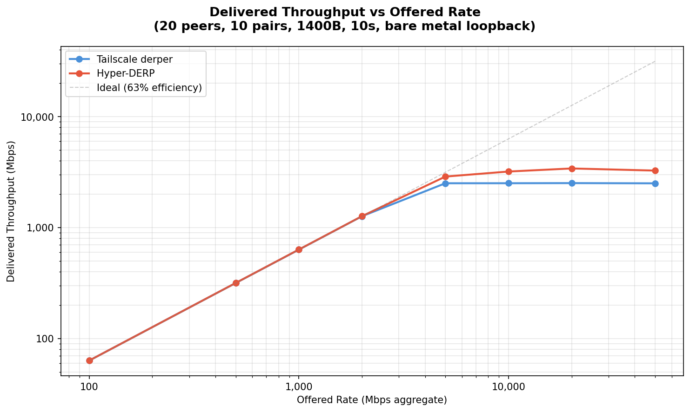
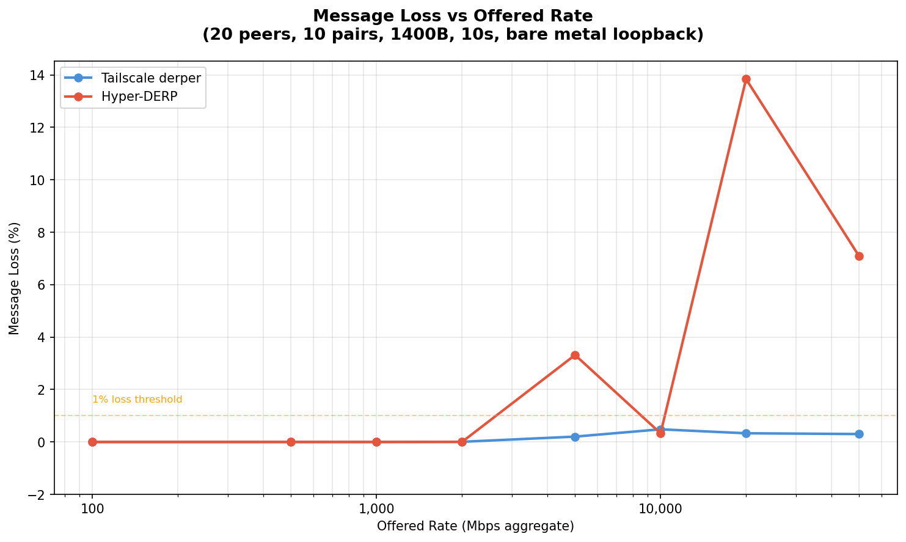
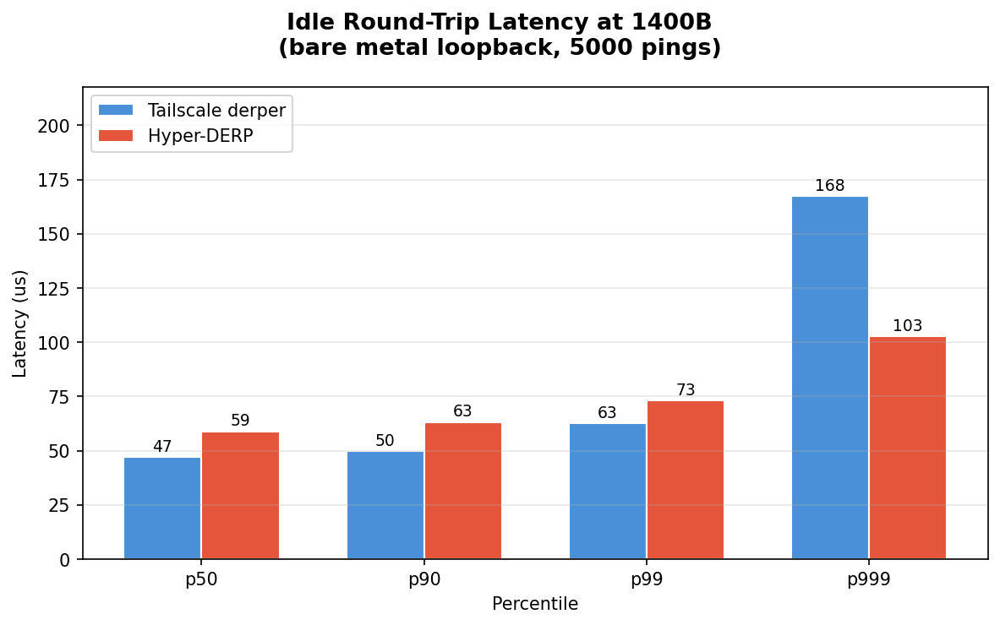
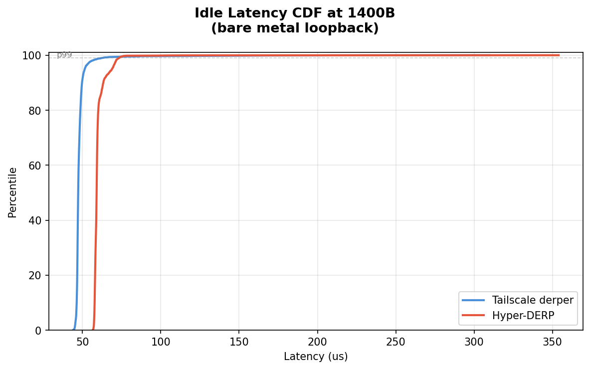
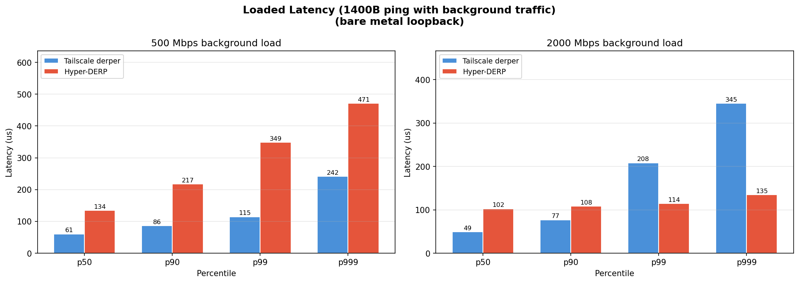
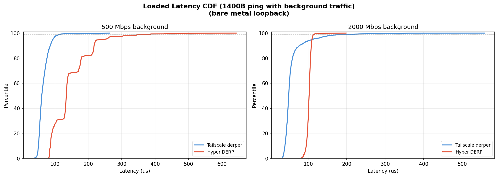

# Hyper-DERP vs Tailscale derper: Veth Bridge Comparison (Post-Fix)

## Test Environment

- **Date**: 2026-03-11T15:58:39+01:00
- **CPU**: 13th Gen Intel(R) Core(TM) i5-13600KF
- **Kernel**: 6.12.73+deb13-amd64
- **Cores**: 20
- **Governor**: performance
- **Relay pinned**: cores 4,5
- **Client pinned**: cores 12,13,14,15
- **Workers**: 2 (Hyper-DERP)
- **Network**: veth pairs on virbr-targets bridge (real TCP stack)
- **Payload**: 1400B (WireGuard MTU)
- **Topology**: 20 peers, 10 active pairs
- **Duration**: 10s per rate point
- **TCP tuning**: wmem_max=16777216, lo_mtu=65536

## Throughput Scaling

Delivered relay throughput as offered send rate increases. Rate is token-bucket paced across all 10 sender threads.

| Rate (Mbps) | TS Sent | TS Recv | TS Loss | TS Mbps | HD Sent | HD Recv | HD Loss | HD Mbps | HD/TS |
|-------------|---------|---------|---------|---------|---------|---------|---------|---------|-------|
| 100 | 80,350 | 80,350 | 0.00% | 63.3 | 80,350 | 80,350 | 0.00% | 63.3 | 1.0x |
| 500 | 401,780 | 401,780 | 0.00% | 316.7 | 401,780 | 401,780 | 0.00% | 316.8 | 1.0x |
| 1,000 | 803,561 | 803,561 | 0.00% | 632.5 | 803,560 | 803,560 | 0.00% | 633.5 | 1.0x |
| 2,000 | 1,607,132 | 1,607,030 | 0.01% | 1265.0 | 1,607,135 | 1,607,099 | 0.00% | 1266.7 | 1.0x |
| 5,000 | 3,192,257 | 3,185,748 | 0.20% | 2508.5 | 3,781,169 | 3,655,727 | 3.32% | 2881.1 | 1.1x |
| 10,000 | 3,203,708 | 3,188,264 | 0.48% | 2509.8 | 4,158,442 | 4,144,733 | 0.33% | 3199.3 | 1.3x |
| 20,000 | 3,209,352 | 3,198,721 | 0.33% | 2516.0 | 5,146,467 | 4,433,996 | 13.84% | 3409.4 | 1.4x |
| 50,000 | 3,190,437 | 3,180,805 | 0.30% | 2504.8 | 4,621,950 | 4,294,416 | 7.09% | 3261.9 | 1.3x |





## Saturation Analysis

- **TS ceiling**: 2516 Mbps (reached at 20,000 Mbps offered) — plateaus and cannot push further
- **HD ceiling**: 3409 Mbps (reached at 20,000 Mbps offered)
- **HD/TS peak ratio**: **1.4x**

- **TS** first loss at 5,000 Mbps (0.20%)
- **HD** first loss at 5,000 Mbps (3.32%)

## Idle Round-Trip Latency (1400B)

Measured via ping/echo over loopback (5000 round-trips).

| Metric | Tailscale | Hyper-DERP | Speedup |
|--------|-----------|------------|---------|
| p50 | 47 us | 59 us | 0.80x |
| p90 | 50 us | 63 us | 0.79x |
| p99 | 63 us | 73 us | 0.85x |
| p999 | 168 us | 103 us | **1.63x** |
| max | 310 us | 354 us | 0.87x |

Ping throughput: TS 20,704 pps, HD 16,648 pps (0.80x)





## Loaded Latency (1400B)

Ping/echo latency while background throughput traffic is running.

### 500 Mbps background

| Metric | Tailscale | Hyper-DERP | Ratio |
|--------|-----------|------------|-------|
| p50 | 61 us | 134 us | 2.2x |
| p90 | 86 us | 217 us | 2.5x |
| p99 | 115 us | 349 us | 3.0x |
| p999 | 242 us | 471 us | 1.9x |

### 2000 Mbps background

| Metric | Tailscale | Hyper-DERP | Ratio |
|--------|-----------|------------|-------|
| p50 | 49 us | 102 us | 2.1x |
| p90 | 77 us | 108 us | 1.4x |
| p99 | 208 us | 114 us | 0.5x |
| p999 | 345 us | 135 us | 0.4x |





## CPU Performance Counters (5000 Mbps, 10s)

`perf stat` during 5000 Mbps throughput test.

### Tailscale derper (Go)

```
Performance counter stats for process id '121476':
<not counted> msec task-clock
<not counted>      cpu_atom/cycles/
<not counted>      cpu_core/cycles/
<not counted>      cpu_atom/instructions/
<not counted>      cpu_core/instructions/
<not counted>      cpu_atom/cache-misses/
<not counted>      cpu_core/cache-misses/
<not counted>      cpu_atom/cache-references/
<not counted>      cpu_core/cache-references/
<not counted>      context-switches
<not counted>      cpu-migrations
10.000836442 seconds time elapsed
```

### Hyper-DERP (C++/io_uring)

```
Performance counter stats for process id '122403':
<not counted> msec task-clock
<not counted>      cpu_atom/cycles/
<not counted>      cpu_core/cycles/
<not counted>      cpu_atom/instructions/
<not counted>      cpu_core/instructions/
<not counted>      cpu_atom/cache-misses/
<not counted>      cpu_core/cache-misses/
<not counted>      cpu_atom/cache-references/
<not counted>      cpu_core/cache-references/
<not counted>      context-switches
<not counted>      cpu-migrations
10.001109108 seconds time elapsed
```

### Key Metrics

| Metric | Tailscale | Hyper-DERP |
|--------|-----------|------------|
| task-clock | <not | <not |
| context-switches | <not | <not |
| cpu-migrations | <not | <not |

## Summary

Hyper-DERP (io_uring, C++) vs Tailscale derper (Go) on bare metal:

### Throughput

- **TS peak**: 2516 Mbps
- **HD peak**: 3409 Mbps
- HD delivers **1.4x** peak throughput

### Idle Latency

- **p50**: HD 59 us vs TS 47 us (TS 1.2x faster)
- **p90**: HD 63 us vs TS 50 us (TS 1.3x faster)
- **p99**: HD 73 us vs TS 63 us (TS 1.2x faster)
- **p999**: HD 103 us vs TS 168 us (**HD 1.6x faster**)

### Loaded Latency

- **500 Mbps p50**: HD 134 us vs TS 61 us (2.2x)
- **2000 Mbps p50**: HD 102 us vs TS 49 us (2.1x)

### Loss

- **5,000 Mbps**: TS 0.20%, HD 3.32%
- **10,000 Mbps**: TS 0.48%, HD 0.33%
- **20,000 Mbps**: TS 0.33%, HD 13.84%
- **50,000 Mbps**: TS 0.30%, HD 7.09%

### CPU Efficiency

