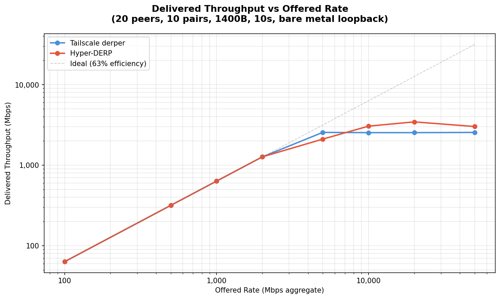
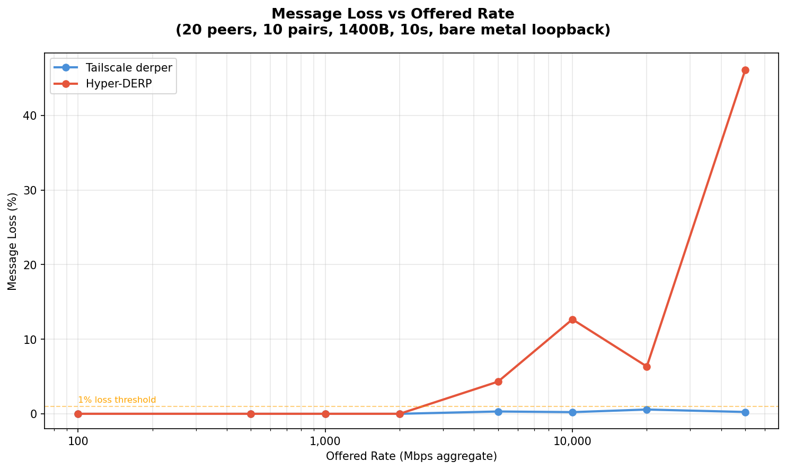
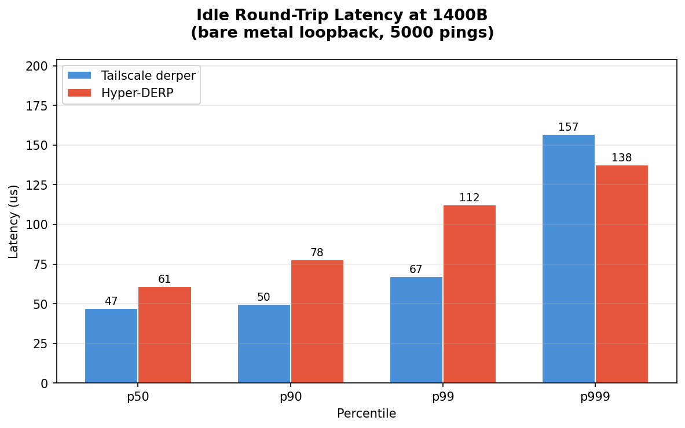
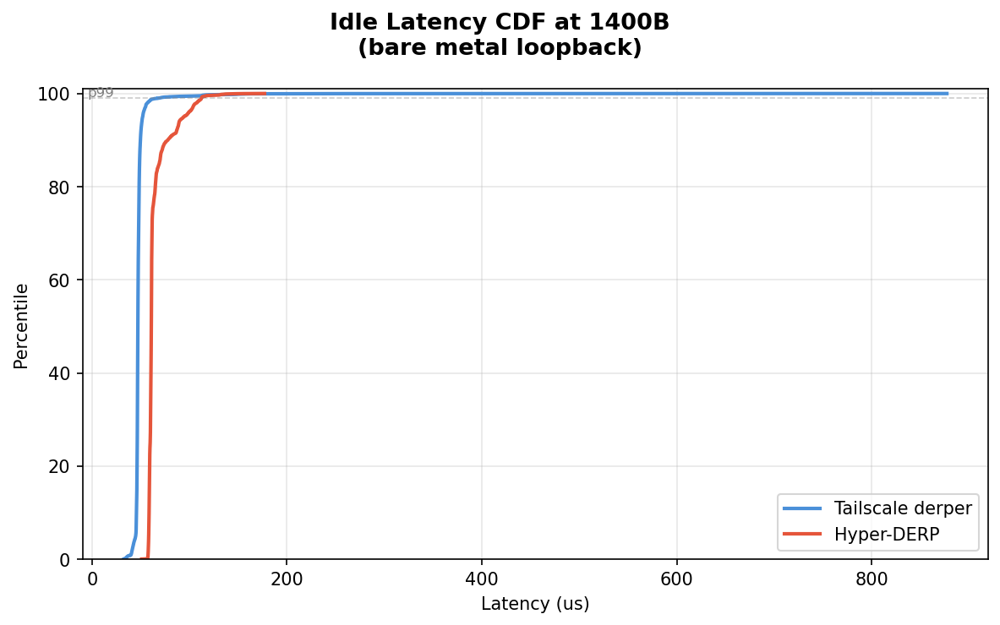
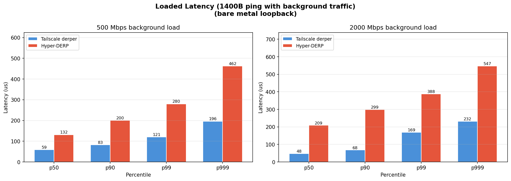
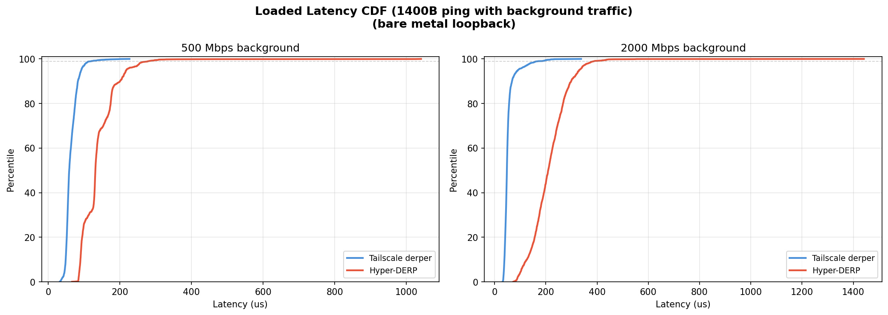

# Hyper-DERP vs Tailscale derper: Veth Bridge Comparison

## Test Environment

- **Date**: 2026-03-11T14:23:50+01:00
- **CPU**: 13th Gen Intel(R) Core(TM) i5-13600KF
- **Kernel**: 6.12.73+deb13-amd64
- **Cores**: 20
- **Governor**: performance
- **Relay pinned**: cores 4,5
- **Client pinned**: cores 12,13,14,15
- **Workers**: 2 (Hyper-DERP)
- **Network**: veth pairs on virbr-targets bridge (real TCP stack)
- **Payload**: 1400B (WireGuard MTU)
- **Topology**: 20 peers, 10 active pairs
- **Duration**: 10s per rate point
- **TCP tuning**: wmem_max=16777216, lo_mtu=65536

## Throughput Scaling

Delivered relay throughput as offered send rate increases. Rate is token-bucket paced across all 10 sender threads.

| Rate (Mbps) | TS Sent | TS Recv | TS Loss | TS Mbps | HD Sent | HD Recv | HD Loss | HD Mbps | HD/TS |
|-------------|---------|---------|---------|---------|---------|---------|---------|---------|-------|
| 100 | 80,350 | 80,350 | 0.00% | 63.3 | 80,350 | 80,350 | 0.00% | 63.4 | 1.0x |
| 500 | 401,780 | 401,780 | 0.00% | 316.9 | 401,780 | 401,780 | 0.00% | 316.9 | 1.0x |
| 1,000 | 803,560 | 803,560 | 0.00% | 633.5 | 803,560 | 803,560 | 0.00% | 633.7 | 1.0x |
| 2,000 | 1,607,130 | 1,607,129 | 0.00% | 1267.2 | 1,607,136 | 1,607,136 | 0.00% | 1267.2 | 1.0x |
| 5,000 | 3,245,468 | 3,235,356 | 0.31% | 2551.5 | 2,859,048 | 2,735,765 | 4.31% | 2105.3 | 0.8x |
| 10,000 | 3,219,673 | 3,212,488 | 0.22% | 2533.0 | 4,506,168 | 3,935,329 | 12.67% | 3049.7 | 1.2x |
| 20,000 | 3,233,860 | 3,215,361 | 0.57% | 2534.4 | 4,761,420 | 4,459,297 | 6.35% | 3446.5 | 1.4x |
| 50,000 | 3,240,474 | 3,232,606 | 0.24% | 2548.8 | 7,260,715 | 3,913,506 | 46.10% | 3018.2 | 1.2x |





## Saturation Analysis

- **TS ceiling**: 2552 Mbps (reached at 5,000 Mbps offered) — plateaus and cannot push further
- **HD ceiling**: 3446 Mbps (reached at 20,000 Mbps offered)
- **HD/TS peak ratio**: **1.4x**

- **TS** first loss at 5,000 Mbps (0.31%)
- **HD** first loss at 5,000 Mbps (4.31%)

## Idle Round-Trip Latency (1400B)

Measured via ping/echo over loopback (5000 round-trips).

| Metric | Tailscale | Hyper-DERP | Speedup |
|--------|-----------|------------|---------|
| p50 | 47 us | 61 us | 0.77x |
| p90 | 50 us | 78 us | 0.64x |
| p99 | 67 us | 112 us | 0.60x |
| p999 | 157 us | 138 us | **1.14x** |
| max | 877 us | 177 us | **4.96x** |

Ping throughput: TS 20,796 pps, HD 15,419 pps (0.74x)





## Loaded Latency (1400B)

Ping/echo latency while background throughput traffic is running.

### 500 Mbps background

| Metric | Tailscale | Hyper-DERP | Ratio |
|--------|-----------|------------|-------|
| p50 | 59 us | 132 us | 2.2x |
| p90 | 83 us | 200 us | 2.4x |
| p99 | 121 us | 280 us | 2.3x |
| p999 | 196 us | 462 us | 2.4x |

### 2000 Mbps background

| Metric | Tailscale | Hyper-DERP | Ratio |
|--------|-----------|------------|-------|
| p50 | 48 us | 209 us | 4.4x |
| p90 | 68 us | 299 us | 4.4x |
| p99 | 169 us | 388 us | 2.3x |
| p999 | 232 us | 547 us | 2.4x |





## CPU Performance Counters (5000 Mbps, 10s)

`perf stat` during 5000 Mbps throughput test.

### Tailscale derper (Go)

```
Performance counter stats for process id '72593':
<not counted> msec task-clock
<not counted>      cpu_atom/cycles/
<not counted>      cpu_core/cycles/
<not counted>      cpu_atom/instructions/
<not counted>      cpu_core/instructions/
<not counted>      cpu_atom/cache-misses/
<not counted>      cpu_core/cache-misses/
<not counted>      cpu_atom/cache-references/
<not counted>      cpu_core/cache-references/
<not counted>      context-switches
<not counted>      cpu-migrations
10.000734973 seconds time elapsed
```

### Hyper-DERP (C++/io_uring)

```
Performance counter stats for process id '73483':
<not counted> msec task-clock
<not counted>      cpu_atom/cycles/
<not counted>      cpu_core/cycles/
<not counted>      cpu_atom/instructions/
<not counted>      cpu_core/instructions/
<not counted>      cpu_atom/cache-misses/
<not counted>      cpu_core/cache-misses/
<not counted>      cpu_atom/cache-references/
<not counted>      cpu_core/cache-references/
<not counted>      context-switches
<not counted>      cpu-migrations
10.000998666 seconds time elapsed
```

### Key Metrics

| Metric | Tailscale | Hyper-DERP |
|--------|-----------|------------|
| task-clock | <not | <not |
| context-switches | <not | <not |
| cpu-migrations | <not | <not |

## Summary

Hyper-DERP (io_uring, C++) vs Tailscale derper (Go) on bare metal:

### Throughput

- **TS peak**: 2552 Mbps
- **HD peak**: 3446 Mbps
- HD delivers **1.4x** peak throughput

### Idle Latency

- **p50**: HD 61 us vs TS 47 us (TS 1.3x faster)
- **p90**: HD 78 us vs TS 50 us (TS 1.6x faster)
- **p99**: HD 112 us vs TS 67 us (TS 1.7x faster)
- **p999**: HD 138 us vs TS 157 us (**HD 1.1x faster**)

### Loaded Latency

- **500 Mbps p50**: HD 132 us vs TS 59 us (2.2x)
- **2000 Mbps p50**: HD 209 us vs TS 48 us (4.4x)

### Loss

- **5,000 Mbps**: TS 0.31%, HD 4.31%
- **10,000 Mbps**: TS 0.22%, HD 12.67%
- **20,000 Mbps**: TS 0.57%, HD 6.35%
- **50,000 Mbps**: TS 0.24%, HD 46.10%

### CPU Efficiency

