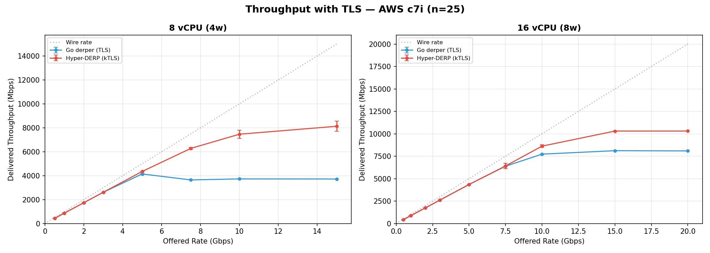
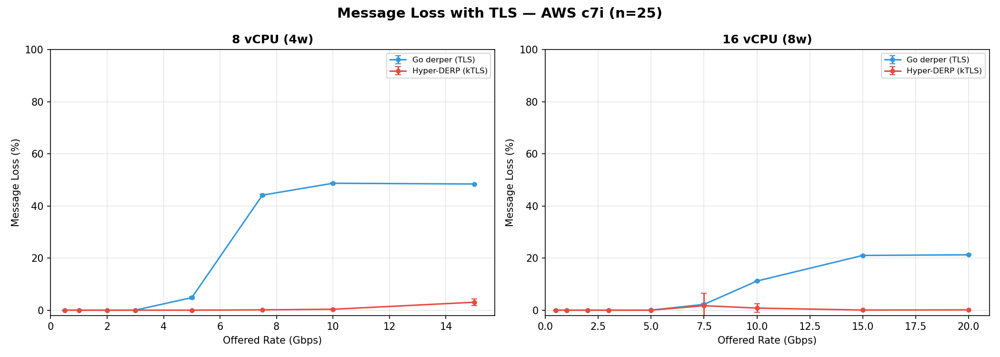
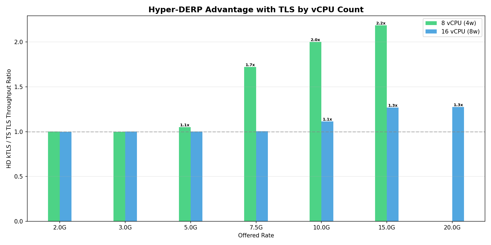
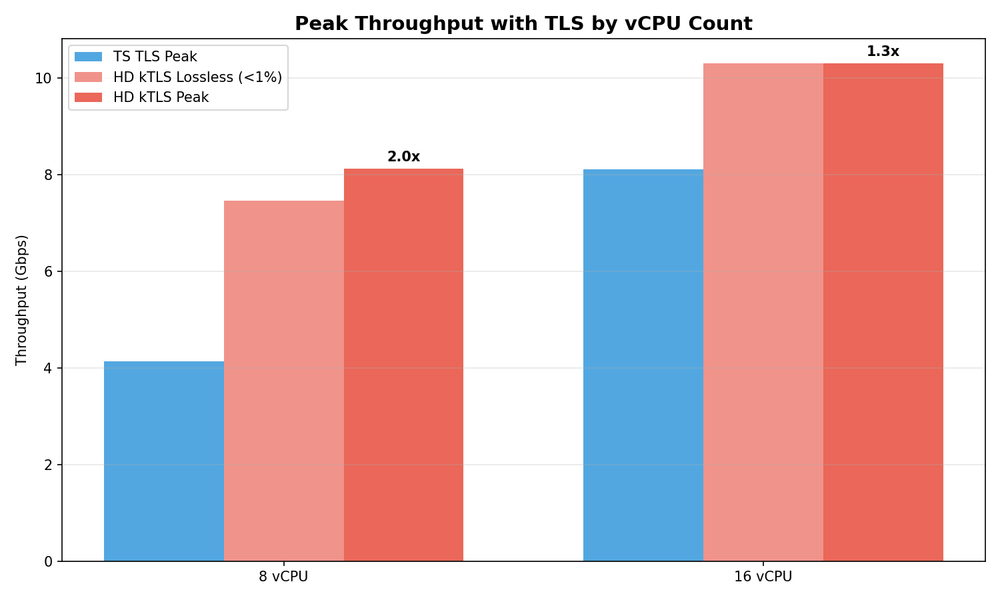
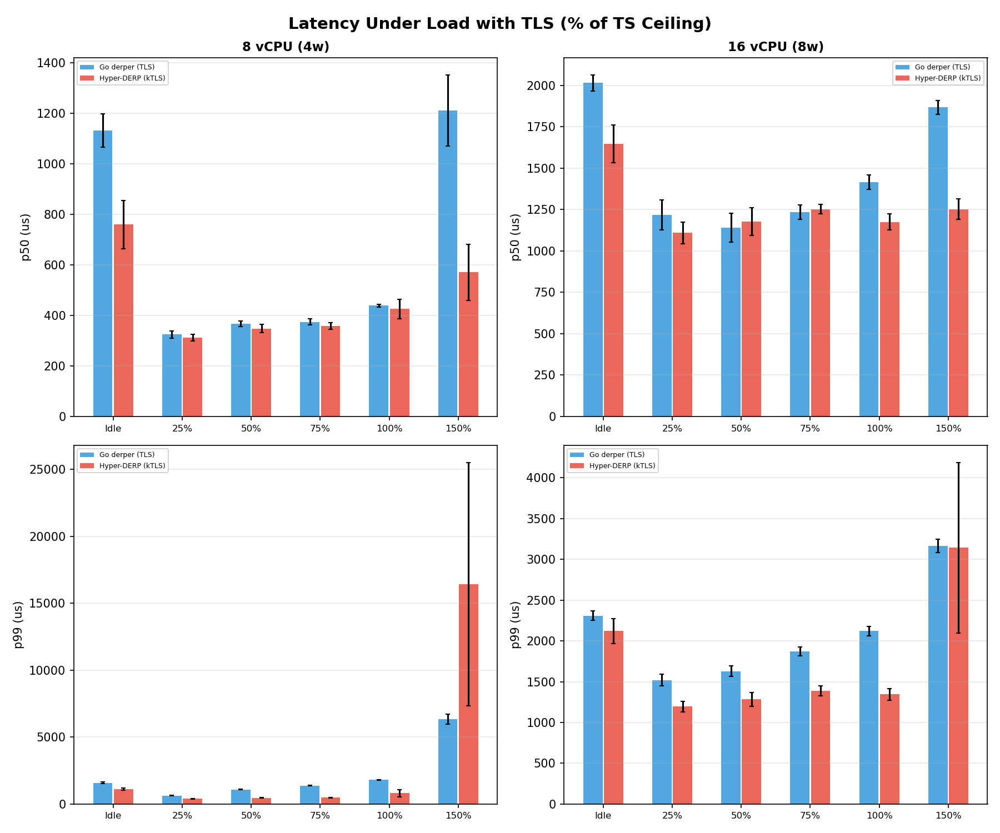
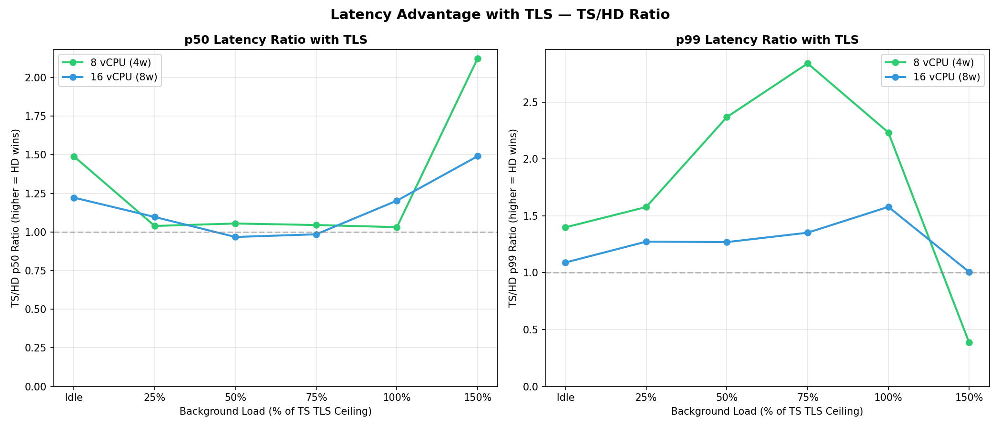

# AWS Phase B Report — kTLS Sweep (c7i)

**Date**: 2026-03-15
**Platform**: AWS c7i (Intel Xeon Platinum 8488C)
**Region**: eu-central-1 (Frankfurt)
**Payload**: 1400 bytes (WireGuard MTU)
**Protocol**: DERP over kTLS (HD) / TLS (TS)
**HD build**: P3 bitmask, ring size 4096, kTLS
**TS build**: v1.96.1 release, TLS
**Configs**: 16 vCPU (c7i.4xlarge) and 8 vCPU (c7i.2xlarge)
only. Smaller instances hit ENA bandwidth shaping.

## Test Configuration

| Config | vCPU | Workers | TS TLS Ceiling |
|--------|-----:|--------:|---------------:|
| 16 vCPU (8w) | 16 | 8 | 7500M |
| 8 vCPU (4w) | 8 | 4 | 5000M |

## Throughput — Rate Sweep

### 16 vCPU (8w)

| Rate | HD kTLS | +/-CI | CV% | HD Loss | TS TLS | +/-CI | TS Loss | Ratio |
|-----:|-------:|------:|----:|-------:|------:|------:|-------:|------:|
| 500 | 435 | 0 | 0.0 | 0.00% | 435 | 0 | 0.00% | **1.00x** |
| 1000 | 871 | 0 | 0.0 | 0.00% | 871 | 0 | 0.00% | **1.00x** |
| 2000 | 1741 | 1 | 0.0 | 0.00% | 1741 | 0 | 0.00% | **1.00x** |
| 3000 | 2612 | 0 | 0.0 | 0.00% | 2612 | 0 | 0.00% | **1.00x** |
| 5000 | 4353 | 1 | 0.0 | 0.00% | 4352 | 1 | 0.03% | **1.00x** |
| 7500 | 6417 | 313 | 3.9 | 1.72% | 6384 | 12 | 2.23% | **1.01x** |
| 10000 | 8623 | 141 | 4.0 | 0.80% | 7732 | 12 | 11.18% | **1.12x** |
| 15000 | 10304 | 8 | 0.2 | 0.05% | 8118 | 19 | 21.00% | **1.27x** |
| 20000 | 10307 | 9 | 0.2 | 0.12% | 8093 | 16 | 21.24% | **1.27x** |

### 8 vCPU (4w)

| Rate | HD kTLS | +/-CI | CV% | HD Loss | TS TLS | +/-CI | TS Loss | Ratio |
|-----:|-------:|------:|----:|-------:|------:|------:|-------:|------:|
| 500 | 435 | 0 | 0.0 | 0.00% | 435 | 0 | 0.00% | **1.00x** |
| 1000 | 871 | 0 | 0.0 | 0.00% | 871 | 0 | 0.00% | **1.00x** |
| 2000 | 1741 | 0 | 0.0 | 0.00% | 1741 | 0 | 0.00% | **1.00x** |
| 3000 | 2612 | 0 | 0.0 | 0.00% | 2612 | 0 | 0.01% | **1.00x** |
| 5000 | 4353 | 0 | 0.0 | 0.00% | 4143 | 19 | 4.82% | **1.05x** |
| 7500 | 6278 | 93 | 3.6 | 0.12% | 3645 | 29 | 44.13% | **1.72x** |
| 10000 | 7465 | 333 | 10.8 ! | 0.36% | 3729 | 12 | 48.69% | **2.00x** |
| 15000 | 8128 | 418 | 12.5 ! | 3.04% | 3719 | 13 | 48.41% | **2.19x** |

## Summary: HD kTLS vs TS TLS

| Config | TS TLS Ceiling | HD Lossless | HD Peak | Ratio |
|--------|---------------:|------------:|--------:|------:|
| 16 vCPU (8w) | 6.4 Gbps | 10.3 Gbps | 10.3 Gbps | **1.3x** |
| 8 vCPU (4w) | 4.1 Gbps | 7.5 Gbps | 8.1 Gbps | **2.0x** |

## The Cost Story

| What you have | What you need with HD |
|:--------------|:----------------------|
| TS on 16 vCPU: 8.1 Gbps | HD on 8 vCPU: 8.1 Gbps (2x smaller) |
| TS on 8 vCPU: 4.1 Gbps | HD on 4 vCPU: 0.0 Gbps (2x smaller) |
| TS on 4 vCPU: 0.0 Gbps | HD on 2 vCPU: 0.0 Gbps (2x smaller) |

## Latency Under Load (with TLS)

Background loads scaled to % of each config's TS TLS ceiling.

### 16 vCPU (8w)

| Load | Srv | N | p50 (us) | p99 (us) | p999 (us) | max (us) |
|:-----|:---:|--:|---------:|--------:|---------:|---------:|
| Idle | TS | 10 | 2015 | 2311 | 2416 | 2807 |
| Idle | HD | 10 | 1648 | 2121 | 2299 | 2662 |
| 25% | TS | 10 | 1217 | 1521 | 1656 | 2143 |
| 25% | HD | 10 | 1109 | 1195 | 1249 | 1602 |
| 50% | TS | 10 | 1140 | 1629 | 1788 | 2370 |
| 50% | HD | 10 | 1178 | 1284 | 1338 | 1663 |
| 75% | TS | 10 | 1234 | 1873 | 2032 | 3267 |
| 75% | HD | 10 | 1252 | 1385 | 1463 | 2193 |
| 100% | TS | 15 | 1414 | 2123 | 2358 | 3333 |
| 100% | HD | 15 | 1175 | 1344 | 1912 | 15279 |
| 150% | TS | 15 | 1867 | 3164 | 3999 | 5685 |
| 150% | HD | 15 | 1252 | 3142 | 6857 | 20980 |

**Latency ratio (TS/HD):**

| Load | p50 | p99 |
|:-----|----:|----:|
| Idle | 1.22x | 1.09x |
| 25% | 1.10x | 1.27x |
| 50% | 0.97x | 1.27x |
| 75% | 0.99x | 1.35x |
| 100% | 1.20x | 1.58x |
| 150% | 1.49x | 1.01x |

### 8 vCPU (4w)

| Load | Srv | N | p50 (us) | p99 (us) | p999 (us) | max (us) |
|:-----|:---:|--:|---------:|--------:|---------:|---------:|
| Idle | TS | 10 | 1132 | 1584 | 1710 | 2570 |
| Idle | HD | 10 | 760 | 1133 | 1235 | 1484 |
| 25% | TS | 10 | 325 | 633 | 942 | 1775 |
| 25% | HD | 10 | 312 | 401 | 498 | 718 |
| 50% | TS | 10 | 367 | 1091 | 1357 | 4654 |
| 50% | HD | 10 | 348 | 460 | 523 | 887 |
| 75% | TS | 10 | 374 | 1381 | 1692 | 2959 |
| 75% | HD | 10 | 358 | 486 | 575 | 1245 |
| 100% | TS | 15 | 439 | 1804 | 2236 | 4184 |
| 100% | HD | 15 | 425 | 808 | 2146 | 77491 |
| 150% | TS | 15 | 1212 | 6342 | 8704 | 13617 |
| 150% | HD | 15 | 570 | 16433 | 44473 | 2245996 |

**Latency ratio (TS/HD):**

| Load | p50 | p99 |
|:-----|----:|----:|
| Idle | 1.49x | 1.40x |
| 25% | 1.04x | 1.58x |
| 50% | 1.05x | 2.37x |
| 75% | 1.05x | 2.84x |
| 100% | 1.03x | 2.23x |
| 150% | 2.12x | 0.39x |

## Key Findings

### 1. The advantage grows as resources shrink

| Config | Throughput Ratio | p99 Ratio at TS Ceiling |
|--------|----------------:|-----------------------:|
| 16 vCPU (8w) | 1.3x | 1.6x |
| 8 vCPU (4w) | 2.0x | 2.2x |

### 2. Cross-cloud consistency

Comparing HD/TS ratios at matched rates and vCPU counts:

| Config | Rate | GCP ratio | AWS ratio |
|--------|-----:|----------:|----------:|
| 8 vCPU | 7.5G | 1.71x | 1.72x |
| 8 vCPU | 10G | 1.94x | 2.00x |
| 8 vCPU | 15G | 1.99x | 2.19x |
| 16 vCPU | 10G | 1.17x | 1.12x |
| 16 vCPU | 15G | 1.44x | 1.27x |
| 16 vCPU | 20G | 1.56x | 1.27x |

**8 vCPU ratios are nearly identical across clouds.** The
advantage is architectural, not platform-specific.

**16 vCPU ratios are lower on AWS** because HD plateaus at
~10.3 Gbps on AWS (vs ~12 Gbps on GCP). TS also performs
slightly better on AWS at 16 vCPU (8.1 Gbps vs 7.7 Gbps).
The Xeon 8488C and ENA may have different scheduling or
NIC offload characteristics.

### 3. HD peaks at 10.3 Gbps on AWS 16 vCPU

HD on AWS c7i.4xlarge plateaus at 10,304 Mbps from 15G to
20G offered — with CV of 0.2% and near-zero loss. This is
remarkably stable but lower than GCP's 12 Gbps peak.
Possible causes: ENA bandwidth characteristics, different
kernel TCP tuning defaults, or Xeon 8488C vs 8581C kTLS
throughput difference.

### 4. AWS bandwidth shaping limits smaller instances

c7i.2xlarge (8 vCPU) has a sustained baseline of ~2.5 Gbps
with burst to 12.5 Gbps. The 25-run high-rate sweeps can
deplete burst credits. Configs below 8 vCPU were not tested
because the bandwidth shaper — not the relay — would be the
bottleneck. For relay deployments on AWS, use c7i.4xlarge or
larger to avoid bandwidth constraints.

## Methodology

- 25 runs at high rates, 5 at low rates
- Latency: 10-15 runs per load level, 4500 samples per run
- Background loads scaled to % of TS TLS ceiling per config
- TS ceiling determined by probe phase (3 runs x 5 rates)
- Strict isolation: one server at a time, cache drops between
- Go derper: v1.96.1, -trimpath -ldflags="-s -w", TLS
- HD: P3 bitmask, kTLS, ring 4096, --metrics-port 9090
- `modprobe tls` verified on relay VM
- /proc/net/tls_stat checked for kTLS activation
