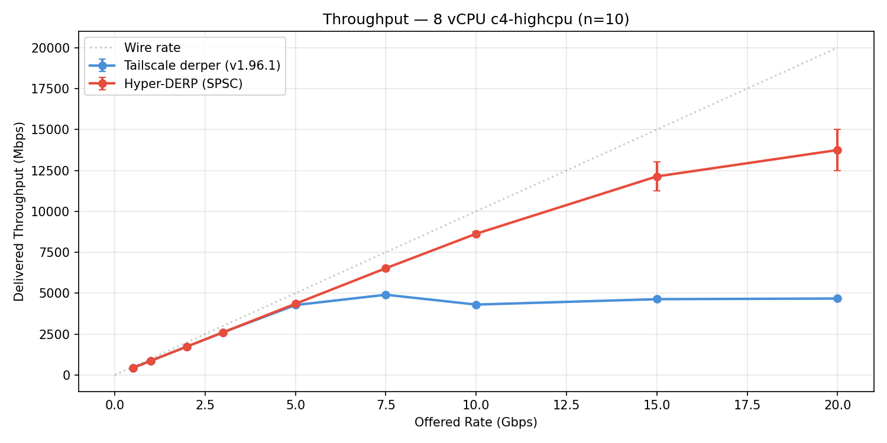
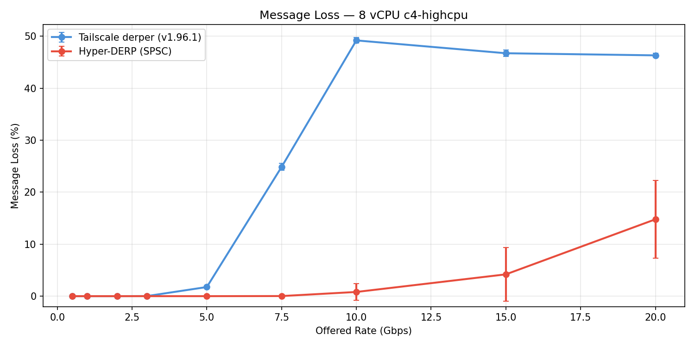
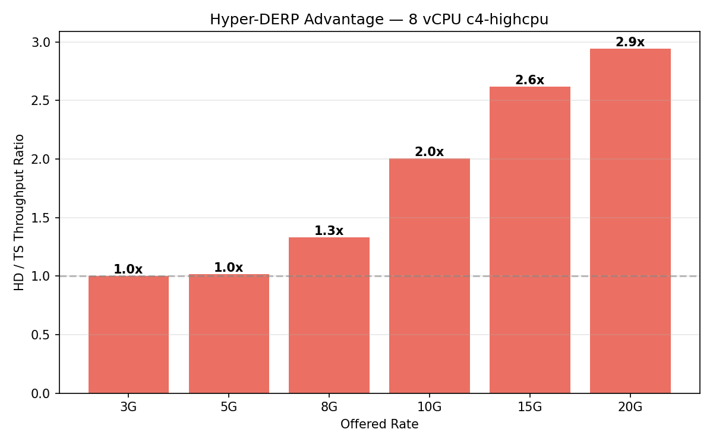
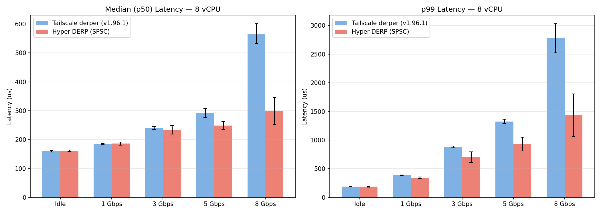

# Hyper-DERP SPSC Benchmark — GCP c4-highcpu-8

**Date**: 2026-03-13
**Platform**: GCP c4-highcpu-8 (Intel Xeon Platinum 8581C)
**Region**: europe-west3-b (Frankfurt)
**Network**: VPC internal (10.10.0.0/24)
**Payload**: 1400 bytes (WireGuard MTU)
**Protocol**: DERP over plain TCP (no TLS)
**Go derper**: v1.96.1 release build (stripped, -trimpath)
**Hyper-DERP**: SPSC xfer rings + per-source frame return inboxes
**Workers**: 4 (8 vCPU / 2)

## Changes from Previous Benchmark

1. **SPSC xfer rings** — Replaced MPSC ring (spinlock contention) with per-source SPSC rings (N*N total, lock-free)
2. **Batched eventfd signaling** — One write(eventfd) per destination worker per CQE batch instead of per frame
3. **SPSC frame return inboxes** — Replaced Treiber stack (CAS contention) with per-source return slots (CAS retries at most once)
4. **Go derper release build** — v1.96.1, -trimpath -ldflags="-s -w", stripped (was unoptimized debug build)

## Methodology

- **Isolation**: Only one server runs at a time
- **Rate sweep**: 9 rates (500M-20G), 20 peers, 10 active pairs, 15s/run
- **Runs**: 3 at low rates (<=3G), 10 at high rates (>=5G)
- **Latency**: 5000 pings, 500 warmup, 10 runs/load
- **Background loads**: idle, 1G, 3G, 5G, 8G

## Rate Sweep

| Rate | Server | N | Throughput (Mbps) | 95% CI | Loss% | Loss CI |
|-----:|:------:|--:|------------------:|-------:|------:|--------:|
| 500 | TS | 3 | 435 | +/-0 | 0.00 | +/-0.00 |
| 500 | HD | 3 | 435 | +/-0 | 0.00 | +/-0.00 |
| 1000 | TS | 3 | 870 | +/-0 | 0.00 | +/-0.00 |
| 1000 | HD | 3 | 870 | +/-1 | 0.00 | +/-0.00 |
| 2000 | TS | 3 | 1740 | +/-0 | 0.00 | +/-0.00 |
| 2000 | HD | 3 | 1740 | +/-1 | 0.00 | +/-0.00 |
| 3000 | TS | 3 | 2609 | +/-1 | 0.02 | +/-0.03 |
| 3000 | HD | 3 | 2610 | +/-1 | 0.00 | +/-0.00 |
| 5000 | TS | 10 | 4274 | +/-3 | 1.76 | +/-0.08 |
| 5000 | HD | 10 | 4351 | +/-1 | 0.00 | +/-0.00 |
| 7500 | TS | 10 | 4904 | +/-45 | 24.86 | +/-0.68 |
| 7500 | HD | 10 | 6523 | +/-7 | 0.02 | +/-0.05 |
| 10000 | TS | 10 | 4303 | +/-63 | 49.20 | +/-0.52 |
| 10000 | HD | 10 | 8631 | +/-140 | 0.81 | +/-1.60 |
| 15000 | TS | 10 | 4633 | +/-44 | 46.73 | +/-0.60 |
| 15000 | HD | 10 | 12134 | +/-875 | 4.20 | +/-5.16 |
| 20000 | TS | 10 | 4672 | +/-44 | 46.33 | +/-0.43 |
| 20000 | HD | 10 | 13746 | +/-1273 | 14.78 | +/-7.48 |

## HD vs TS Comparison

| Rate | HD (Mbps) | TS (Mbps) | Ratio | HD Loss | TS Loss |
|-----:|----------:|----------:|------:|--------:|--------:|
| 500 | 435 | 435 | 1.00x | 0.0% | 0.0% |
| 1000 | 870 | 870 | 1.00x | 0.0% | 0.0% |
| 2000 | 1740 | 1740 | 1.00x | 0.0% | 0.0% |
| 3000 | 2610 | 2609 | 1.00x | 0.0% | 0.0% |
| 5000 | 4351 | 4274 | 1.02x | 0.0% | 1.8% |
| 7500 | 6523 | 4904 | **1.33x** | 0.0% | 24.9% |
| 10000 | 8631 | 4303 | **2.01x** | 0.8% | 49.2% |
| 15000 | 12134 | 4633 | **2.62x** | 4.2% | 46.7% |
| 20000 | 13746 | 4672 | **2.94x** | 14.8% | 46.3% |

## Latency Under Load

| Load | Server | N | p50 (us) | CI | p99 (us) | CI | p999 (us) | max (us) |
|-----:|:------:|--:|---------:|---:|---------:|---:|----------:|---------:|
| idle | TS | 10 | 160 | +/-3 | 190 | +/-2 | 242 | 356 |
| idle | HD | 10 | 161 | +/-2 | 187 | +/-7 | 198 | 242 |
| 1000M | TS | 10 | 185 | +/-2 | 388 | +/-7 | 615 | 787 |
| 1000M | HD | 10 | 186 | +/-5 | 342 | +/-14 | 447 | 678 |
| 3000M | TS | 10 | 240 | +/-6 | 881 | +/-15 | 1173 | 1774 |
| 3000M | HD | 10 | 234 | +/-15 | 702 | +/-96 | 931 | 1191 |
| 5000M | TS | 10 | 292 | +/-16 | 1324 | +/-37 | 1741 | 2973 |
| 5000M | HD | 10 | 249 | +/-14 | 931 | +/-121 | 1368 | 1819 |
| 8000M | TS | 10 | 567 | +/-34 | 2777 | +/-253 | 4467 | 7656 |
| 8000M | HD | 10 | 299 | +/-46 | 1437 | +/-371 | 2927 | 59093 |

### Latency Ratio (TS / HD)

| Load | p50 TS | p50 HD | p50 Ratio | p99 TS | p99 HD | p99 Ratio |
|-----:|-------:|-------:|----------:|-------:|-------:|----------:|
| idle | 160 | 161 | 0.99x | 190 | 187 | 1.02x |
| 1000M | 185 | 186 | 0.99x | 388 | 342 | 1.14x |
| 3000M | 240 | 234 | 1.03x | 881 | 702 | 1.25x |
| 5000M | 292 | 249 | 1.17x | 1324 | 931 | 1.42x |
| 8000M | 567 | 299 | 1.90x | 2777 | 1437 | 1.93x |

## Key Findings

1. **Peak throughput**: HD 13.7 Gbps vs TS 4.9 Gbps (2.8x)

2. **Zero-loss ceiling**: HD lossless up to 8G offered vs TS at 3G — 2x headroom

3. **Latency at 8G load**: HD p50=299us / p99=1437us vs TS p50=567us / p99=2777us (1.9x / 1.9x)
