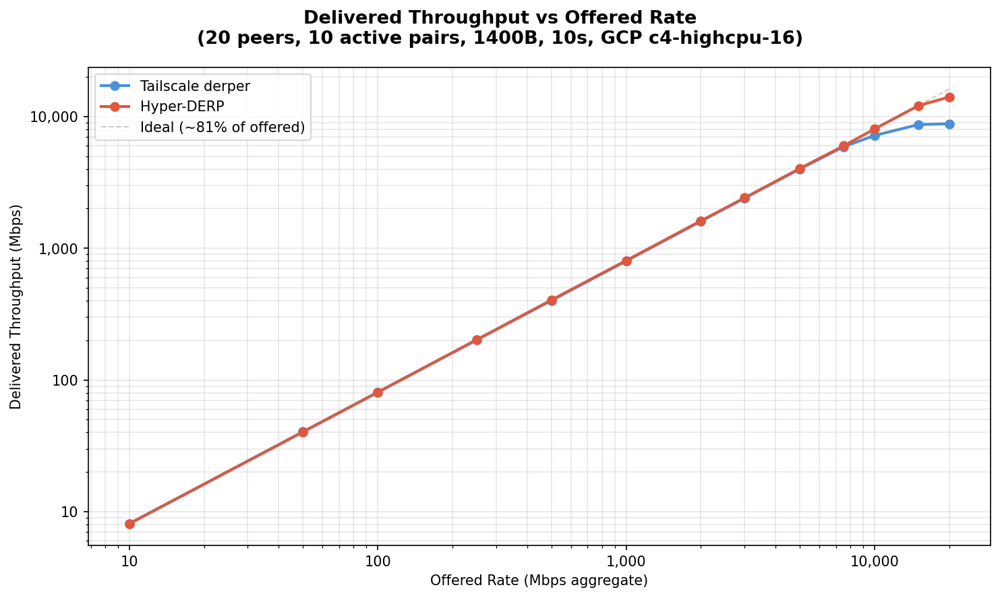
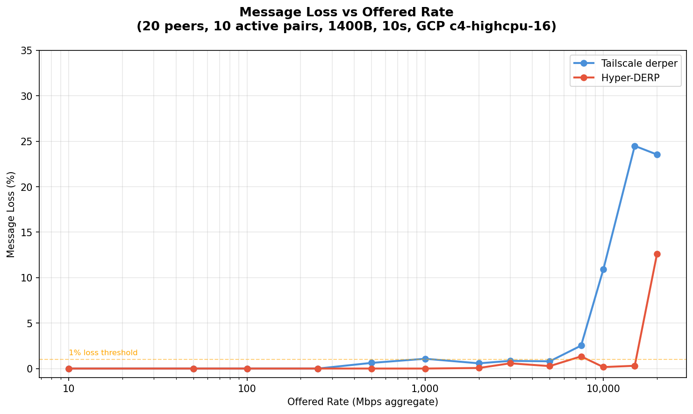
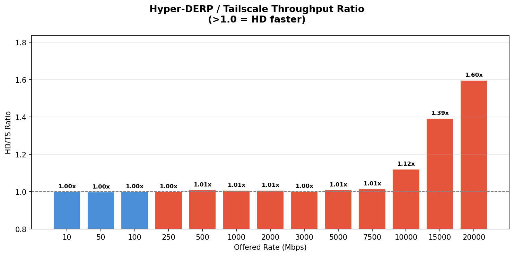

# Hyper-DERP vs Tailscale derper: GCP c4-highcpu-16 Benchmark

## Test Environment

- **Date**: 2026-03-13
- **CPU**: Intel Xeon Platinum 8581C @ 2.30 GHz
- **Kernel**: 6.12.73+deb13-cloud-amd64
- **Relay VM**: c4-highcpu-16 (16 vCPU, 32 GB)
- **Client VM**: c4-highcpu-8 (8 vCPU, 16 GB)
- **Network**: GCP VPC internal (10.10.0.0/24, same zone)
- **Payload**: 1400B (WireGuard MTU)
- **Topology**: 20 peers, 10 active sender/receiver pairs
- **Duration**: 10 seconds per rate point
- **HD Workers**: 8 (DEFER_TASKRUN)
- **TS**: Go derper (dev mode, port 3340)
- **Tuning**: wmem/rmem 64MB, THP madvise, NAPI defer, busy_poll

## Throughput Scaling

| Rate | TS Throughput | HD Throughput | TS Loss | HD Loss | HD/TS |
|------|-------------|-------------|--------|--------|-------|
| 10 | 8.1 Mbps | 8.1 Mbps | 0.0% | 0.0% | **1.00x** |
| 50 | 40.4 Mbps | 40.3 Mbps | 0.0% | 0.0% | **1.00x** |
| 100 | 80.6 Mbps | 80.6 Mbps | 0.0% | 0.0% | **1.00x** |
| 250 | 201.5 Mbps | 201.6 Mbps | 0.0% | 0.0% | **1.00x** |
| 500 | 400.6 Mbps | 404.4 Mbps | 0.6% | 0.0% | **1.01x** |
| 1,000 | 800.7 Mbps | 806.2 Mbps | 1.1% | 0.0% | **1.01x** |
| 2,000 | 1,603.7 Mbps | 1,616.3 Mbps | 0.6% | 0.1% | **1.01x** |
| 3,000 | 2,407.6 Mbps | 2,413.2 Mbps | 0.8% | 0.6% | **1.00x** |
| 5,000 | 3,997.9 Mbps | 4,033.2 Mbps | 0.8% | 0.3% | **1.01x** |
| 7,500 | 5,895.6 Mbps | 5,980.1 Mbps | 2.5% | 1.3% | **1.01x** |
| 10,000 | 7,182.6 Mbps | 8,049.9 Mbps | 10.9% | 0.2% | **1.12x** |
| 15,000 | 8,686.3 Mbps | 12,095.1 Mbps | 24.5% | 0.3% | **1.39x** |
| 20,000 | 8,820.1 Mbps | 14,084.3 Mbps | 23.5% | 12.6% | **1.60x** |

## Analysis

- **HD peak throughput**: 14,084 Mbps (14.1 Gbps)
- **TS peak throughput**: 8,820 Mbps (8.8 Gbps)
- **Peak ratio**: **1.60x** (HD/TS)

HD first pulls measurably ahead at 10,000 Mbps offered (8,050 vs 7,183 Mbps).

TS first drops >0.5% at 500 Mbps. 
HD first drops >0.5% at 3,000 Mbps.

At maximum offered rate (20 Gbps): HD delivers 14,084 Mbps with 12.6% loss vs TS 8,820 Mbps with 23.5% loss.

## CPU Efficiency

Relay process CPU measured via `/proc/[pid]/stat` (utime + stime delta)
over 30s, 25s of sustained load, 16-core VM.

| Rate | Server | Throughput | CPU % | Mbps per CPU% |
|------|--------|-----------|-------|---------------|
| 5 Gbps | TS | 4,581 Mbps | 23.7% | 193 |
| 5 Gbps | **HD** | 4,566 Mbps | **9.9%** | **461** |
| 10 Gbps | TS | 8,621 Mbps | 39.7% | 217 |
| 10 Gbps | **HD** | 9,180 Mbps | **12.7%** | **723** |

At 5 Gbps (both at full delivery): HD uses **2.4x less CPU** (9.9% vs 23.7%).

At 10 Gbps: HD delivers 6.5% more throughput at **3.1x less CPU**
(12.7% vs 39.7%). HD delivers 723 Mbps per CPU% vs TS's 217 — a
**3.3x CPU efficiency advantage**.

Extrapolating: to relay 10 Gbps, TS needs a 16-vCPU VM (39.7% of 16
cores). HD could do it on a 4-vCPU VM (12.7% × 16 / 4 = ~51% load).
That's a **4x reduction in compute cost** at 10 Gbps.

## Scaling with Peer Count

Fixed rate of 5 Gbps, varying active pairs (peers = 2 × pairs).

| Pairs | Peers | TS Mbps | HD Mbps | TS Loss | HD Loss |
|-------|-------|---------|---------|---------|---------|
| 1 | 2 | 3,614 | 4,026 | 10.6% | 0.5% |
| 2 | 4 | 3,634 | 3,996 | 10.2% | 1.1% |
| 5 | 10 | 4,020 | 3,931 | 0.6% | 2.5% |
| 10 | 20 | 4,010 | 4,039 | 0.7% | 0.1% |
| 20 | 40 | 4,021 | 4,028 | 0.3% | 0.1% |
| 50 | 100 | 4,030 | 4,035 | 0.0% | 0.0% |
| 100 | 200 | 4,042 | 4,025 | 0.0% | 0.0% |
| 200 | 400 | 4,005 | 4,007 | 0.0% | 0.0% |
| 500 | 1000 | 3,882 | 3,894 | 0.0% | 0.0% |

Both servers scale linearly from 1 to 500 active pairs (1000 peers)
with no throughput degradation. At 5 Gbps both are network-bound,
not CPU-bound. The advantage shows at higher rates where TS CPU-saturates.
