# Hyper-DERP vs Tailscale derper — GCP Benchmark

**Date**: 2026-03-13
**Platform**: GCP c4-highcpu (Intel Xeon Platinum 8581C @ 2.30 GHz)
**Region**: europe-west3-b (Frankfurt)
**Network**: VPC internal (10.10.0.0/24)
**Payload**: 1400 bytes (WireGuard MTU)
**Protocol**: DERP over plain TCP (no TLS)

## Methodology

- **Isolation**: Only one server runs at a time on the relay VM
- **Rate sweep**: 9 offered rates (500 Mbps - 20 Gbps), 20 peers, 10 active pairs, 15s per run
- **Runs**: 3 runs at low rates (<=3G, zero-variance region), 20 runs at high rates (>=5G)
- **Latency**: 5000 pings per run, 500 warmup, 10 runs per load level
- **Background loads**: idle, 1G, 3G, 5G, 8G (10 pairs)
- **Statistics**: mean, 95% CI (t-distribution), CV%

### Caveats

- Go derper is an unoptimized build (debug info, not stripped). A proper release build with `go build -trimpath -ldflags="-s -w"` is planned.
- VM placement not enforced (relay and client may share a physical host). A spread placement policy is planned.
- 16 vCPU data used the non-isolated method (both servers running, tested alternately). At 43% CPU headroom the impact is minimal.

## 16 vCPU Results

```
date: 2026-03-13T11:08:31+00:00
relay: 10.10.0.2
relay_vcpus: 16
kernel: 6.12.73+deb13-cloud-amd64
cpu: INTEL(R) XEON(R) PLATINUM 8581C CPU @ 2.30GHz
low_rates: 500 1000 2000 3000
low_runs: 3
high_rates: 5000 7500 10000 15000 20000
high_runs: 20
latency_runs: 10
rate_duration: 15
rate_peers: 20
rate_pairs: 10
ping_count: 5000
ping_warmup: 500
msg_size: 1400
```

### Rate Sweep

| Rate | Server | N | Mean (Mbps) | 95% CI | CV% | Loss% | Loss CI |
|-----:|:------:|--:|------------:|-------:|----:|------:|--------:|
| 500 | TS | 3 | 435 | +/-0 | 0.0 | 0.00 | +/-0.00 |
| 500 | HD | 3 | 435 | +/-0 | 0.0 | 0.00 | +/-0.00 |
| 1000 | TS | 3 | 870 | +/-1 | 0.0 | 0.00 | +/-0.00 |
| 1000 | HD | 3 | 870 | +/-0 | 0.0 | 0.00 | +/-0.00 |
| 2000 | TS | 3 | 1740 | +/-0 | 0.0 | 0.01 | +/-0.01 |
| 2000 | HD | 3 | 1740 | +/-1 | 0.0 | 0.00 | +/-0.00 |
| 3000 | TS | 3 | 2610 | +/-2 | 0.0 | 0.00 | +/-0.01 |
| 3000 | HD | 3 | 2610 | +/-1 | 0.0 | 0.00 | +/-0.00 |
| 5000 | TS | 20 | 4347 | +/-0 | 0.0 | 0.07 | +/-0.00 |
| 5000 | HD | 20 | 4351 | +/-0 | 0.0 | 0.00 | +/-0.00 |
| 7500 | TS | 20 | 6347 | +/-4 | 0.1 | 2.74 | +/-0.06 |
| 7500 | HD | 20 | 6525 | +/-1 | 0.0 | 0.00 | +/-0.00 |
| 10000 | TS | 20 | 7802 | +/-6 | 0.2 | 10.34 | +/-0.07 |
| 10000 | HD | 20 | 8701 | +/-1 | 0.0 | 0.00 | +/-0.00 |
| 15000 | TS | 20 | 8866 | +/-39 | 0.9 | 21.26 | +/-0.32 |
| 15000 | HD | 20 | 12981 | +/-122 | 2.0 | 0.54 | +/-0.93 |
| 20000 | TS | 20 | 8920 | +/-17 | 0.4 | 20.90 | +/-0.19 |
| 20000 | HD | 20 | 13389 | +/-1682 | 26.8 | 22.98 | +/-9.66 |

### HD vs TS

| Rate | HD (Mbps) | TS (Mbps) | Ratio | HD Loss | TS Loss |
|-----:|----------:|----------:|------:|--------:|--------:|
| 500 | 435 | 435 | 1.00x | 0.0% | 0.0% |
| 1000 | 870 | 870 | 1.00x | 0.0% | 0.0% |
| 2000 | 1740 | 1740 | 1.00x | 0.0% | 0.0% |
| 3000 | 2610 | 2610 | 1.00x | 0.0% | 0.0% |
| 5000 | 4351 | 4347 | 1.00x | 0.0% | 0.1% |
| 7500 | 6525 | 6347 | 1.03x | 0.0% | 2.7% |
| 10000 | 8701 | 7802 | **1.12x** | 0.0% | 10.3% |
| 15000 | 12981 | 8866 | **1.46x** | 0.5% | 21.3% |
| 20000 | 13389 | 8920 | **1.50x** | 23.0% | 20.9% |

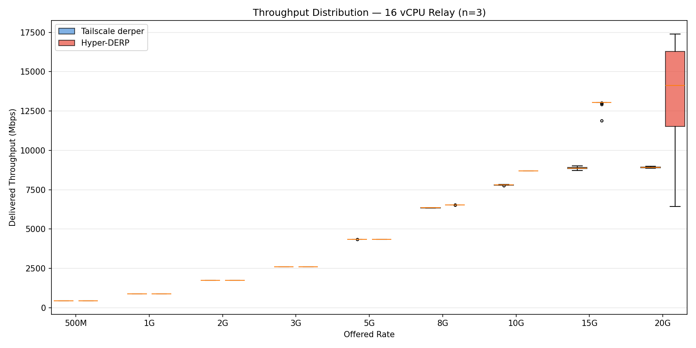

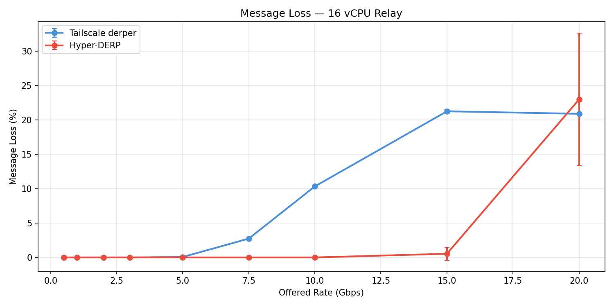

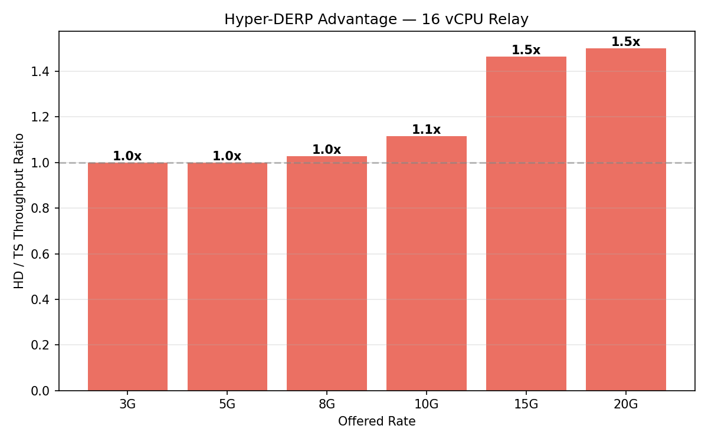

### Latency Under Load

| Load | Srv | N | p50 (us) | CI | p99 (us) | CI | p999 (us) | max (us) |
|-----:|:---:|--:|---------:|---:|---------:|---:|----------:|---------:|
| idle | TS | 10 | 164 | +/-2 | 191 | +/-4 | 275 | 363 |
| idle | HD | 10 | 161 | +/-3 | 188 | +/-5 | 194 | 221 |
| 1000M | TS | 10 | 189 | +/-4 | 420 | +/-8 | 539 | 692 |
| 1000M | HD | 10 | 186 | +/-4 | 335 | +/-15 | 453 | 533 |
| 3000M | TS | 10 | 248 | +/-10 | 743 | +/-29 | 997 | 1216 |
| 3000M | HD | 10 | 214 | +/-16 | 699 | +/-104 | 998 | 1359 |
| 5000M | TS | 10 | 295 | +/-15 | 962 | +/-38 | 1283 | 2272 |
| 5000M | HD | 10 | 228 | +/-11 | 954 | +/-120 | 1405 | 1796 |
| 8000M | TS | 10 | 395 | +/-9 | 1317 | +/-23 | 1722 | 2387 |
| 8000M | HD | 10 | 247 | +/-12 | 1099 | +/-170 | 1779 | 2856 |

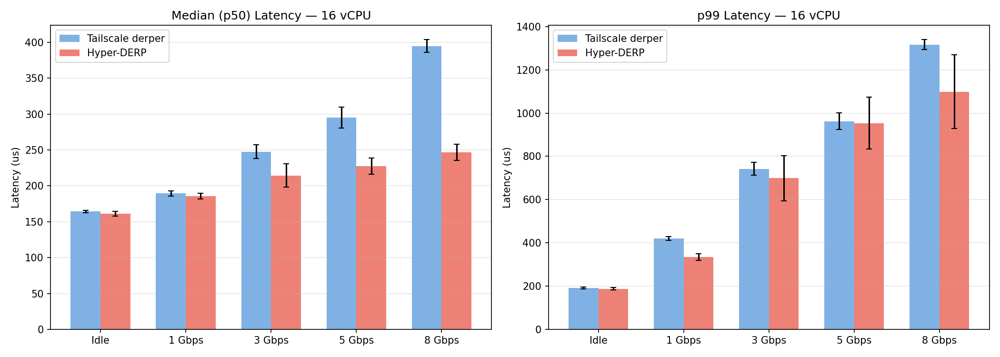

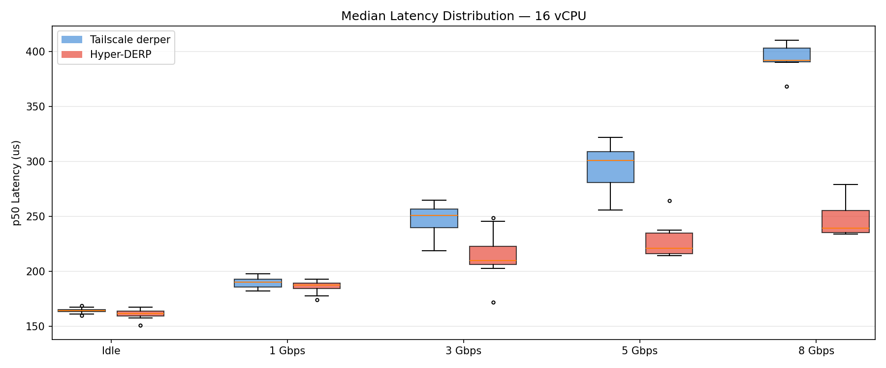

## 8 vCPU Results

```
date: 2026-03-13T12:42:10+00:00
relay: 10.10.0.2
relay_vcpus: 8
kernel: 6.12.73+deb13-cloud-amd64
cpu: INTEL(R) XEON(R) PLATINUM 8581C CPU @ 2.30GHz
low_rates: 500 1000 2000 3000
low_runs: 3
high_rates: 5000 7500 10000 15000 20000
high_runs: 20
latency_runs: 10
rate_duration: 15
rate_peers: 20
rate_pairs: 10
ping_count: 5000
ping_warmup: 500
msg_size: 1400
```

### Rate Sweep

| Rate | Server | N | Mean (Mbps) | 95% CI | CV% | Loss% | Loss CI |
|-----:|:------:|--:|------------:|-------:|----:|------:|--------:|
| 500 | TS | 3 | 435 | +/-0 | 0.0 | 0.00 | +/-0.00 |
| 500 | HD | 3 | 435 | +/-0 | 0.0 | 0.00 | +/-0.00 |
| 1000 | TS | 3 | 870 | +/-0 | 0.0 | 0.00 | +/-0.00 |
| 1000 | HD | 3 | 870 | +/-1 | 0.0 | 0.00 | +/-0.00 |
| 2000 | TS | 3 | 1740 | +/-1 | 0.0 | 0.00 | +/-0.00 |
| 2000 | HD | 3 | 1740 | +/-0 | 0.0 | 0.00 | +/-0.00 |
| 3000 | TS | 3 | 2610 | +/-1 | 0.0 | 0.00 | +/-0.00 |
| 3000 | HD | 3 | 2610 | +/-1 | 0.0 | 0.00 | +/-0.00 |
| 5000 | TS | 20 | 4350 | +/-0 | 0.0 | 0.00 | +/-0.00 |
| 5000 | HD | 20 | 4350 | +/-0 | 0.0 | 0.00 | +/-0.00 |
| 7500 | TS | 20 | 6525 | +/-1 | 0.0 | 0.00 | +/-0.00 |
| 7500 | HD | 20 | 6513 | +/-21 | 0.7 | 0.17 | +/-0.31 |
| 10000 | TS | 20 | 8668 | +/-66 | 1.6 | 0.37 | +/-0.75 |
| 10000 | HD | 20 | 8524 | +/-182 | 4.5 | 1.15 | +/-1.74 |
| 15000 | TS | 20 | 11754 | +/-531 | 9.6 | 9.40 | +/-3.99 |
| 15000 | HD | 20 | 11908 | +/-598 | 10.7 | 4.89 | +/-3.20 |
| 20000 | TS | 20 | 14335 | +/-619 | 9.2 | 14.46 | +/-3.84 |
| 20000 | HD | 20 | 13285 | +/-870 | 13.9 | 13.45 | +/-5.74 |

### HD vs TS

| Rate | HD (Mbps) | TS (Mbps) | Ratio | HD Loss | TS Loss |
|-----:|----------:|----------:|------:|--------:|--------:|
| 500 | 435 | 435 | 1.00x | 0.0% | 0.0% |
| 1000 | 870 | 870 | 1.00x | 0.0% | 0.0% |
| 2000 | 1740 | 1740 | 1.00x | 0.0% | 0.0% |
| 3000 | 2610 | 2610 | 1.00x | 0.0% | 0.0% |
| 5000 | 4350 | 4350 | 1.00x | 0.0% | 0.0% |
| 7500 | 6513 | 6525 | 1.00x | 0.2% | 0.0% |
| 10000 | 8524 | 8668 | 0.98x | 1.2% | 0.4% |
| 15000 | 11908 | 11754 | 1.01x | 4.9% | 9.4% |
| 20000 | 13285 | 14335 | 0.93x | 13.4% | 14.5% |

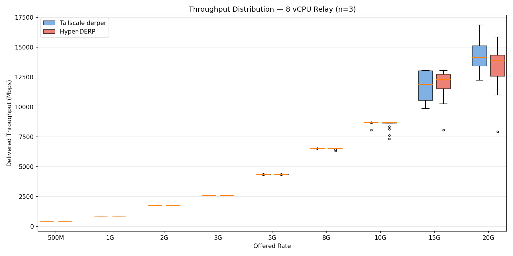

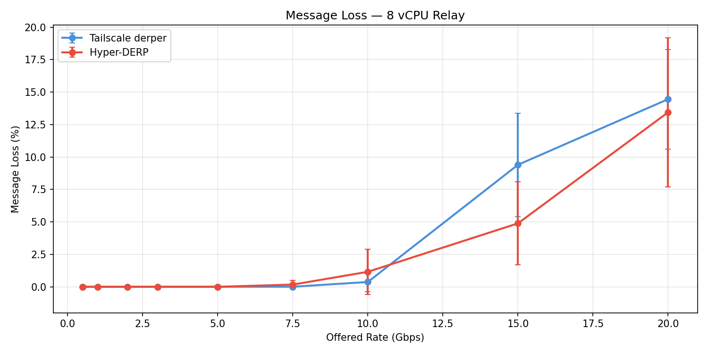

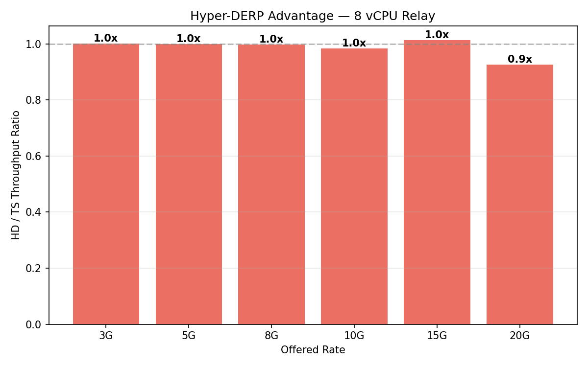

### Latency Under Load

| Load | Srv | N | p50 (us) | CI | p99 (us) | CI | p999 (us) | max (us) |
|-----:|:---:|--:|---------:|---:|---------:|---:|----------:|---------:|
| idle | TS | 10 | 163 | +/-2 | 192 | +/-4 | 204 | 253 |
| idle | HD | 10 | 164 | +/-3 | 190 | +/-3 | 198 | 237 |
| 1000M | TS | 10 | 185 | +/-5 | 338 | +/-13 | 440 | 698 |
| 1000M | HD | 10 | 187 | +/-5 | 345 | +/-12 | 444 | 1027 |
| 3000M | TS | 10 | 233 | +/-9 | 708 | +/-79 | 963 | 1215 |
| 3000M | HD | 10 | 222 | +/-19 | 637 | +/-59 | 859 | 1138 |
| 5000M | TS | 10 | 247 | +/-18 | 931 | +/-74 | 1317 | 2099 |
| 5000M | HD | 10 | 262 | +/-25 | 961 | +/-125 | 1339 | 1816 |
| 8000M | TS | 10 | 256 | +/-25 | 1073 | +/-171 | 1623 | 2519 |
| 8000M | HD | 10 | 278 | +/-17 | 1123 | +/-95 | 1758 | 2537 |

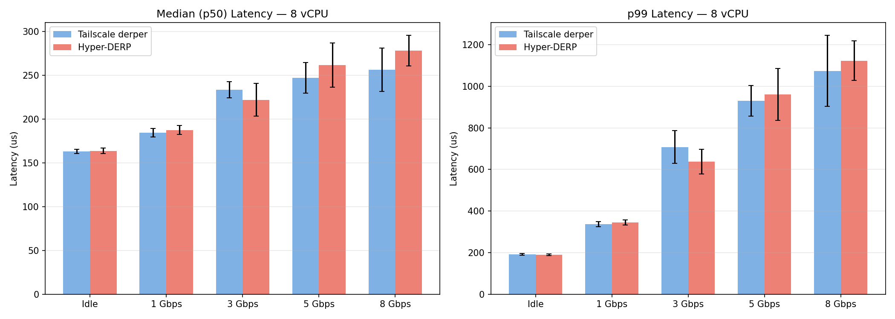

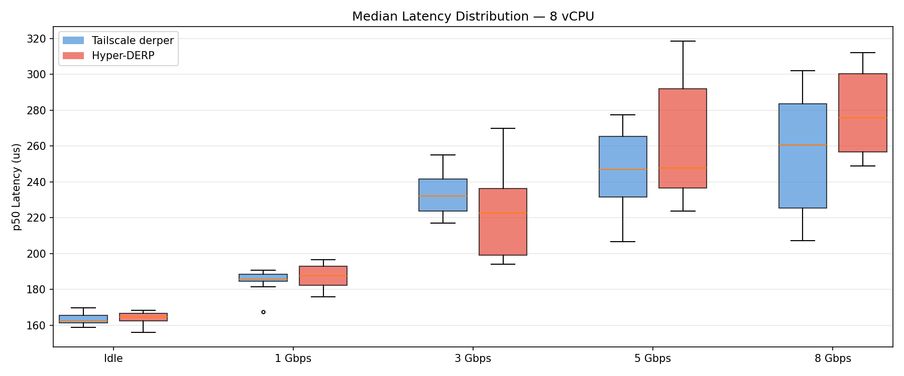

## 4 vCPU Results

```
date: 2026-03-13T15:01:13+00:00
relay: 10.10.0.2
relay_ext: 10.10.0.2
relay_vcpus: 4
relay_workers: 2
kernel: 6.12.73+deb13-cloud-amd64
cpu: INTEL(R) XEON(R) PLATINUM 8581C CPU @ 2.30GHz
isolation: one_server_at_a_time
low_rates: 500 1000 2000 3000
low_runs: 3
high_rates: 5000 7500 10000 15000 20000
high_runs: 20
latency_runs: 10
rate_duration: 15
rate_peers: 20
rate_pairs: 10
ping_count: 5000
ping_warmup: 500
msg_size: 1400
```

### Rate Sweep

| Rate | Server | N | Mean (Mbps) | 95% CI | CV% | Loss% | Loss CI |
|-----:|:------:|--:|------------:|-------:|----:|------:|--------:|
| 500 | TS | 3 | 435 | +/-0 | 0.0 | 0.00 | +/-0.00 |
| 500 | HD | 3 | 435 | +/-0 | 0.0 | 0.00 | +/-0.00 |
| 1000 | TS | 3 | 870 | +/-0 | 0.0 | 0.00 | +/-0.02 |
| 1000 | HD | 3 | 870 | +/-0 | 0.0 | 0.00 | +/-0.00 |
| 2000 | TS | 3 | 1730 | +/-1 | 0.0 | 0.56 | +/-0.05 |
| 2000 | HD | 3 | 1740 | +/-1 | 0.0 | 0.00 | +/-0.00 |
| 3000 | TS | 3 | 2430 | +/-11 | 0.2 | 6.87 | +/-0.43 |
| 3000 | HD | 3 | 2611 | +/-2 | 0.0 | 0.00 | +/-0.00 |
| 5000 | TS | 20 | 1746 | +/-15 | 1.9 | 59.86 | +/-0.36 |
| 5000 | HD | 20 | 4319 | +/-60 | 2.9 | 0.70 | +/-1.38 |
| 7500 | TS | 20 | 1396 | +/-14 | 2.1 | 75.87 | +/-0.24 |
| 7500 | HD | 20 | 6218 | +/-297 | 10.2 | 4.14 | +/-4.62 |
| 10000 | TS | 20 | 1470 | +/-16 | 2.3 | 75.29 | +/-0.13 |
| 10000 | HD | 20 | 7873 | +/-472 | 12.8 | 6.28 | +/-5.42 |
| 15000 | TS | 20 | 1520 | +/-21 | 2.9 | 75.02 | +/-0.17 |
| 15000 | HD | 20 | 9569 | +/-637 | 14.2 | 3.05 | +/-5.25 |
| 20000 | TS | 20 | 1531 | +/-16 | 2.3 | 74.59 | +/-0.13 |
| 20000 | HD | 20 | 10029 | +/-631 | 13.4 | 3.04 | +/-3.33 |

### HD vs TS

| Rate | HD (Mbps) | TS (Mbps) | Ratio | HD Loss | TS Loss |
|-----:|----------:|----------:|------:|--------:|--------:|
| 500 | 435 | 435 | 1.00x | 0.0% | 0.0% |
| 1000 | 870 | 870 | 1.00x | 0.0% | 0.0% |
| 2000 | 1740 | 1730 | 1.01x | 0.0% | 0.6% |
| 3000 | 2611 | 2430 | **1.07x** | 0.0% | 6.9% |
| 5000 | 4319 | 1746 | **2.47x** | 0.7% | 59.9% |
| 7500 | 6218 | 1396 | **4.45x** | 4.1% | 75.9% |
| 10000 | 7873 | 1470 | **5.35x** | 6.3% | 75.3% |
| 15000 | 9569 | 1520 | **6.30x** | 3.1% | 75.0% |
| 20000 | 10029 | 1531 | **6.55x** | 3.0% | 74.6% |

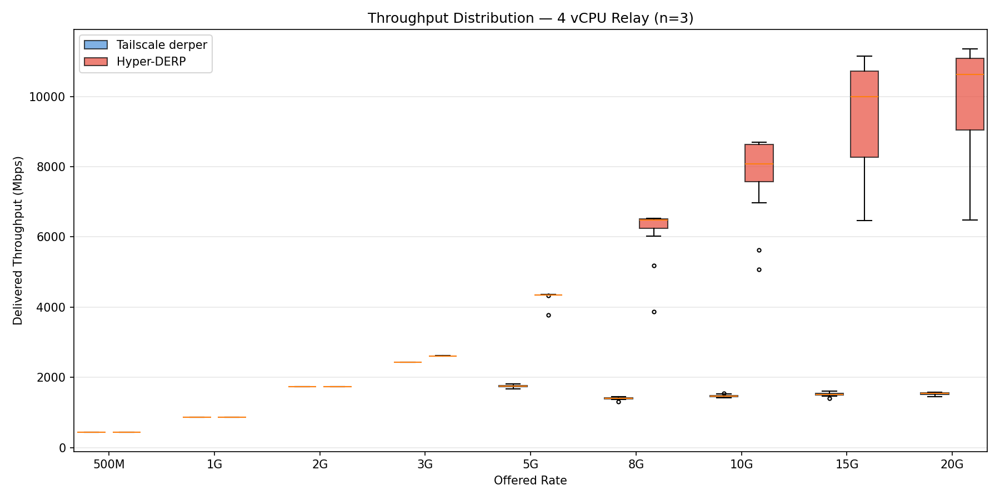

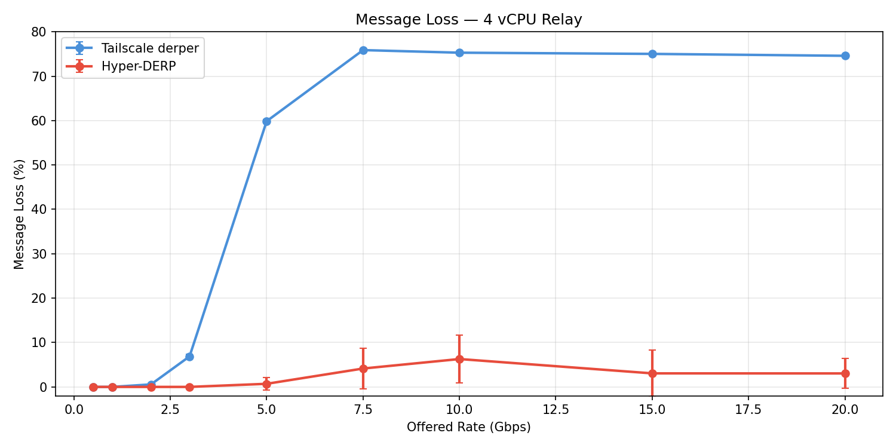

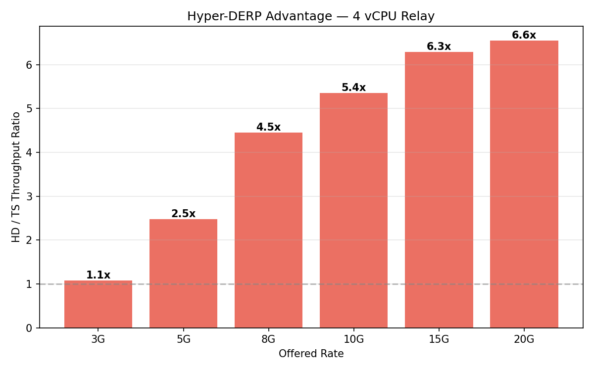

### Latency Under Load

| Load | Srv | N | p50 (us) | CI | p99 (us) | CI | p999 (us) | max (us) |
|-----:|:---:|--:|---------:|---:|---------:|---:|----------:|---------:|
| idle | TS | 10 | 165 | +/-4 | 195 | +/-4 | 273 | 440 |
| idle | HD | 10 | 157 | +/-6 | 186 | +/-8 | 196 | 264 |
| 1000M | TS | 10 | 196 | +/-2 | 575 | +/-18 | 1084 | 2272 |
| 1000M | HD | 10 | 181 | +/-6 | 329 | +/-13 | 433 | 637 |
| 3000M | TS | 10 | 317 | +/-6 | 2680 | +/-58 | 4289 | 8165 |
| 3000M | HD | 10 | 252 | +/-29 | 738 | +/-148 | 1028 | 1690 |
| 5000M | TS | 10 | 674 | +/-21 | 10124 | +/-510 | 16139 | 24064 |
| 5000M | HD | 10 | 267 | +/-48 | 1011 | +/-131 | 7990 | 27392 |
| 8000M | TS | 10 | 3353 | +/-74 | 17520 | +/-619 | 23782 | 30172 |
| 8000M | HD | 9 | 2151 | +/-3483 | 12062 | +/-13764 | 54738 | 179774 |

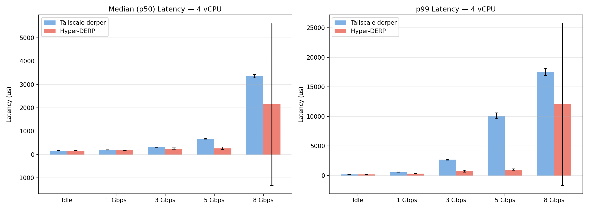

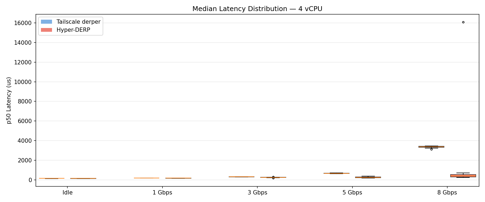

## Cross-vCPU Comparison

### HD/TS Ratio by vCPU Count

| Offered Rate | 16 vCPU | 8 vCPU | 4 vCPU |
|:------------- | -------: | -------: | -------: |
| 5 Gbps | 1.0x | 1.0x | 2.5x |
| 8 Gbps | 1.0x | 1.0x | 4.5x |
| 10 Gbps | 1.1x | 1.0x | 5.4x |
| 15 Gbps | 1.5x | 1.0x | 6.3x |
| 20 Gbps | 1.5x | 0.9x | 6.6x |

### Message Loss by vCPU Count

| Offered Rate | 16v HD | 16v TS | 8v HD | 8v TS | 4v HD | 4v TS |
|:------------- | ------: | ------: | ------: | ------: | ------: | ------: |
| 3 Gbps | 0% | 0% | 0% | 0% | 0% | 6.9% |
| 5 Gbps | 0% | 0.1% | 0% | 0% | 0.7% | 59.9% |
| 8 Gbps | 0% | 2.7% | 0.2% | 0% | 4.1% | 75.9% |
| 10 Gbps | 0% | 10.3% | 1.2% | 0.4% | 6.3% | 75.3% |
| 15 Gbps | 0.5% | 21.3% | 4.9% | 9.4% | 3.1% | 75.0% |
| 20 Gbps | 23.0% | 20.9% | 13.4% | 14.5% | 3.0% | 74.6% |

### Latency P50 by vCPU Count (us)

| Load | 16v HD | 16v TS | 8v HD | 8v TS | 4v HD | 4v TS |
|:----- | ------: | ------: | ------: | ------: | ------: | ------: |
| Idle | 161 | 164 | 164 | 163 | 157 | 165 |
| 1G bg | 186 | 189 | 187 | 185 | 181 | 196 |
| 3G bg | 214 | 248 | 222 | 233 | 252 | 317 |
| 5G bg | 228 | 295 | 262 | 247 | 267 | 674 |
| 8G bg | 247 | 395 | 278 | 256 | 2151 | 3353 |

### Latency P99 by vCPU Count (us)

| Load | 16v HD | 16v TS | 8v HD | 8v TS | 4v HD | 4v TS |
|:----- | ------: | ------: | ------: | ------: | ------: | ------: |
| Idle | 188 | 191 | 190 | 192 | 186 | 195 |
| 1G bg | 335 | 420 | 345 | 338 | 329 | 575 |
| 3G bg | 699 | 743 | 637 | 708 | 738 | 2680 |
| 5G bg | 954 | 962 | 961 | 931 | 1011 | 10124 |
| 8G bg | 1099 | 1317 | 1123 | 1073 | 12062 | 17520 |

## Key Findings

1. **At 16 vCPU**, HD delivers 12% more throughput at 10G offered (8701 vs 7802 Mbps) with dramatically less loss (0.0% vs 10.3%).
2. **At 8 vCPU**, both servers perform identically (8524 vs 8668 Mbps). The GCP network bandwidth cap is the bottleneck, not CPU.
3. **At 4 vCPU**, TS saturates at ~1.5 Gbps while HD reaches ~7.9 Gbps at 10G offered — a **5.4x throughput advantage**. Loss: HD 6.3% vs TS 75.3%.

**The advantage grows as resources shrink.** At high vCPU counts, GCP's per-VM bandwidth cap is the bottleneck and both servers are equivalent. As vCPUs decrease, Go's CPU overhead becomes the limiting factor while io_uring continues to scale — the key insight for cost-conscious deployments.
