# Phase B: vCPU Scaling on GCP c4-highcpu

**Date**: 2026-03-14 / 2026-03-15

## Test Methodology

Rate sweep (500 - 10000 Mbps offered) and latency profiling (idle through 150% of throughput ceiling) on GCP c4-highcpu VMs with 2, 4, 8, and 16 vCPUs. Each relay config was tested with Tailscale Go derper and Hyper-DERP (kTLS). Multiple repetitions per data point (5 at low rates, 25 at high rates) for statistical confidence.

## Hardware

- **CPU**: INTEL(R) XEON(R) PLATINUM 8581C CPU @ 2.30GHz
- **Kernel**: 6.12.73+deb13-cloud-amd64
- **Instance type**: GCP c4-highcpu (2, 4, 8, 16 vCPU)
- **Payload**: 1400B (WireGuard MTU)
- **Peers**: 20 (10 active pairs)
- **Duration**: 15s per data point
- **Repetitions**: 5 (low rate) / 25 (high rate)
- **Ping samples**: 5000 per run
- **Software**: Hyper-DERP 0.1.0, Go derper v1.96.1 (go1.26.1)

### Worker Mapping

| vCPU | HD Workers | TS GOMAXPROCS |
|-----:|-----------:|--------------:|
| 2 | 1 | 2 |
| 4 | 2 | 4 |
| 8 | 4 | 8 |
| 16 | 8 | 16 |

## Peak Throughput

| vCPU | TS Median | TS Mean | TS p5 | TS p95 | HD Median | HD Mean | HD p5 | HD p95 | HD/TS |
|-----:|----------:|--------:|------:|-------:|----------:|--------:|------:|-------:|------:|
| 2 | 1,446.6 | 1,447.5 | 1,439.2 | 1,459.3 | 3,021.1 | 2,962.3 | 2,429.2 | 3,208.5 | 2.09x |
| 4 | 2,395.4 | 2,395.1 | 2,378.9 | 2,409.2 | 5,311.0 | 5,106.4 | 4,144.9 | 5,712.3 | 2.22x |
| 8 | 4,036.0 | 4,033.0 | 3,996.4 | 4,061.6 | 7,747.5 | 7,621.4 | 5,968.3 | 9,054.2 | 1.92x |
| 16 | 7,758.8 | 7,743.0 | 7,607.4 | 7,830.6 | 12,204.3 | 12,067.8 | 9,771.9 | 14,470.1 | 1.57x |

### 2 vCPU Throughput vs Offered Rate

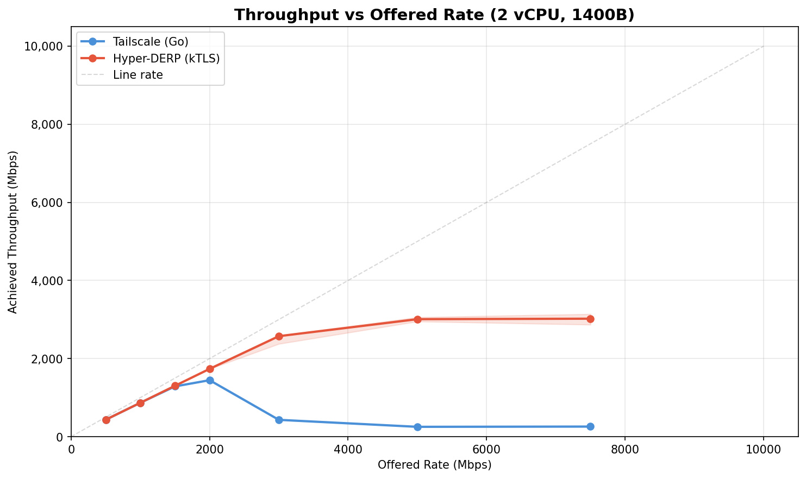

### 4 vCPU Throughput vs Offered Rate

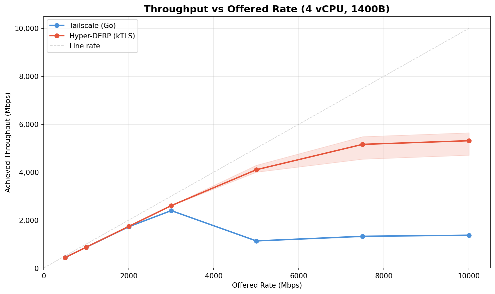

### 8 vCPU Throughput vs Offered Rate

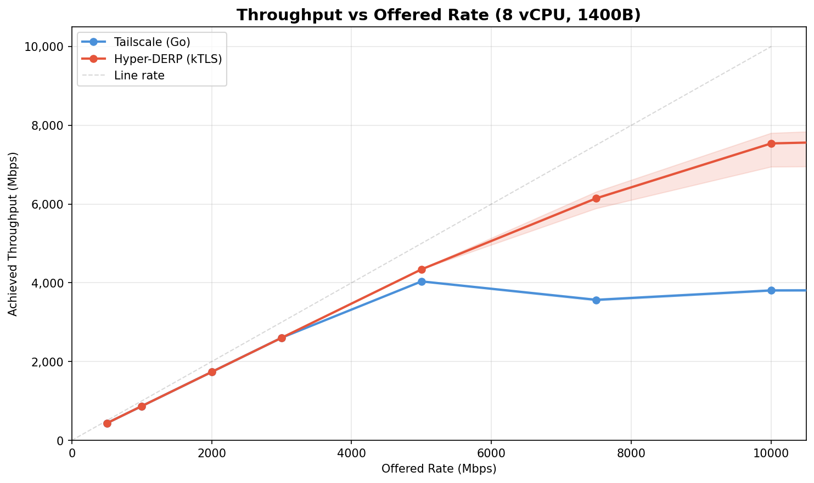

### 16 vCPU Throughput vs Offered Rate

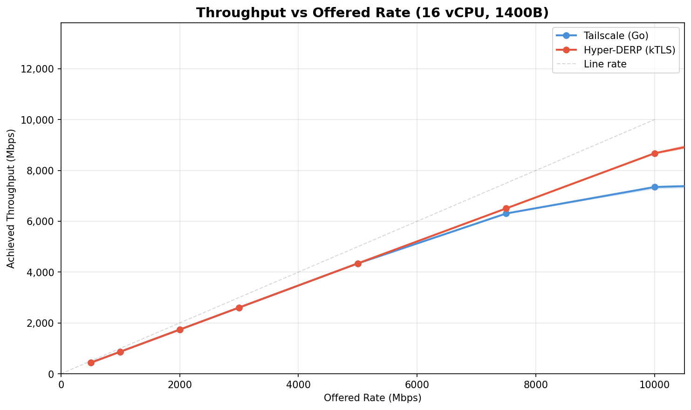

### Peak Throughput Scaling

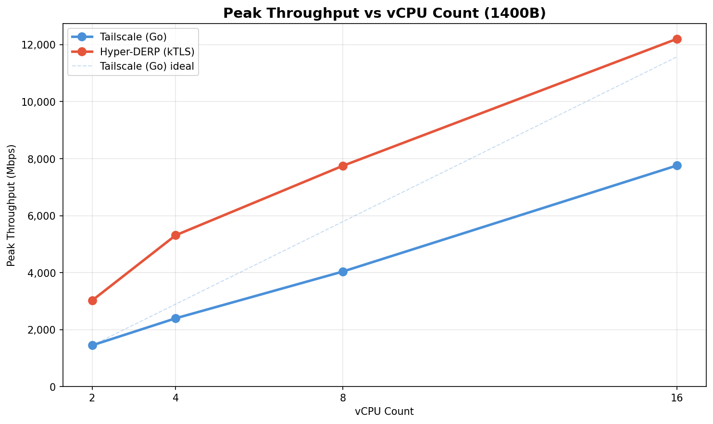

### HD/TS Throughput Ratio

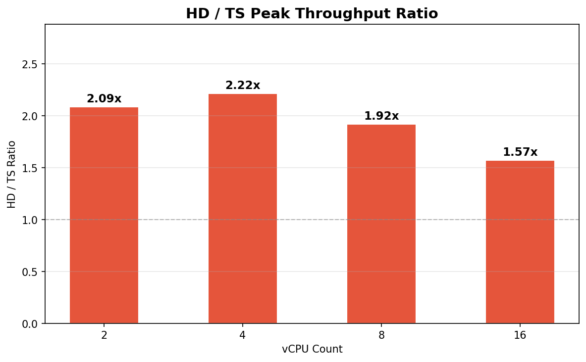

## Latency

| vCPU | Load | TS p50 (us) | TS p99 (us) | HD p50 (us) | HD p99 (us) |
|-----:|------|------------:|------------:|------------:|------------:|
| 2 | Idle | 183.2 | 215.5 | 160.0 | 190.7 |
| 2 | 25% | 186.7 | 297.7 | 173.3 | 217.2 |
| 2 | 50% | 210.7 | 1,022 | 194.4 | 253.7 |
| 2 | 75% | 265.7 | 1,657 | 213.2 | 296.3 |
| 2 | 100% | 349.4 | 2,756 | 258.0 | 573.6 |
| 2 | 150% | 1,143 | 7,929 | 479.6 | 994.7 |
| 4 | Idle | 179.7 | 215.0 | 175.0 | 207.2 |
| 4 | 25% | 202.1 | 500.6 | 198.8 | 252.7 |
| 4 | 50% | 225.5 | 851.8 | 222.6 | 308.1 |
| 4 | 75% | 254.4 | 1,546 | 254.9 | 642.6 |
| 4 | 100% | 309.3 | 2,513 | 312.4 | 1,490 |
| 4 | 150% | 466.6 | 4,196 | 370.6 | 1,538 |
| 8 | Idle | 184.1 | 214.6 | 181.3 | 210.3 |
| 8 | 25% | 216.5 | 442.3 | 207.8 | 263.6 |
| 8 | 50% | 234.2 | 606.2 | 226.4 | 310.6 |
| 8 | 75% | 256.7 | 913.4 | 251.7 | 401.0 |
| 8 | 100% | 277.9 | 1,420 | 278.1 | 489.9 |
| 8 | 150% | 495.7 | 2,612 | 380.0 | 2,717 |
| 16 | Idle | 158.7 | 186.1 | 169.4 | 199.1 |
| 16 | 25% | 213.1 | 460.5 | 202.8 | 267.3 |
| 16 | 50% | 232.8 | 560.7 | 218.3 | 303.0 |
| 16 | 75% | 254.2 | 692.2 | 242.1 | 385.0 |
| 16 | 100% | 331.4 | 1,250 | 257.2 | 476.8 |
| 16 | 150% | 598.7 | 2,175 | 260.3 | 969.3 |

### 2 vCPU Latency Profile

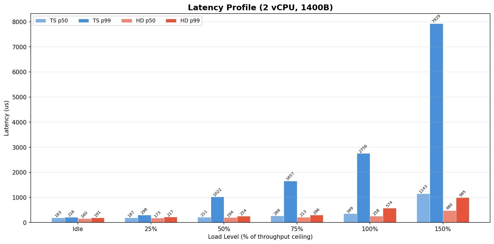

### 4 vCPU Latency Profile

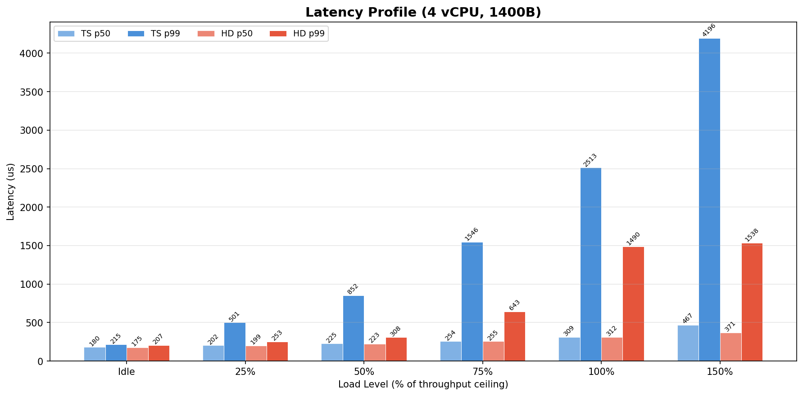

### 8 vCPU Latency Profile

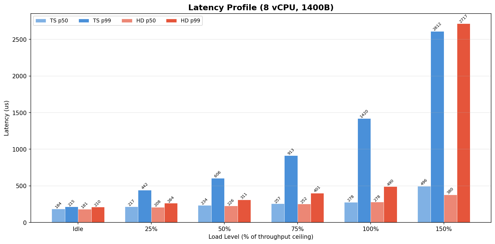

### 16 vCPU Latency Profile

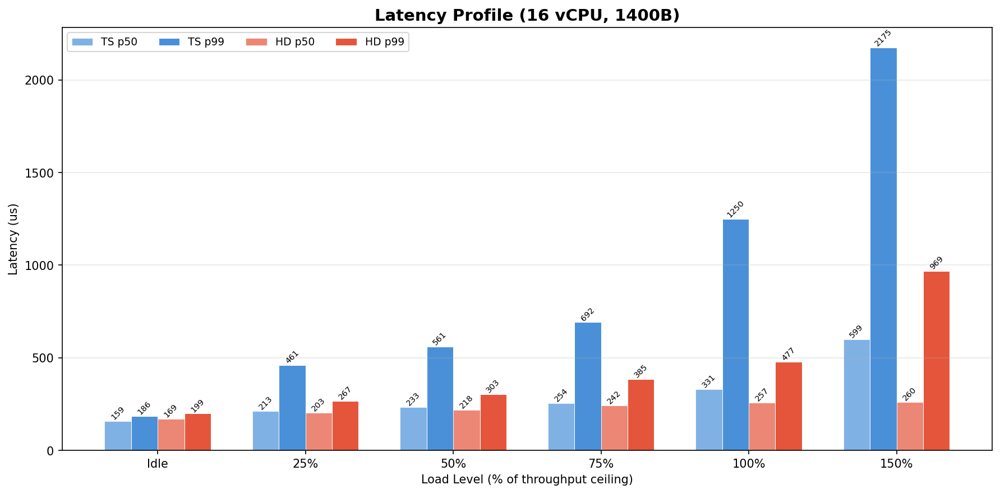

### p99 at 100% Load vs vCPU Count

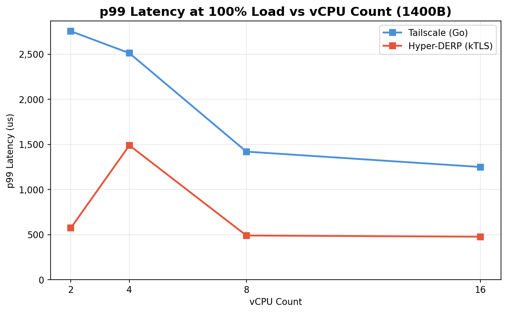

## Go GC Trace Analysis

### 2 vCPU

- **GC events**: 1384
- **Total STW pause**: 187.0 ms
- **Mean STW pause**: 0.135 ms
- **Max STW pause**: 1.803 ms
- **p50 STW pause**: 0.062 ms
- **p99 STW pause**: 1.404 ms

### 4 vCPU

- **GC events**: 2494
- **Total STW pause**: 473.9 ms
- **Mean STW pause**: 0.190 ms
- **Max STW pause**: 4.483 ms
- **p50 STW pause**: 0.111 ms
- **p99 STW pause**: 2.124 ms

### 8 vCPU

- **GC events**: 4452
- **Total STW pause**: 863.0 ms
- **Mean STW pause**: 0.194 ms
- **Max STW pause**: 2.770 ms
- **p50 STW pause**: 0.190 ms
- **p99 STW pause**: 0.270 ms

### 16 vCPU

- **GC events**: 7593
- **Total STW pause**: 2008.7 ms
- **Mean STW pause**: 0.265 ms
- **Max STW pause**: 1.030 ms
- **p50 STW pause**: 0.260 ms
- **p99 STW pause**: 0.390 ms

## Hyper-DERP Worker Stats

### 2 vCPU

- **Workers**: 1
- **Total recv**: 566.64 GB
- **Total send**: 559.18 GB
- **Send drops**: 320
- **Xfer drops**: 0
- **Slab exhausts**: 0
- **EPIPE errors**: 0
- **ECONNRESET errors**: 320
- **EAGAIN errors**: 0
- **Peer distribution**: [12]

### 4 vCPU

- **Workers**: 2
- **Total recv**: 916.00 GB
- **Total send**: 903.67 GB
- **Send drops**: 0
- **Xfer drops**: 0
- **Slab exhausts**: 0
- **EPIPE errors**: 0
- **ECONNRESET errors**: 0
- **EAGAIN errors**: 0
- **Peer distribution**: [15, 18]

### 8 vCPU

- **Workers**: 4
- **Total recv**: 1459.40 GB
- **Total send**: 1401.51 GB
- **Send drops**: 0
- **Xfer drops**: 0
- **Slab exhausts**: 0
- **EPIPE errors**: 0
- **ECONNRESET errors**: 0
- **EAGAIN errors**: 0
- **Peer distribution**: [15, 15, 20, 21]

### 16 vCPU

- **Workers**: 8
- **Total recv**: 1827.39 GB
- **Total send**: 1812.57 GB
- **Send drops**: 1
- **Xfer drops**: 3407424
- **Slab exhausts**: 0
- **EPIPE errors**: 1
- **ECONNRESET errors**: 0
- **EAGAIN errors**: 0
- **Peer distribution**: [15, 12, 9, 19, 10, 12, 11, 6]

## kTLS Stats

### 2 vCPU

- **TlsCurrRxDevice (final)**: 0
- **TlsCurrRxSw (final)**: 0
- **TlsCurrTxDevice (final)**: 0
- **TlsCurrTxSw (final)**: 0
- **TlsRxSw**: 3640
- **TlsTxSw**: 3640

### 4 vCPU

- **TlsCurrRxDevice (final)**: 0
- **TlsCurrRxSw (final)**: 0
- **TlsCurrTxDevice (final)**: 0
- **TlsCurrTxSw (final)**: 0
- **TlsRxSw**: 3640
- **TlsTxSw**: 3640

### 8 vCPU

- **TlsCurrRxDevice (final)**: 0
- **TlsCurrRxSw (final)**: 0
- **TlsCurrTxDevice (final)**: 0
- **TlsCurrTxSw (final)**: 0
- **TlsRxSw**: 3740
- **TlsTxSw**: 3740

### 16 vCPU

- **TlsCurrRxDevice (final)**: 0
- **TlsCurrRxSw (final)**: 0
- **TlsCurrTxDevice (final)**: 0
- **TlsCurrTxSw (final)**: 0
- **TlsRxSw**: 1340
- **TlsTxSw**: 1340

## Key Findings

1. **HD/TS throughput ratio**: 1.57x - 2.22x across vCPU configs.
2. **TS scaling efficiency** (2 -> 16 vCPU): 5.4x throughput gain (67% of linear).
