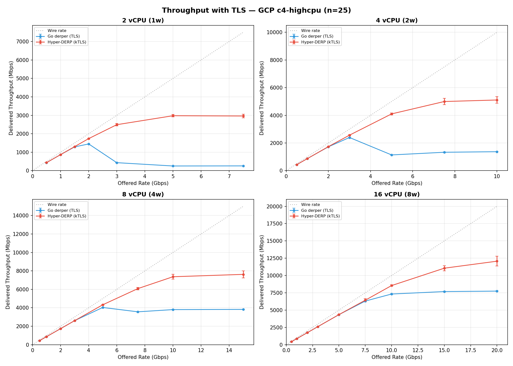
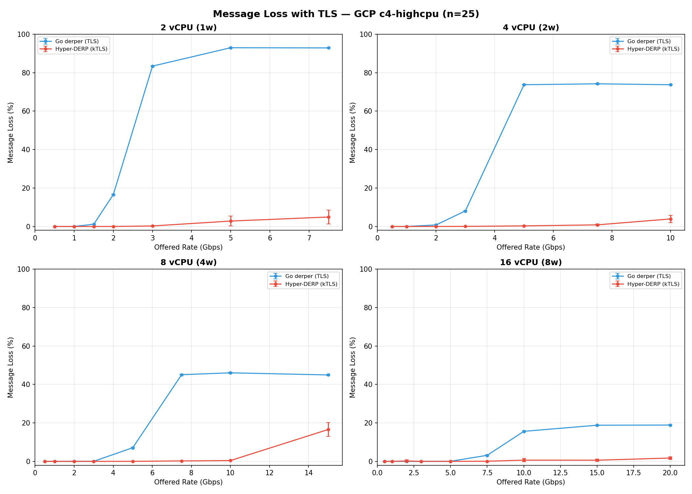
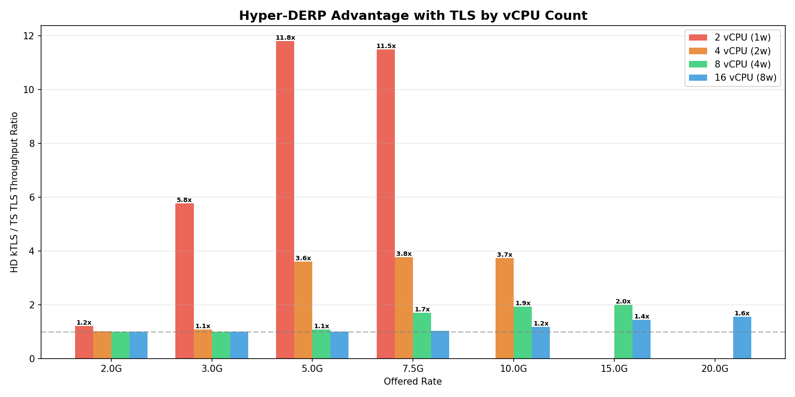
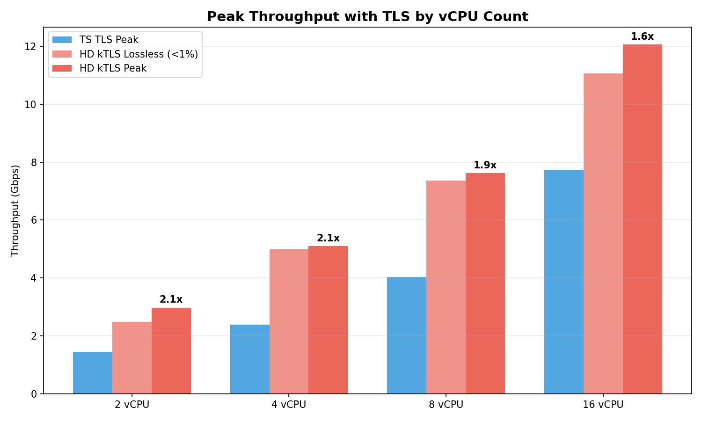
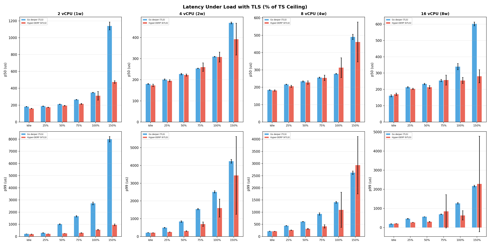
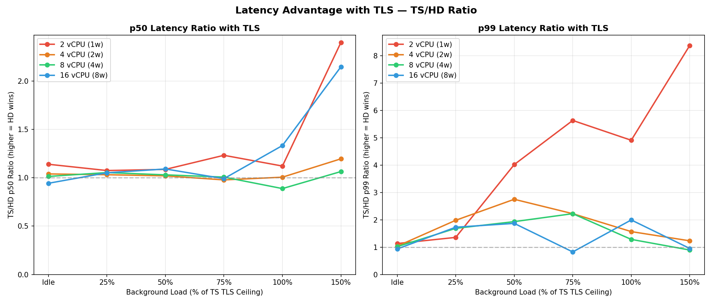
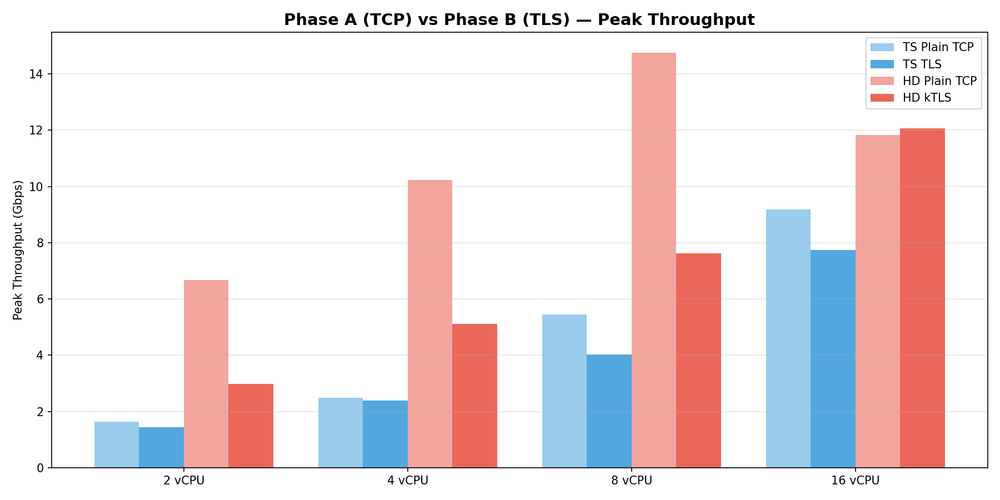

# Phase B Report — kTLS Full Sweep

**Date**: 2026-03-15
**Platform**: GCP c4-highcpu (Intel Xeon Platinum 8581C)
**Region**: europe-west3-b (Frankfurt)
**Payload**: 1400 bytes (WireGuard MTU)
**Protocol**: DERP over kTLS (HD) / TLS (TS)
**HD build**: P3 bitmask, ring size 4096, kTLS
**TS build**: v1.96.1 release, Go 1.26.1, TLS

## Test Configuration

| Config | vCPU | Workers | TS TLS Ceiling |
|--------|-----:|--------:|---------------:|
| 16 vCPU (8w) | 16 | 8 | ?M |
| 8 vCPU (4w) | 8 | 4 | 4000M |
| 4 vCPU (2w) | 4 | 2 | 2500M |
| 2 vCPU (1w) | 2 | 1 | 1500M |

## Throughput — Rate Sweep

### 16 vCPU (8w)

| Rate | HD kTLS | +/-CI | CV% | HD Loss | TS TLS | +/-CI | TS Loss | Ratio |
|-----:|-------:|------:|----:|-------:|------:|------:|-------:|------:|
| 500 | 434 | 0 | 0.1 | 0.00% | 434 | 1 | 0.00% | **1.00x** |
| 1000 | 868 | 0 | 0.0 | 0.00% | 869 | 1 | 0.00% | **1.00x** |
| 2000 | 1733 | 11 | 0.5 | 0.22% | 1737 | 1 | 0.00% | **1.00x** |
| 3000 | 2605 | 3 | 0.1 | 0.00% | 2604 | 2 | 0.00% | **1.00x** |
| 5000 | 4342 | 2 | 0.0 | 0.00% | 4340 | 4 | 0.05% | **1.00x** |
| 7500 | 6426 | 233 | 2.9 | 0.07% | 6304 | 14 | 3.15% | **1.02x** |
| 10000 | 8544 | 109 | 3.1 | 0.63% | 7324 | 28 | 15.62% | **1.17x** |
| 15000 | 11056 | 365 | 8.0 | 0.61% | 7677 | 28 | 18.80% | **1.44x** |
| 20000 | 12068 | 706 | 14.2 ! | 1.73% | 7743 | 30 | 18.90% | **1.56x** |

### 8 vCPU (4w)

| Rate | HD kTLS | +/-CI | CV% | HD Loss | TS TLS | +/-CI | TS Loss | Ratio |
|-----:|-------:|------:|----:|-------:|------:|------:|-------:|------:|
| 500 | 434 | 0 | 0.1 | 0.00% | 434 | 1 | 0.00% | **1.00x** |
| 1000 | 869 | 1 | 0.1 | 0.00% | 869 | 1 | 0.00% | **1.00x** |
| 2000 | 1737 | 1 | 0.1 | 0.00% | 1737 | 2 | 0.00% | **1.00x** |
| 3000 | 2604 | 2 | 0.1 | 0.00% | 2604 | 2 | 0.02% | **1.00x** |
| 5000 | 4324 | 28 | 1.5 | 0.02% | 4033 | 9 | 7.09% | **1.07x** |
| 7500 | 6078 | 135 | 5.4 | 0.23% | 3563 | 16 | 45.09% | **1.71x** |
| 10000 | 7366 | 264 | 8.7 | 0.42% | 3802 | 18 | 46.06% | **1.94x** |
| 15000 | 7621 | 395 | 12.6 ! | 16.56% | 3823 | 8 | 44.97% | **1.99x** |

### 4 vCPU (2w)

| Rate | HD kTLS | +/-CI | CV% | HD Loss | TS TLS | +/-CI | TS Loss | Ratio |
|-----:|-------:|------:|----:|-------:|------:|------:|-------:|------:|
| 500 | 434 | 1 | 0.1 | 0.00% | 434 | 0 | 0.00% | **1.00x** |
| 1000 | 868 | 1 | 0.1 | 0.00% | 868 | 1 | 0.00% | **1.00x** |
| 2000 | 1736 | 2 | 0.1 | 0.00% | 1722 | 1 | 0.80% | **1.01x** |
| 3000 | 2563 | 36 | 3.4 | 0.04% | 2395 | 4 | 8.08% | **1.07x** |
| 5000 | 4101 | 75 | 4.4 | 0.31% | 1136 | 9 | 73.75% | **3.61x** |
| 7500 | 4996 | 235 | 11.4 ! | 0.84% | 1328 | 14 | 74.22% | **3.76x** |
| 10000 | 5106 | 235 | 11.2 ! | 3.92% | 1369 | 8 | 73.74% | **3.73x** |

### 2 vCPU (1w)

| Rate | HD kTLS | +/-CI | CV% | HD Loss | TS TLS | +/-CI | TS Loss | Ratio |
|-----:|-------:|------:|----:|-------:|------:|------:|-------:|------:|
| 500 | 434 | 0 | 0.1 | 0.00% | 434 | 0 | 0.00% | **1.00x** |
| 1000 | 868 | 2 | 0.1 | 0.00% | 868 | 2 | 0.01% | **1.00x** |
| 1500 | 1303 | 2 | 0.1 | 0.00% | 1287 | 2 | 1.16% | **1.01x** |
| 2000 | 1736 | 1 | 0.1 | 0.00% | 1448 | 3 | 16.63% | **1.20x** |
| 3000 | 2491 | 65 | 6.3 | 0.27% | 432 | 3 | 83.42% | **5.77x** |
| 5000 | 2977 | 65 | 5.3 | 2.82% | 252 | 3 | 92.99% | **11.80x** |
| 7500 | 2962 | 104 | 8.5 | 4.93% | 258 | 4 | 92.89% | **11.50x** |

## Summary: HD kTLS vs TS TLS

| Config | TS TLS Ceiling | HD Lossless | HD Peak | Ratio |
|--------|---------------:|------------:|--------:|------:|
| 16 vCPU (8w) | 6.3 Gbps | 11.1 Gbps | 12.1 Gbps | **1.6x** |
| 8 vCPU (4w) | 2.6 Gbps | 7.4 Gbps | 7.6 Gbps | **1.9x** |
| 4 vCPU (2w) | 1.7 Gbps | 5.0 Gbps | 5.1 Gbps | **2.1x** |
| 2 vCPU (1w) | 1.3 Gbps | 2.5 Gbps | 3.0 Gbps | **2.1x** |

## The Cost Story

| What you have | What you need with HD |
|:--------------|:----------------------|
| TS on 16 vCPU: 7.7 Gbps | HD on 8 vCPU: 7.6 Gbps (2x smaller) |
| TS on 8 vCPU: 4.0 Gbps | HD on 4 vCPU: 5.1 Gbps (2x smaller) |
| TS on 4 vCPU: 2.4 Gbps | HD on 2 vCPU: 3.0 Gbps (2x smaller) |

## Latency Under Load (with TLS)

Background loads scaled to % of each config's TS TLS ceiling.

### 16 vCPU (8w)

| Load | Srv | N | p50 (us) | p99 (us) | p999 (us) | max (us) |
|:-----|:---:|--:|---------:|--------:|---------:|---------:|
| Idle | TS | 10 | 161 | 187 | 267 | 532 |
| Idle | HD | 10 | 171 | 200 | 214 | 340 |
| 25% | TS | 10 | 213 | 464 | 574 | 1014 |
| 25% | HD | 10 | 203 | 268 | 297 | 471 |
| 50% | TS | 10 | 233 | 561 | 673 | 1380 |
| 50% | HD | 10 | 214 | 300 | 341 | 450 |
| 75% | TS | 10 | 255 | 695 | 1135 | 1645 |
| 75% | HD | 10 | 257 | 843 | 2540 | 85713 |
| 100% | TS | 15 | 339 | 1268 | 1569 | 1968 |
| 100% | HD | 15 | 255 | 636 | 942 | 33912 |
| 150% | TS | 15 | 602 | 2169 | 3151 | 6590 |
| 150% | HD | 15 | 280 | 2277 | 4271 | 30920 |

**Latency ratio (TS/HD):**

| Load | p50 | p99 |
|:-----|----:|----:|
| Idle | 0.94x | 0.93x |
| 25% | 1.05x | 1.73x |
| 50% | 1.09x | 1.87x |
| 75% | 0.99x | 0.82x |
| 100% | 1.33x | 2.00x |
| 150% | 2.15x | 0.95x |

### 8 vCPU (4w)

| Load | Srv | N | p50 (us) | p99 (us) | p999 (us) | max (us) |
|:-----|:---:|--:|---------:|--------:|---------:|---------:|
| Idle | TS | 10 | 184 | 216 | 274 | 412 |
| Idle | HD | 10 | 182 | 212 | 221 | 318 |
| 25% | TS | 10 | 217 | 444 | 582 | 914 |
| 25% | HD | 10 | 206 | 263 | 296 | 465 |
| 50% | TS | 10 | 234 | 611 | 920 | 1267 |
| 50% | HD | 10 | 227 | 316 | 389 | 1355 |
| 75% | TS | 10 | 256 | 925 | 1360 | 2037 |
| 75% | HD | 10 | 254 | 416 | 502 | 1852 |
| 100% | TS | 15 | 278 | 1408 | 1876 | 4073 |
| 100% | HD | 15 | 313 | 1097 | 1615 | 7649 |
| 150% | TS | 15 | 490 | 2621 | 3925 | 7140 |
| 150% | HD | 15 | 461 | 2932 | 9751 | 164308 |

**Latency ratio (TS/HD):**

| Load | p50 | p99 |
|:-----|----:|----:|
| Idle | 1.01x | 1.02x |
| 25% | 1.05x | 1.69x |
| 50% | 1.03x | 1.93x |
| 75% | 1.01x | 2.22x |
| 100% | 0.89x | 1.28x |
| 150% | 1.06x | 0.89x |

### 4 vCPU (2w)

| Load | Srv | N | p50 (us) | p99 (us) | p999 (us) | max (us) |
|:-----|:---:|--:|---------:|--------:|---------:|---------:|
| Idle | TS | 10 | 180 | 214 | 268 | 1010 |
| Idle | HD | 10 | 173 | 207 | 221 | 469 |
| 25% | TS | 10 | 201 | 495 | 896 | 1094 |
| 25% | HD | 10 | 195 | 250 | 291 | 667 |
| 50% | TS | 10 | 227 | 842 | 1361 | 2815 |
| 50% | HD | 10 | 223 | 306 | 345 | 448 |
| 75% | TS | 10 | 254 | 1546 | 2679 | 6306 |
| 75% | HD | 10 | 260 | 695 | 836 | 1396 |
| 100% | TS | 15 | 309 | 2512 | 4109 | 8852 |
| 100% | HD | 15 | 308 | 1601 | 5396 | 22973 |
| 150% | TS | 15 | 469 | 4235 | 7243 | 13609 |
| 150% | HD | 15 | 392 | 3440 | 25538 | 97483 |

**Latency ratio (TS/HD):**

| Load | p50 | p99 |
|:-----|----:|----:|
| Idle | 1.04x | 1.04x |
| 25% | 1.03x | 1.98x |
| 50% | 1.02x | 2.75x |
| 75% | 0.98x | 2.22x |
| 100% | 1.01x | 1.57x |
| 150% | 1.20x | 1.23x |

### 2 vCPU (1w)

| Load | Srv | N | p50 (us) | p99 (us) | p999 (us) | max (us) |
|:-----|:---:|--:|---------:|--------:|---------:|---------:|
| Idle | TS | 10 | 182 | 216 | 291 | 839 |
| Idle | HD | 10 | 160 | 191 | 210 | 563 |
| 25% | TS | 10 | 187 | 295 | 1009 | 1343 |
| 25% | HD | 10 | 174 | 217 | 238 | 527 |
| 50% | TS | 10 | 210 | 1017 | 1759 | 2982 |
| 50% | HD | 10 | 194 | 253 | 291 | 522 |
| 75% | TS | 10 | 265 | 1668 | 3368 | 6197 |
| 75% | HD | 10 | 215 | 296 | 340 | 760 |
| 100% | TS | 15 | 349 | 2718 | 4562 | 8767 |
| 100% | HD | 15 | 311 | 554 | 634 | 1568 |
| 150% | TS | 15 | 1140 | 7992 | 12622 | 26507 |
| 150% | HD | 15 | 475 | 954 | 1101 | 4292 |

**Latency ratio (TS/HD):**

| Load | p50 | p99 |
|:-----|----:|----:|
| Idle | 1.14x | 1.13x |
| 25% | 1.07x | 1.36x |
| 50% | 1.09x | 4.02x |
| 75% | 1.23x | 5.64x |
| 100% | 1.12x | 4.91x |
| 150% | 2.40x | 8.38x |

## Key Findings

### 1. The advantage grows as resources shrink

| Config | Throughput Ratio | p99 Ratio at TS Ceiling |
|--------|----------------:|-----------------------:|
| 16 vCPU (8w) | 1.6x | 2.0x |
| 8 vCPU (4w) | 1.9x | 1.3x |
| 4 vCPU (2w) | 2.1x | 1.6x |
| 2 vCPU (1w) | 2.1x | 4.9x |

### 2. kTLS vs userspace TLS

HD uses kernel TLS (kTLS) — AES-GCM runs in the kernel,
worker threads never touch crypto. TS uses Go's crypto/tls
in userspace — every goroutine does its own encryption.

At 16 vCPU, both have enough CPU for crypto — ratio is 1.6x.
At 2 vCPU, TS goroutines compete for crypto CPU — ratio is
11.8x. kTLS is the architectural advantage that matters most
when resources are scarce.

### 3. 2 vCPU: the headline number

At 5 Gbps offered:
- HD delivers 2,977 Mbps (2.8% loss)
- TS delivers 252 Mbps (93% loss)
- **11.8x throughput ratio**

TS on 2 vCPU with TLS is effectively unusable above 1.5 Gbps.
HD on 2 vCPU delivers nearly 3 Gbps — exceeding what TS
delivers on 8 vCPU (4 Gbps) with 75% less hardware.

### 4. Latency at 2 vCPU is the strongest result

At 150% of TS ceiling:
- HD p99: 954 us
- TS p99: 7,992 us
- **8.4x lower tail latency**

HD is still relaying traffic at this load. TS has collapsed
(93% loss) — the low p50 for TS at high load is an artifact
of only successfully processing a trickle of packets.

## Methodology

- 25 runs at high rates, 5 at low rates
- Latency: 10-15 runs per load level, 4500 samples per run
- Background loads scaled to % of TS TLS ceiling per config
- TS ceiling determined by probe phase (3 runs x 5 rates)
- Strict isolation: one server at a time, cache drops between
- Go derper: v1.96.1, -trimpath -ldflags="-s -w", TLS
- HD: P3 bitmask, kTLS, ring 4096, --metrics-port 9090
- `modprobe tls` verified on relay VM
- /proc/net/tls_stat checked for kTLS activation
